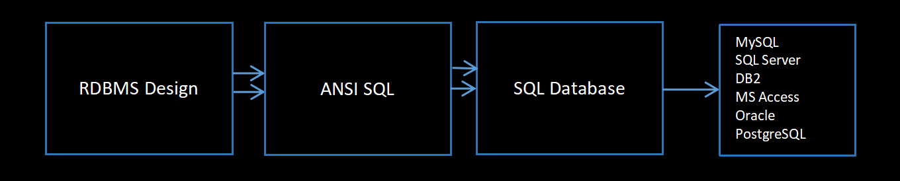

# DATABASE CONCEPTS - NOTES PART 1

In the context of database software, data is stored in a persistent medium. It can be retrieved as and when required.

Prior to database software, data was stored in the **Flat File System (FFS)**.

A **delimiter** was used to separate fields within these files.

## Properties of Flat File System:

1. The entire data is stored in a **single file**. No physical or logical division is done.
2. A heavy amount of **data redundancy** (repetition of data).
3. **Unnecessary disk space** is consumed due to redundant data.
4. **More processing time** is required for data retrieval and manipulation.
5. No support for **data types** (only text data was stored).
6. No inherent support for **data validation** (e.g., ensuring a date is valid).
7. No built-in support for **data security** (no control over who can access the data).
8. Lack of a built-in **backup strategy** to safeguard data.
9. Difficult to create reports quickly. **Programming languages** were often needed to generate reports, making it challenging.
10. **Data updates** required inserting a new record. Overriding existing values wasn't feasible.
11. No easy mechanism to **delete records**.

---

**RDBMS** (Relational Database Management System) was introduced by **Dr. E.F. Codd** in the late 1970s.


## Properties of RDBMS:

1. Data is not stored in a single table or file. Use **subject- or context-specific** tables.
2. **Heavy data redundancy** is eliminated. Only a marginal amount of data, like **IDs**, may be repeated.
3. **Unnecessary disk space** usage is avoided.
4. **Processing time** is optimized, reducing overhead.
5. You don't need to enter new records for updates. You can **override existing values**.
6. **Datatype support** is provided (e.g., integer, date, varchar, etc.).
7. Inherent support for **data validation** (ensuring data meets specific criteria).
8. Inherent support for **data security** (restricting access to authorized users).
9. Inherent support for a **backup strategy** (this may vary depending on the database).
10. Provides an easy mechanism to **generate reports** without relying on programming languages.
11. **Simple mechanisms** are available for **deleting records**.

---

## SQL

1. **RDBMS** is a framework.
2. **SQL** implements RDBMS through **scripting**.
3. SQL is a **fourth-generation language (4GL)**.
4. It is based on **English-like syntax**.
5. **SQL keywords** are **not case-sensitive**.
6. No coding knowledge is required for basic queries.
7. **Data validation** can be done easily using SQL.

## ANSI SQL:

1. SQL syntaxes are **common across all databases**.
2. **Supported by all DBMS** platforms.

---



## Data Integrity Rules:

1. **Primary Key (PK)**: A value or set of values that uniquely identifies a record in the SQL database table.
   - It must be **unique**.
   - It **cannot** be **blank** or **NULL**.
   - There can be **only one PK per table**.

2. **Unique Key (UK)**: The value must be **unique** across the column.

3. **Not Null (NN)**: The value is **mandatory**; it cannot be left blank.

4. **Foreign Key (FK)**: A value that references the PK or UK of a different or the same table.
   - **FK can repeat** (e.g., a student may issue multiple books).
   - **FK can be NULL** (e.g., a book may not be issued by any student).

   `The table containing the PK is called the Parent Table (Master Table).`
   
   `The table containing the FK is called the Child Table.`

   `A table containing both FK and PK can act as both Parent and Child Table.`

5. **Check Constraint (Ch)**: Ensures that specific rules are followed for the values being entered.
   - Examples:
     - Salary must be greater than 50000.
     - City should be either Pune, Mumbai, or Bangalore.
     - Return Date must be **greater than or equal to** the Issue Date.

### Combining Data Integrity Rules for a Single Column:
1. **UK + NN**: Ensures uniqueness and that the value is mandatory.
2. **PK + Ch**: Combines uniqueness and a condition that must be met.
3. **NN + Ch**: Ensures the value is mandatory and must satisfy a condition.
4. **FK + Ch**: Ensures the foreign key follows certain validation rules.

### Composite Primary Key (Composite PK):
- A **combination of columns** that together form a unique key. The combination must be unique, though individual values in those columns may repeat.

---

## Example Tables

### Student_Master Table:
| Rollno (PK) | Name | Address | Mobile_No |
|-------------|------|---------|-----------|
| 1           | A    | Pune    | xxxxx     |
| 2           | B    | Mumbai  | rrrr      |
| 3           | C    | Pune    | tttt      |
| 4           | D    | Delhi   | tttt      |

---

### Result_Details Table:
| Rollno (FK) + (PK) | Marks |
|--------------------|-------|
| 2                  | 89    |
| 3                  | 78    |

---

### Certificate_Details Table:
| Rollno (FK from Result_Details) | Certificate_ID |
|---------------------------------|----------------|
| 2                               | C1             |
| 3                               | C2             |

---

### Additional Explanation:
- **Foreign Keys (FK)** can also act as **Primary Keys (PK)** for another table. For example, in the `Result_Details` table, `Rollno` acts as both a **Foreign Key (FK)** (referencing `Rollno` in `Student_Master`) and a **Primary Key (PK)** in the `Result_Details` table itself.

## Types of SQL Commands

1. **DDL (Data Definition Language)**: `CREATE`, `DROP`, `ALTER`
   - Focuses on the **structure of data** (defining and modifying database objects like tables, indexes, etc.).

2. **DML (Data Manipulation Language)**: `INSERT`, `UPDATE`, `DELETE`, `MERGE`
   - Focuses on the **manipulation of data** (adding, updating, or removing records in tables).

3. **DQL (Data Query Language)** OR **DRL (Data Retrieval Language)**: `SELECT`, `FROM`, `WHERE`, etc.
   - Focuses on **retrieving data** from the database using queries.

---

4. **DCL (Data Control Language)**: `GRANT`, `REVOKE`
   - Focuses on **controlling access** to data by granting or revoking permissions.

5. **TCL (Transactional Control Language)**: `COMMIT`, `ROLLBACK`
   - Manages **transactions** in the database, ensuring data consistency by committing or rolling back changes.

---

## SQL Database Structure:

1. **Client-Server Architecture**:
   - **Server**: Refers to the physical copy of the database where data is stored on a machine.
   - **Client**: Refers to the software that has the necessary networking configuration to connect and access the server remotely.

2. There will be an implicit set of **default users**, usually **DBA (Database Administrator)** users.

3. Some implicit databases are created during installation. A **database** is a collection of related data and objects like tables, views, and indexes.

4. **Editors** available for interacting with the database:
   - **CUI** (Character User Interface): Command-line interfaces like the command prompt.
   - **GUI** (Graphical User Interface): Visual tools for interacting with the database without using commands.

5. **Sample tables** are provided, often used for training purposes to help learn SQL `SELECT` commands and other operations.

6. **Service Configuration** is required to connect the database with the **operating system**.

7. Database **booting or starting** is necessary to initiate the database services.

---


```sql
SELECT user();  -- To show current user.
```

```
+----------------+
| user()         |
+----------------+
| root@localhost |
+----------------+
```

```sql
System cls; -- To clear screen.
```

```sql
SELECT user FROM mysql.user; -- To show all users.
```

```
+------------------+
| user             |
+------------------+
| mysql.infoschema |
| mysql.session    |
| mysql.sys        |
| root             |
+------------------+
```

```sql
SHOW TABLES; --To show tables.
```

```
+-----------------+
| Tables_in_mydb3 |
+-----------------+
| australia       |
| comp            |
| d               |
| dept            |
| dept1           |
| e               |
| emp             |
| emp1            |
| india           |
| mech            |
| p               |
| pcodes          |
| period          |
| rates           |
+-----------------+
```

### Display records of employees who earns sal greater than or equal to 3000.

```sql
SELECT *
FROM emp
WHERE SAL >= 3000;
```
```
+-------+-------+-----------+------+------------+------+------+--------+
| EMPNO | ENAME | JOB       | MGR  | HIREDATE   | SAL  | COMM | DEPTNO |
+-------+-------+-----------+------+------------+------+------+--------+
|  7788 | SCOTT | ANALYST   | 7566 | 1982-12-09 | 3000 | NULL |     20 |
|  7839 | KING  | PRESIDENT | NULL | 1981-11-17 | 5000 | NULL |     10 |
|  7902 | FORD  | ANALYST   | 7566 | 1981-03-06 | 3000 | NULL |     20 |
+-------+-------+-----------+------+------------+------+------+--------+
```


## Types of Compile-Time Errors in SQL:

1. **Incorrect table name or column name**.
2. **Wrong keywords** used in the SQL statement.
3. **Permission denied** to access a table or database.
4. **Tables are locked**, preventing access or modification.
5. **Tables or databases are offline** or unavailable.
6. **Cannot reach the server**, possibly due to network or configuration issues.

`Note: MySQL is super case-insensitive.`  
`Tip: Use single quotes (' ') for string values in SQL queries.`

---

### Example Queries:

- **Display clerks who earn a salary greater than 1000**:
  ```sql
  SELECT * FROM emp WHERE job = 'clerk' AND sal > 1000;

- **Select all employees with the job 'manager' or salary less than 1000**:
  
  ```sql
  SELECT * FROM emp WHERE job = 'manager' OR sal < 1000;

### Combining Different Conditions:

- **Display clerks earning less than 1000, as well as salesmen earning less than 1300**:

  ```sql
  SELECT * FROM emp 
  WHERE (job = 'clerk' AND sal < 1000) 
  OR (job = 'salesman' AND sal < 1300);

## Special SQL Operators:

1. Between (Range of values)
```sql
SELECT *
FROM emp 
WHERE sal BETWEEN 1250 AND 3000;
```

  NOT BETWEEN
```sql
SELECT *
FROM emp 
WHERE sal NOT BETWEEN 1250 AND 3000;
```

2. IN Operator (Used to filter rows by checking if a value matches any value in a given list)
```sql
SELECT * FROM emp
WHERE job IN ('CLERK', 'MANAGER');
```

  NOT IN Operator
```sql
SELECT * FROM emp
WHERE job NOT IN ('CLERK', 'MANAGER');
```

3. IS NULL (Used to show records where a column value is null)
```SQL
SELECT * FROM emp
WHERE comm IS NULL;
```

IS NOT NULL
```SQL
SELECT * FROM emp
WHERE comm is NOT NULL;
```

## Pattern Matching Operators of SQL:

### Two Wildcard Characters:
- **Percentage (%)**: Represents zero or more characters.
- **Underscore (_)**: Represents a single character.

---

### Display Records that Start with 'S':
```sql
SELECT * 
FROM emp 
WHERE ename LIKE 'S%';
```
```
+-------+-------+---------+------+------------+------+------+--------+
| EMPNO | ENAME | JOB     | MGR  | HIREDATE   | SAL  | COMM | DEPTNO |
+-------+-------+---------+------+------------+------+------+--------+
|  7369 | SMITH | CLERK   | 7902 | 1980-12-17 |  800 | NULL |     20 |
|  7788 | SCOTT | ANALYST | 7566 | 1982-12-09 | 3000 | NULL |     20 |
+-------+-------+---------+------+------------+------+------+--------+
```
## Display Records that ends with 'R'
```sql
SELECT *
FROM emp
WHERE ename LIKE '%R';
```
```
+-------+--------+----------+------+------------+------+------+--------+
| EMPNO | ENAME  | JOB      | MGR  | HIREDATE   | SAL  | COMM | DEPTNO |
+-------+--------+----------+------+------------+------+------+--------+
|  7844 | TURNER | SALESMAN | 7698 | 1981-08-09 | 1500 |    0 |     30 |
|  7934 | MILLER | CLERK    | 7782 | 1982-01-23 | 1300 | NULL |     10 |
+-------+--------+----------+------+------------+------+------+--------+
```
### Command: Display Records with Specific Pattern Matching Using Underscore

This SQL command retrieves all records from the `PCODES` table where the `CODE` column matches the pattern `'pq_%01'`. The `LIKE` operator is used with the underscore (`_`) wildcard to match exactly one character in the third position.

Example:
```sql
SELECT * 
FROM PCODES 
WHERE CODE LIKE 'pq_%01';
```
```
+-------+------+
| Code  | Qty  |
+-------+------+
| PQR01 |   29 |
+-------+------+
```

## ESCAPE OPERATOR

The `ESCAPE` operator allows you to define an escape character, which can be used to treat special wildcard characters (like `%` and `_`) as literal characters in pattern matching.

```SQL
SELECT *
FROM pcodes
WHERE code LIKE 'A?%C01' ESCAPE '?';
```

In this query:

- The **?** is defined as the escape character.
- The **%** after the escape character **?** is treated as a literal **%**, not as a wildcard.

## COLUMN ALIASES

Column aliases are used to temporarily rename a column heading in the result set of an SQL query. This is particularly useful for improving readability or when working with complex expressions.

```sql
SELECT ename AS "Name Of Employee",
sal AS "Salary"
FROM emp;
```
```
+------------------+--------+
| Name Of Employee | Salary |
+------------------+--------+
| SMITH            |    800 |
| ALLEN            |   1600 |
| WARD             |   1250 |
| JONES            |   2975 |
| MARTIN           |   1250 |
| BLAKE            |   2850 |
| CLARK            |   2450 |
| SCOTT            |   3000 |
| KING             |   5000 |
| TURNER           |   1500 |
| ADAMS            |   1100 |
| JAMES            |    950 |
| FORD             |   3000 |
| MILLER           |   1300 |
+------------------+--------+
```

## ORDER BY (Sorting)

The `ORDER BY` clause is used to sort the result set of a query by one or more columns. Sorting can be done in ascending (default) or descending order.

### Syntax:
```sql
SELECT column1, column2, ...
FROM table_name
ORDER BY column1 [ASC|DESC], column2 [ASC|DESC], ...;
```

- **ASC**: Sorts the data in ascending order (smallest to largest). This is the default.

- **DESC**: Sorts the data in descending order (largest to smallest).

- You can sort by multiple columns by separating them with commas.

### Notes:
- Sorting can be performed on numeric, string, or date columns.
- You can sort by columns that are not selected in the result set.

```sql
SELECT * FROM emp
ORDER BY sal DESC;
```
```
+-------+--------+-----------+------+------------+------+------+--------+
| EMPNO | ENAME  | JOB       | MGR  | HIREDATE   | SAL  | COMM | DEPTNO |
+-------+--------+-----------+------+------------+------+------+--------+
|  7839 | KING   | PRESIDENT | NULL | 1981-11-17 | 5000 | NULL |     10 |
|  7788 | SCOTT  | ANALYST   | 7566 | 1982-12-09 | 3000 | NULL |     20 |
|  7902 | FORD   | ANALYST   | 7566 | 1981-03-06 | 3000 | NULL |     20 |
|  7566 | JONES  | MANAGER   | 7839 | 1981-04-02 | 2975 | NULL |     20 |
|  7698 | BLAKE  | MANAGER   | 7839 | 1981-05-01 | 2850 | NULL |     30 |
|  7782 | CLARK  | MANAGER   | 7839 | 1981-06-08 | 2450 | NULL |     10 |
|  7499 | ALLEN  | SALESMAN  | 7698 | 1981-05-20 | 1600 |  300 |     30 |
|  7844 | TURNER | SALESMAN  | 7698 | 1981-08-09 | 1500 |    0 |     30 |
|  7934 | MILLER | CLERK     | 7782 | 1982-01-23 | 1300 | NULL |     10 |
|  7521 | WARD   | SALESMAN  | 7698 | 1981-05-22 | 1250 |  500 |     30 |
|  7654 | MARTIN | SALESMAN  | 7698 | 1981-09-20 | 1250 | 1400 |     30 |
|  7876 | ADAMS  | CLERK     | 7788 | 1983-12-01 | 1100 | NULL |     20 |
|  7900 | JAMES  | CLERK     | 7698 | 1981-12-03 |  950 | NULL |     30 |
|  7369 | SMITH  | CLERK     | 7902 | 1980-12-17 |  800 | NULL |     20 |
+-------+--------+-----------+------+------------+------+------+--------+
```

## ORDER BY (Multiple Column Sorting)

The `ORDER BY` clause can be used to sort the result set by multiple columns. When sorting by multiple columns, the rows are first sorted by the first column specified, and then by the subsequent columns.

### Syntax:
```sql
SELECT column1, column2, ...
FROM table_name
ORDER BY column1 [ASC|DESC], column2 [ASC|DESC], ...;
```

- **Primary Sort**: The first column in the `ORDER BY` clause.

- **Secondary Sort**: The second column (and subsequent columns) that the result set is sorted by if there are ties in the primary sort.

### Notes:
- The sorting order for each column can be specified independently (ascending or descending).
- Multiple columns allow for more refined sorting, with the first column being sorted first, followed by subsequent columns.

```sql
SELECT DEPTNO, ENAME, SAL
FROM EMP
ORDER BY DEPTNO, SAL DESC;
```
```
+--------+--------+------+
| DEPTNO | ENAME  | SAL  |
+--------+--------+------+
|     10 | KING   | 5000 |
|     10 | CLARK  | 2450 |
|     10 | MILLER | 1300 |
|     20 | SCOTT  | 3000 |
|     20 | FORD   | 3000 |
|     20 | JONES  | 2975 |
|     20 | ADAMS  | 1100 |
|     20 | SMITH  |  800 |
|     30 | BLAKE  | 2850 |
|     30 | ALLEN  | 1600 |
|     30 | TURNER | 1500 |
|     30 | WARD   | 1250 |
|     30 | MARTIN | 1250 |
|     30 | JAMES  |  950 |
+--------+--------+------+
```

## ALIAS with ORDER BY

You can use column aliases in the `ORDER BY` clause to sort the result set based on the renamed columns. This improves readability and makes it easier to reference columns, especially when using complex expressions or calculations in the `SELECT` statement.

### Syntax:
```sql
SELECT column_name AS alias_name
FROM table_name
ORDER BY alias_name [ASC|DESC];
```
### Notes:
- Column aliases can be used in the `ORDER BY` clause even if the original column name is complex or derived from an expression.
- Aliases used in `ORDER BY` help in making queries more readable and easier to maintain.
- Aliases can include spaces or special characters, but they must be enclosed in double quotes (`" "`).

```sql
SELECT ENAME AS Name,
SAL AS Salary,
DEPTNO FROM EMP
ORDER BY Name;
```
```
+--------+--------+--------+
| Name   | Salary | DEPTNO |
+--------+--------+--------+
| ADAMS  |   1100 |     20 |
| ALLEN  |   1600 |     30 |
| BLAKE  |   2850 |     30 |
| CLARK  |   2450 |     10 |
| FORD   |   3000 |     20 |
| JAMES  |    950 |     30 |
| JONES  |   2975 |     20 |
| KING   |   5000 |     10 |
| MARTIN |   1250 |     30 |
| MILLER |   1300 |     10 |
| SCOTT  |   3000 |     20 |
| SMITH  |    800 |     20 |
| TURNER |   1500 |     30 |
| WARD   |   1250 |     30 |
+--------+--------+--------+
```

## ORDER BY Column Number

In SQL, you can also use the column number (position) in the `ORDER BY` clause to specify the sort order. This is an alternative to specifying the actual column names or aliases. The column number refers to the position of the column in the `SELECT` list.

### Syntax:
```sql
SELECT column1, column2, ...
FROM table_name
ORDER BY column_position [ASC|DESC];
```
- **column_position**: The number representing the position of the column in the `SELECT` statement (starting from 1).

- This method can be useful when you want to sort by a column that is difficult to reference by name, or when using complex calculations.

### Notes:
- Using the column number can make the query less readable, so it’s generally recommended to use column names or aliases.
- The column numbers must correspond to the order of columns in the `SELECT` clause, starting from 1.
- If you change the column order in the `SELECT` clause, make sure to adjust the column number accordingly in the `ORDER BY` clause.

```sql
SELECT * FROM EMP
ORDER BY 3;
```
```
+-------+--------+-----------+------+------------+------+------+--------+
| EMPNO | ENAME  | JOB       | MGR  | HIREDATE   | SAL  | COMM | DEPTNO |
+-------+--------+-----------+------+------------+------+------+--------+
|  7788 | SCOTT  | ANALYST   | 7566 | 1982-12-09 | 3000 | NULL |     20 |
|  7902 | FORD   | ANALYST   | 7566 | 1981-03-06 | 3000 | NULL |     20 |
|  7369 | SMITH  | CLERK     | 7902 | 1980-12-17 |  800 | NULL |     20 |
|  7876 | ADAMS  | CLERK     | 7788 | 1983-12-01 | 1100 | NULL |     20 |
|  7900 | JAMES  | CLERK     | 7698 | 1981-12-03 |  950 | NULL |     30 |
|  7934 | MILLER | CLERK     | 7782 | 1982-01-23 | 1300 | NULL |     10 |
|  7566 | JONES  | MANAGER   | 7839 | 1981-04-02 | 2975 | NULL |     20 |
|  7698 | BLAKE  | MANAGER   | 7839 | 1981-05-01 | 2850 | NULL |     30 |
|  7782 | CLARK  | MANAGER   | 7839 | 1981-06-08 | 2450 | NULL |     10 |
|  7839 | KING   | PRESIDENT | NULL | 1981-11-17 | 5000 | NULL |     10 |
|  7499 | ALLEN  | SALESMAN  | 7698 | 1981-05-20 | 1600 |  300 |     30 |
|  7521 | WARD   | SALESMAN  | 7698 | 1981-05-22 | 1250 |  500 |     30 |
|  7654 | MARTIN | SALESMAN  | 7698 | 1981-09-20 | 1250 | 1400 |     30 |
|  7844 | TURNER | SALESMAN  | 7698 | 1981-08-09 | 1500 |    0 |     30 |
+-------+--------+-----------+------+------------+------+------+--------+
```

## Column Expressions or Derived Columns in the Projections

In SQL, column expressions or derived columns refer to the use of expressions in the `SELECT` clause to compute values based on the existing data. These computed values can be returned as part of the result set.

### Syntax:
```sql
SELECT expression AS alias_name
FROM table_name;
```
- **expression**: Any calculation or combination of columns, constants, operators, and functions that results in a new derived value.

- **alias_name**: The optional name given to the derived column for easier reference.

### Examples of Column Expressions:
- Arithmetic operations (e.g., `sal * 12` to calculate annual salary).
- String concatenation (e.g., `fname || ' ' || lname` to combine first and last names).
- Functions like `UPPER()`, `LOWER()`, `ROUND()`, `SUBSTRING()`, etc.

### Notes:
- Aliases can be used to provide meaningful names for derived columns.
- Derived columns can be referenced in the `ORDER BY` clause using either the expression or its alias.

```sql
SELECT ENAME, SAL, SAL * 12 FROM EMP;
```
```
+--------+------+----------+
| ENAME  | SAL  | SAL * 12 |
+--------+------+----------+
| SMITH  |  800 |     9600 |
| ALLEN  | 1600 |    19200 |
| WARD   | 1250 |    15000 |
| JONES  | 2975 |    35700 |
| MARTIN | 1250 |    15000 |
| BLAKE  | 2850 |    34200 |
| CLARK  | 2450 |    29400 |
| SCOTT  | 3000 |    36000 |
| KING   | 5000 |    60000 |
| TURNER | 1500 |    18000 |
| ADAMS  | 1100 |    13200 |
| JAMES  |  950 |    11400 |
| FORD   | 3000 |    36000 |
| MILLER | 1300 |    15600 |
+--------+------+----------+
```
```sql
SELECT ENAME, SAL, SAL * 12 AS "Annual Salary" FROM EMP;
```
```
+--------+------+---------------+
| ENAME  | SAL  | Annual Salary |
+--------+------+---------------+
| SMITH  |  800 |          9600 |
| ALLEN  | 1600 |         19200 |
| WARD   | 1250 |         15000 |
| JONES  | 2975 |         35700 |
| MARTIN | 1250 |         15000 |
| BLAKE  | 2850 |         34200 |
| CLARK  | 2450 |         29400 |
| SCOTT  | 3000 |         36000 |
| KING   | 5000 |         60000 |
| TURNER | 1500 |         18000 |
| ADAMS  | 1100 |         13200 |
| JAMES  |  950 |         11400 |
| FORD   | 3000 |         36000 |
| MILLER | 1300 |         15600 |
+--------+------+---------------+
```

## Types of BUILT-IN SQL Functions as per their execution:

1. **Single Row Functions (Scalar Functions)**: 
   - These functions operate on a single row and return one result per row.
   - Examples: `UPPER()`, `LOWER()`, `ROUND()`, `LENGTH()`, `SUBSTRING()`, etc.

2. **Multi Row Functions (Aggregate Functions or Group Functions)**: 
   - These functions operate on multiple rows and return a single result for a group of rows.
   - Examples: `SUM()`, `COUNT()`, `AVG()`, `MAX()`, `MIN()`, etc.

### **Single Row Functions**: 
   - These functions return one result for each row in the result set. 
   - They operate on individual row values and can modify or return values based on specific operations or calculations.

   Examples include:
   - **UPPER()**: Converts a string to uppercase.
   - **LOWER()**: Converts a string to lowercase.
   - **ROUND()**: Rounds a number to a specified number of decimal places.
   - **LENGTH()**: Returns the length of a string.

```sql
SELECT ENAME, LOWER(ENAME) FROM EMP;
```
```
+--------+--------------+
| ENAME  | LOWER(ENAME) |
+--------+--------------+
| SMITH  | smith        |
| ALLEN  | allen        |
| WARD   | ward         |
| JONES  | jones        |
| MARTIN | martin       |
| BLAKE  | blake        |
| CLARK  | clark        |
| SCOTT  | scott        |
| KING   | king         |
| TURNER | turner       |
| ADAMS  | adams        |
| JAMES  | james        |
| FORD   | ford         |
| MILLER | miller       |
+--------+--------------+
```
```sql
SELECT 5 + NULL;
```
```
+----------+
| 5 + NULL |
+----------+
|     NULL |
+----------+
```
```sql
SELECT ENAME, SAL, COMM, SAL + COMM AS "Total" FROM EMP;
```
```
+--------+------+------+-------+
| ENAME  | SAL  | COMM | Total |
+--------+------+------+-------+
| SMITH  |  800 | NULL |  NULL |
| ALLEN  | 1600 |  300 |  1900 |
| WARD   | 1250 |  500 |  1750 |
| JONES  | 2975 | NULL |  NULL |
| MARTIN | 1250 | 1400 |  2650 |
| BLAKE  | 2850 | NULL |  NULL |
| CLARK  | 2450 | NULL |  NULL |
| SCOTT  | 3000 | NULL |  NULL |
| KING   | 5000 | NULL |  NULL |
| TURNER | 1500 |    0 |  1500 |
| ADAMS  | 1100 | NULL |  NULL |
| JAMES  |  950 | NULL |  NULL |
| FORD   | 3000 | NULL |  NULL |
| MILLER | 1300 | NULL |  NULL |
+--------+------+------+-------+
```

### IFNULL Function

The `IFNULL` function in SQL is used to return an alternate value or expression if the first parameter is `NULL`. If the first parameter is not `NULL`, it will return the original value.

#### Syntax:
```sql
IFNULL(column_name_or_expression, value_or_expression_if_null)
```
- **column_name_or_expression**: The column or expression to be evaluated.

- **value_or_expression_if_null**: The value or expression returned if the first parameter is `NULL`.

### Example:
```sql
SELECT IFNULL(comm, 0) AS commission
FROM emp;
```

This query will return `0` in place of `NULL` values in the `comm` column.

```sql
SELECT ENAME, SAL, COMM, SAL + ifnull (COMM,0) AS "Total" FROM EMP;
```
```
+--------+------+------+-------+
| ENAME  | SAL  | COMM | Total |
+--------+------+------+-------+
| SMITH  |  800 | NULL |   800 |
| ALLEN  | 1600 |  300 |  1900 |
| WARD   | 1250 |  500 |  1750 |
| JONES  | 2975 | NULL |  2975 |
| MARTIN | 1250 | 1400 |  2650 |
| BLAKE  | 2850 | NULL |  2850 |
| CLARK  | 2450 | NULL |  2450 |
| SCOTT  | 3000 | NULL |  3000 |
| KING   | 5000 | NULL |  5000 |
| TURNER | 1500 |    0 |  1500 |
| ADAMS  | 1100 | NULL |  1100 |
| JAMES  |  950 | NULL |   950 |
| FORD   | 3000 | NULL |  3000 |
| MILLER | 1300 | NULL |  1300 |
+--------+------+------+-------+
```

## COALESCE Function

The `COALESCE` function in SQL returns the first non-NULL value from a list of expressions. It is commonly used to handle `NULL` values by providing an alternative in case all values are `NULL`.

### Syntax:
```sql
COALESCE(expression1, expression2, ..., expressionN)
```
- **expression1, expression2, ..., expressionN**: The list of expressions to be evaluated in order. The function returns the first non-NULL value in this list.

### Example:
```sql
SELECT COALESCE(comm, bonus, 0) AS final_value
FROM emp;
```

This query will return the value from `comm` if it is not `NULL`. If `comm` is `NULL`, it will check `bonus`. If both are `NULL`, it will return `0`.

```sql
SELECT ENAME, SAL, COMM, SAL + coalesce(COMM,0) AS "Total" FROM EMP;
```
```
+--------+------+------+-------+
| ENAME  | SAL  | COMM | Total |
+--------+------+------+-------+
| SMITH  |  800 | NULL |   800 |
| ALLEN  | 1600 |  300 |  1900 |
| WARD   | 1250 |  500 |  1750 |
| JONES  | 2975 | NULL |  2975 |
| MARTIN | 1250 | 1400 |  2650 |
| BLAKE  | 2850 | NULL |  2850 |
| CLARK  | 2450 | NULL |  2450 |
| SCOTT  | 3000 | NULL |  3000 |
| KING   | 5000 | NULL |  5000 |
| TURNER | 1500 |    0 |  1500 |
| ADAMS  | 1100 | NULL |  1100 |
| JAMES  |  950 | NULL |   950 |
| FORD   | 3000 | NULL |  3000 |
| MILLER | 1300 | NULL |  1300 |
+--------+------+------+-------+
```
```sql
SELECT COALESCE(null, null, 78, null, 76, null, 54);
```
```
+----------------------------------------------+
| COALESCE(null, null, 78, null, 76, null, 54) |
+----------------------------------------------+
|                                           78 |
+----------------------------------------------+
```

## Conditional Function: CASE

The `CASE` function is an ANSI SQL conditional function that can be used for conditional logic similar to a switch-case or if-else statement in programming. It allows you to return specific values based on conditions.

### Types of CASE:

1. **Switch (Based on Values)**:
   - This type of `CASE` checks for specific values and returns a corresponding result.

2. **If-else, If...-Else (Based on Boolean Conditions)**:
   - This type of `CASE` is based on evaluating boolean conditions, returning results accordingly.

### Syntax (Switch Based on Values):
```sql
SELECT CASE column_name
    WHEN value1 THEN result1
    WHEN value2 THEN result2
    ELSE default_result
END AS alias_name
FROM table_name;
```

### Syntax (If-Else Based on Conditions):
```sql
SELECT CASE
    WHEN condition1 THEN result1
    WHEN condition2 THEN result2
    ELSE default_result
END AS alias_name
FROM table_name;
```

Notes:
The `CASE` function ensures more complex conditional logic directly within your SQL queries.
It helps in writing cleaner and more readable SQL code when conditional evaluation is needed.

```sql
SELECT ename,
    deptno,
    case deptno
        when 10 then 'A'
        when 20 then 'B'
        else
        'C'
    end as "Deptno Grade"
from emp;
```
```
+--------+--------+--------------+
| ename  | deptno | Deptno Grade |
+--------+--------+--------------+
| SMITH  |     20 | B            |
| ALLEN  |     30 | C            |
| WARD   |     30 | C            |
| JONES  |     20 | B            |
| MARTIN |     30 | C            |
| BLAKE  |     30 | C            |
| CLARK  |     10 | A            |
| SCOTT  |     20 | B            |
| KING   |     10 | A            |
| TURNER |     30 | C            |
| ADAMS  |     20 | B            |
| JAMES  |     30 | C            |
| FORD   |     20 | B            |
| MILLER |     10 | A            |
+--------+--------+--------------+
```

```
Display ename, sal and salary class.
Salary class should be High if sal is >= 2700
It should be medium if sal >= 1800
else if should be "Low"
```
```sql
SELECT ename, sal,
    case
        when sal >= 2700 then 'High'
        when sal >= 1800 then 'Medium'
        else
        'Low'
    end as "Salary Class"
from emp;
```
```
+--------+------+--------------+
| ename  | sal  | Salary Class |
+--------+------+--------------+
| SMITH  |  800 | Low          |
| ALLEN  | 1600 | Low          |
| WARD   | 1250 | Low          |
| JONES  | 2975 | High         |
| MARTIN | 1250 | Low          |
| BLAKE  | 2850 | High         |
| CLARK  | 2450 | Medium       |
| SCOTT  | 3000 | High         |
| KING   | 5000 | High         |
| TURNER | 1500 | Low          |
| ADAMS  | 1100 | Low          |
| JAMES  |  950 | Low          |
| FORD   | 3000 | High         |
| MILLER | 1300 | Low          |
+--------+------+--------------+
```

`Aliases should be enclosed in Double Inverted Commas and the Condition Output in Single Inverted Commas.'`

```sql
SELECT ename, sal,
    case
         when sal between 2001 and 3000 then 'A'
         when sal between 1001 and 2000 then 'B'
         when sal between 3001 and 5000 then 'c'
    else
    'D'
    end
    as "salary Class"
    From emp;
```
```
+--------+------+--------------+
| ename  | sal  | salary Class |
+--------+------+--------------+
| SMITH  |  800 | D            |
| ALLEN  | 1600 | B            |
| WARD   | 1250 | B            |
| JONES  | 2975 | A            |
| MARTIN | 1250 | B            |
| BLAKE  | 2850 | A            |
| CLARK  | 2450 | A            |
| SCOTT  | 3000 | A            |
| KING   | 5000 | c            |
| TURNER | 1500 | B            |
| ADAMS  | 1100 | B            |
| JAMES  |  950 | D            |
| FORD   | 3000 | A            |
| MILLER | 1300 | B            |
+--------+------+--------------+
```

## CONCAT Function

The `CONCAT` function in SQL is used to concatenate two or more strings into one string.

### Syntax:
```sql
SELECT CONCAT(string1, string2, ..., stringN) AS alias_name
FROM table_name;
```
string1, string2, ..., stringN: These are the strings (or columns) that you want to concatenate.

alias_name: The optional name given to the concatenated result.

### Example:
```sql
SELECT CONCAT(first_name, ' ', last_name) AS "Full Name"
FROM employees;
```

This query will concatenate the `first_name` and `last_name` columns with a space in between and display the result as "Full Name".

### Notes:
- The `CONCAT` function can take two or more arguments.
- If any argument is `NULL`, `CONCAT` will return the non-null values. If all arguments are `NULL`, it will return `NULL`.

```sql
 SELECT CONCAT('mysql', 'cdac');
```
```
+-------------------------+
| CONCAT('mysql', 'cdac') |
+-------------------------+
| mysqlcdac               |
+-------------------------+
```

```sql
SELECT CONCAT('mysql', 'cdac', 'DBDA');
```
```
+---------------------------------+
| CONCAT('mysql', 'cdac', 'DBDA') |
+---------------------------------+
| mysqlcdacDBDA                   |
+---------------------------------+
```
```sql
SELECT CONCAT(ename, job) from emp;
```
```
+--------------------+
| CONCAT(ename, job) |
+--------------------+
| SMITHCLERK         |
| ALLENSALESMAN      |
| WARDSALESMAN       |
| JONESMANAGER       |
| MARTINSALESMAN     |
| BLAKEMANAGER       |
| CLARKMANAGER       |
| SCOTTANALYST       |
| KINGPRESIDENT      |
| TURNERSALESMAN     |
| ADAMSCLERK         |
| JAMESCLERK         |
| FORDANALYST        |
| MILLERCLERK        |
+--------------------+
```

```sql
SELECT CONCAT('Dear ', ENAME, ', Your salary is: ', SAL) AS "SALARY DETAILS" FROM emp;
```
```
+-----------------------------------+
| SALARY DETAILS                    |
+-----------------------------------+
| Dear SMITH, Your salary is: 800   |
| Dear ALLEN, Your salary is: 1600  |
| Dear WARD, Your salary is: 1250   |
| Dear JONES, Your salary is: 2975  |
| Dear MARTIN, Your salary is: 1250 |
| Dear BLAKE, Your salary is: 2850  |
| Dear CLARK, Your salary is: 2450  |
| Dear SCOTT, Your salary is: 3000  |
| Dear KING, Your salary is: 5000   |
| Dear TURNER, Your salary is: 1500 |
| Dear ADAMS, Your salary is: 1100  |
| Dear JAMES, Your salary is: 950   |
| Dear FORD, Your salary is: 3000   |
| Dear MILLER, Your salary is: 1300 |
+-----------------------------------+
```

### Literal Characters
These are the characters which are repeated for every record.

```sql
select ename,sal,comm,concat(sal,coalesce(comm,'N/A'))from emp;
```
```
+--------+------+------+----------------------------------+
| ename  | sal  | comm | concat(sal,coalesce(comm,'N/A')) |
+--------+------+------+----------------------------------+
| SMITH  |  800 | NULL | 800N/A                           |
| ALLEN  | 1600 |  300 | 1600300                          |
| WARD   | 1250 |  500 | 1250500                          |
| JONES  | 2975 | NULL | 2975N/A                          |
| MARTIN | 1250 | 1400 | 12501400                         |
| BLAKE  | 2850 | NULL | 2850N/A                          |
| CLARK  | 2450 | NULL | 2450N/A                          |
| SCOTT  | 3000 | NULL | 3000N/A                          |
| KING   | 5000 | NULL | 5000N/A                          |
| TURNER | 1500 |    0 | 15000                            |
| ADAMS  | 1100 | NULL | 1100N/A                          |
| JAMES  |  950 | NULL | 950N/A                           |
| FORD   | 3000 | NULL | 3000N/A                          |
| MILLER | 1300 | NULL | 1300N/A                          |
+--------+------+------+----------------------------------+
```

## Create Table

```sql
CREATE TABLE Customer_Master
    (CustID Int Primary Key,
    CustName Varchar(40)Not NULL,
    CustDeposit Int Check(CustDeposit >=500),
    CustInvoice Varchar(10) Unique);

desc Customer_Master;
```
```
+-------------+-------------+------+-----+---------+-------+
| Field       | Type        | Null | Key | Default | Extra |
+-------------+-------------+------+-----+---------+-------+
| CustID      | int         | NO   | PRI | NULL    |       |
| CustName    | varchar(40) | NO   |     | NULL    |       |
| CustDeposit | int         | YES  |     | NULL    |       |
| CustInvoice | varchar(10) | YES  | UNI | NULL    |       |
+-------------+-------------+------+-----+---------+-------+
```

## INSERT INTO Table

The `INSERT INTO` statement is used to add new rows of data into a table.

### Syntax:

```sql
INSERT INTO table_name (column1, column2, column3, ...)
VALUES (value1, value2, value3, ...);
```

### Notes:
- You can specify the column names in the `INSERT INTO` statement. If you omit the column names, the values must be listed in the same order as the columns in the table.
- You must provide a value for every `NOT NULL` column.


```sql
INSERT INTO CUSTOMER_MASTER VALUES(1, 'ABC', 700, 'INV1');
```

```sql
SELECT * FROM CUSTOMER_MASTER;
```
```
+--------+----------+-------------+-------------+
| CustID | CustName | CustDeposit | CustInvoice |
+--------+----------+-------------+-------------+
|      1 | ABC      |         700 | INV1        |
+--------+----------+-------------+-------------+
```

We can also insert value by just specifying the column names.

# Foreign Key

A **Foreign Key (FK)** is a field (or collection of fields) in one table that refers to the **Primary Key (PK)** in another table. The foreign key establishes a relationship between two tables.

### Key Points:
- The table containing the foreign key is known as the **Child Table**.
- The table with the primary key referenced by the foreign key is called the **Parent Table**.
- Foreign keys can accept duplicate values and `NULL` values unless otherwise restricted.

### Syntax:

```sql
CREATE TABLE ChildTable (
    column1 datatype,
    column2 datatype,
    FOREIGN KEY (column_name) REFERENCES ParentTable (primary_key_column)
);
```

### Notes:
- A **foreign key** ensures referential integrity of the data in one table to match values in another table.
- It prevents actions that would destroy the links between tables.

```sql
CREATE TABLE CUSTOMER_TRANSACTION
(CustID INT REFERENCES CUSTOMER_MASTER,
CustAmount INT);
```
```sql
DESCRIBE CUSTOMER_TRANSACTION;
```
```
+------------+------+------+-----+---------+-------+
| Field      | Type | Null | Key | Default | Extra |
+------------+------+------+-----+---------+-------+
| CustID     | int  | YES  |     | NULL    |       |
| CustAmount | int  | YES  |     | NULL    |       |
+------------+------+------+-----+---------+-------+
```

```sql
SELECT * FROM CUSTOMER_TRANSACTION;
```
```
+--------+------------+
| CustID | CustAmount |
+--------+------------+
|     78 |        600 |
+--------+------------+
```

Foreign Key should be initialised at table level, i.e., while creating table.

Constraint FK Foreign Key(CustID) References CUSTOMER_MASTER(CustID);
Constraint Constraint_Name Foreign Key(Column name of child table)
References Parent Table Name (Column name of parent table)

## COMPOSTIE PRIMARY KEY
```sql
CREATE TABLE orders
    (orderid varchar(10),
    itemid varchar(10),
    qty int,
    rate int,
    Primary Key (orderid, itemid)
    );

INSERT INTO orders
    VALUES('o1', 'i1', 10, 100);

SELECT * FROM orders;
```
```
+---------+--------+------+------+
| orderid | itemid | qty  | rate |
+---------+--------+------+------+
| o1      | i1     |   10 |  100 |
+---------+--------+------+------+
```

## CHECK CONSTRAINT AT TABLE LEVEL:

```sql
CREATE TABLE t2
    (a int,
    b int,
    c int,
    d int check(d > c)
    );
```
This is column level.

```sql
CREATE TABLE t2
    (a int,
    b int,
    c int,
    d int, check(d > c)
    );
```

This is table level. We have added one comma after int.

`CONSTRAINTS SHOULD BE ADDED AT TABLE LEVEL ONLY.`
`NOT NULL CAN BE ONLY DEFINED AT COLUMN LEVEL.`

## CHAR v/s VARCHAR

Difference Table to be created.

- VARCHAR stands for Varying Length.
- CHAR is fixed length.
- Space wise VARCHAR is good.
- Data Retrieval is faster in CHAR.
- CHAR'S max size is 255.
- VARCHAR'S max size is 16383.
- Size changes with respect to versions.

## DATE FUNCTION

```sql
SELECT ENAME,
    HIREDATE,
    YEAR(HIREDATE) AS "Year",
    MONTH(HIREDATE) AS "Month",
    DAY(HIREDATE) AS "Date"
    FROM emp;
```
```
+--------+------------+------+-------+------+
| ENAME  | HIREDATE   | Year | Month | Date |
+--------+------------+------+-------+------+
| SMITH  | 1980-12-17 | 1980 |    12 |   17 |
| ALLEN  | 1981-05-20 | 1981 |     5 |   20 |
| WARD   | 1981-05-22 | 1981 |     5 |   22 |
| JONES  | 1981-04-02 | 1981 |     4 |    2 |
| MARTIN | 1981-09-20 | 1981 |     9 |   20 |
| BLAKE  | 1981-05-01 | 1981 |     5 |    1 |
| CLARK  | 1981-06-08 | 1981 |     6 |    8 |
| SCOTT  | 1982-12-09 | 1982 |    12 |    9 |
| KING   | 1981-11-17 | 1981 |    11 |   17 |
| TURNER | 1981-08-09 | 1981 |     8 |    9 |
| ADAMS  | 1983-12-01 | 1983 |    12 |    1 |
| JAMES  | 1981-12-03 | 1981 |    12 |    3 |
| FORD   | 1981-03-06 | 1981 |     3 |    6 |
| MILLER | 1982-01-23 | 1982 |     1 |   23 |
+--------+------------+------+-------+------+
```

### Display employees joined in 1983

```sql
SELECT *
    FROM emp
    WHERE YEAR(HIREDATE) = 1983;
```
```
+-------+-------+-------+------+------------+------+------+--------+
| EMPNO | ENAME | JOB   | MGR  | HIREDATE   | SAL  | COMM | DEPTNO |
+-------+-------+-------+------+------------+------+------+--------+
|  7876 | ADAMS | CLERK | 7788 | 1983-12-01 | 1100 | NULL |     20 |
+-------+-------+-------+------+------------+------+------+--------+
```

`Internally Date is a Number.`

## Summary Queries:

ANSI SQL has "Aggregate Function" to summarize the date values.
e.g.: SUM, MIN, MAX, COUNT, AVG

They return a single value for a group of values.
If GROUP BY clause is missing the entire table or filtered rows can become a Group.

```sql
SELECT SUM(SAL) FROM EMP;
```
```
+----------+
| SUM(SAL) |
+----------+
|    29025 |
+----------+
```

```sql
SELECT MAX(SAL) FROM EMP;
```
```
+----------+
| MAX(SAL) |
+----------+
|     5000 |
+----------+
```
```sql
SELECT MIN(SAL) FROM EMP;
```
```
+----------+
| MIN(SAL) |
+----------+
|      800 |
+----------+
```
```sql
SELECT AVG(SAL) FROM EMP;
```
```
+-----------+
| AVG(SAL)  |
+-----------+
| 2073.2143 |
+-----------+
```

`AGGREGATE FUNCTIONS WILL IGNORE NULL VALUES`

```sql
SELECT AVG(COMM) FROM EMP;
```
```
+-----------+
| AVG(COMM) |
+-----------+
|  550.0000 |
+-----------+
```

`When Calculating Average, it will consider only Not Null Values.`

```SQL
SELECT MAX(ENAME), MIN(ENAME) FROM EMP;
```
```
+------------+------------+
| MAX(ENAME) | MIN(ENAME) |
+------------+------------+
| WARD       | ADAMS      |
+------------+------------+
```
```SQL
SELECT MAX(HIREDATE), MIN(HIREDATE) FROM EMP;
```
```
+---------------+---------------+
| MAX(HIREDATE) | MIN(HIREDATE) |
+---------------+---------------+
| 1983-12-01    | 1980-12-17    |
+---------------+---------------+
```
```SQL
SELECT SUM(ENAME), AVG(ENAME) FROM EMP;
```
```
+------------+------------+
| SUM(ENAME) | AVG(ENAME) |
+------------+------------+
|          0 |          0 |
+------------+------------+
```

COUNT(COLUMN_NAME) IGNORES THE VALUE OF NULL IF PRESENT.

```SQL
SELECT COUNT(COMM) FROM EMP;
```
```
+-------------+
| COUNT(COMM) |
+-------------+
|           4 |
+-------------+
```

```SQL
SELECT COUNT(*) FROM EMP;
```
```
+----------+
| COUNT(*) |
+----------+
|       14 |
+----------+
```

`COUNT(1) IS FASTER THAN COUNT('STRING') AND COUNT(*)`

```SQL
SELECT COUNT(*) FROM EMP;
```
```
+----------+
| COUNT(*) |
+----------+
|       14 |
+----------+
```
```SQL
SELECT COUNT('CDAC') FROM EMP;
```
```
+---------------+
| COUNT('CDAC') |
+---------------+
|            14 |
+---------------+
```
```SQL
SELECT COUNT(420) FROM EMP;
```
```
+------------+
| COUNT(420) |
+------------+
|         14 |
+------------+
```

### Display total of salaries of employees from job type 'Clerk'

```SQL
SELECT SUM(SAL)
    FROM EMP
    WHERE JOB = 'CLERK';
```
```
+----------+
| SUM(SAL) |
+----------+
|     4150 |
+----------+
```

`Above Aggregation Function (SUM) is fast and filter took time.`

## DISTINCT

DISTINCT is the clause in ANSI SQL which will eliminate duplicates.

```SQL
SELECT DISTINCT JOB FROM EMP;
```
```
+-----------+
| JOB       |
+-----------+
| CLERK     |
| SALESMAN  |
| MANAGER   |
| ANALYST   |
| PRESIDENT |
+-----------+
```

WHAT IF THERE ARE NULL VALUES IN THE COLUMN?

```SQL
SELECT DISTINCT COMM FROM EMP;
```
```
+------+
| COMM |
+------+
| NULL |
|  300 |
|  500 |
| 1400 |
|    0 |
+------+
```

## DISTINCT WITH MULTIPLE COLUMNS

```SQL
SELECT DISTINCT JOB, DEPTNO FROM EMP;
```
```
+-----------+--------+
| JOB       | DEPTNO |
+-----------+--------+
| CLERK     |     20 |
| SALESMAN  |     30 |
| MANAGER   |     20 |
| MANAGER   |     30 |
| MANAGER   |     10 |
| ANALYST   |     20 |
| PRESIDENT |     10 |
| CLERK     |     30 |
| CLERK     |     10 |
+-----------+--------+
```

## GROUP BY CLAUSE
```sql
SELECT JOB
FROM emp
GROUP BY JOB;
```
```
+-----------+
| JOB       |
+-----------+
| CLERK     |
| SALESMAN  |
| MANAGER   |
| ANALYST   |
| PRESIDENT |
+-----------+
```

GROUP BY AND DISTINCT both eliminate Duplicates.

Difference:
- GROUP BY is the extension of DISTINCT.
- It can do the aggregation in each distinct value. This cannot be done by distinct clause.

### Display job wise total salaries.
```sql
SELECT JOB, SUM(SAL)
    FROM emp
    GROUP BY JOB;
```
```
+-----------+----------+
| JOB       | SUM(SAL) |
+-----------+----------+
| CLERK     |     4150 |
| SALESMAN  |     5600 |
| MANAGER   |     8275 |
| ANALYST   |     6000 |
| PRESIDENT |     5000 |
+-----------+----------+
```

### Display deptno wise employees count
```sql
SELECT DEPTNO, COUNT(*)
    FROM emp
    GROUP BY DEPTNO;
```
```
+--------+----------+
| DEPTNO | COUNT(*) |
+--------+----------+
|     20 |        5 |
|     30 |        6 |
|     10 |        3 |
+--------+----------+
```

### Display total salary for each deptno within each job type.

```sql
SELECT DEPTNO, JOB, SUM(SAL)
    FROM emp
    GROUP BY DEPTNO, JOB;
```
```
+--------+-----------+----------+
| DEPTNO | JOB       | SUM(SAL) |
+--------+-----------+----------+
|     20 | CLERK     |     1900 |
|     30 | SALESMAN  |     5600 |
|     20 | MANAGER   |     2975 |
|     30 | MANAGER   |     2850 |
|     10 | MANAGER   |     2450 |
|     20 | ANALYST   |     6000 |
|     10 | PRESIDENT |     5000 |
|     30 | CLERK     |      950 |
|     10 | CLERK     |     1300 |
+--------+-----------+----------+
```

`If the order of columns is changed in GROUP BY Clause, then there is no change in Output.`

`Whenever you use Aggregate Function in SELECT, it should also come in GROUP BY Clause.`

## GROUP BY ON EXPRESSIONS

### Display year wise count of employees getting hired

```sql
SELECT YEAR(HIREDATE), COUNT(*)
FROM EMP
GROUP BY YEAR(HIREDATE);
```
```
+----------------+----------+
| YEAR(HIREDATE) | COUNT(*) |
+----------------+----------+
|           1980 |        1 |
|           1981 |       10 |
|           1982 |        2 |
|           1983 |        1 |
+----------------+----------+
```

## HAVING CLAUSE

WHERE CLAUSE filters original data of records.
HAVING CLAUSE can filter summary records (based on Aggregate Values).

### Display deptno wise total where total > 10000

```sql
SELECT DEPTNO, SUM(SAL) AS "TOTAL" FROM emp
    GROUP BY DEPTNO
    HAVING TOTAL > 10000;
```
```
+--------+-------+
| DEPTNO | TOTAL |
+--------+-------+
|     20 | 10875 |
+--------+-------+
```

This will return empty set 👇🏻
```sql
SELECT EMPNO, MAX(SAL)
    FROM EMP
    GROUP BY EMPNO
    HAVING COUNT(EMPNO) > 1; -- No Output, but it is correct
```

`We can mention those column name in HAVING CLAUSE only which are mentioned in Projection (SELECT ColumnName) or GROUP BY CLAUSE.`

## EXECUTION FO ALL 6 CLAUSES OF SELECT STATEMENT

### Display job wise highest salaries, excluding president, for those jobs who have highest > 2800. Display output highest salary wise ascending.

```sql
SELECT JOB, MAX(SAL) FROM emp
    WHERE JOB <> 'PRESIDENT'
    GROUP BY JOB
    HAVING MAX(SAL) > 2800
    ORDER BY MAX(SAL);
```
```
+---------+----------+
| JOB     | MAX(SAL) |
+---------+----------+
| MANAGER |     2975 |
| ANALYST |     3000 |
+---------+----------+
```

Above is the Optimised Solution. The below approach is less optimised. We have used the WHERE CLAUSE Condition in HAVING CLAUSE. Why?

```sql
SELECT JOB, MAX(SAL) FROM emp
    GROUP BY JOB
    HAVING MAX(SAL) > 2800 AND JOB <> 'PRESIDENT'
    ORDER BY MAX(SAL);
```

## JOINS IN SQL

- Due to RDBMS design the information gets spread across multiple tables via common fields.
- But due to this design when we want to display columns of those tables based on matching values of common fields then join technique needs to be used.

There are 3 types of JOINS:
1. INNER
2. OUTER
3. CROSS

1. INNER
    A)Equi- Joins
    B)Non equi-joins

a)Equi-join:Based on only matching values of common fieLds.
Display ename and dname from emp and dept tables

ANSI 89 Syntax:
```SQL
SELECT ENAME ,DNAME
FROM EMP, DEPT
WHERE EMP.DEPTNO = DEPT.DEPTNO;
```
```
+--------+------------+
| ENAME  | DNAME      |
+--------+------------+
| SMITH  | RESEARCH   |
| ALLEN  | SALES      |
| WARD   | SALES      |
| JONES  | RESEARCH   |
| MARTIN | SALES      |
| BLAKE  | SALES      |
| CLARK  | ACCOUNTING |
| SCOTT  | RESEARCH   |
| KING   | ACCOUNTING |
| TURNER | SALES      |
| ADAMS  | RESEARCH   |
| JAMES  | SALES      |
| FORD   | RESEARCH   |
| MILLER | ACCOUNTING |
+--------+------------+
```
Ansi 92 Syntax
```sql
SELECT ENAME, DNAME
FROM EMP INNER JOIN DEPT
ON EMP.DEPTNO = DEPT.DEPTNO;
```
```
+--------+------------+
| ENAME  | DNAME      |
+--------+------------+
| SMITH  | RESEARCH   |
| ALLEN  | SALES      |
| WARD   | SALES      |
| JONES  | RESEARCH   |
| MARTIN | SALES      |
| BLAKE  | SALES      |
| CLARK  | ACCOUNTING |
| SCOTT  | RESEARCH   |
| KING   | ACCOUNTING |
| TURNER | SALES      |
| ADAMS  | RESEARCH   |
| JAMES  | SALES      |
| FORD   | RESEARCH   |
| MILLER | ACCOUNTING |
+--------+------------+
```

### Best Practice to Write Join Operations is using ALIAS

```SQL
SELECT e.ENAME, d.DNAME, e.DEPTNO
FROM EMP e JOIN DEPT d
ON e.DEPTNO = d.DEPTNO;
```
```
+--------+------------+--------+
| ENAME  | DNAME      | DEPTNO |
+--------+------------+--------+
| SMITH  | RESEARCH   |     20 |
| ALLEN  | SALES      |     30 |
| WARD   | SALES      |     30 |
| JONES  | RESEARCH   |     20 |
| MARTIN | SALES      |     30 |
| BLAKE  | SALES      |     30 |
| CLARK  | ACCOUNTING |     10 |
| SCOTT  | RESEARCH   |     20 |
| KING   | ACCOUNTING |     10 |
| TURNER | SALES      |     30 |
| ADAMS  | RESEARCH   |     20 |
| JAMES  | SALES      |     30 |
| FORD   | RESEARCH   |     20 |
| MILLER | ACCOUNTING |     10 |
+--------+------------+--------+
```

### Display ename, dname, sal for those who earn sal > 2000

```SQL
SELECT EMP.ENAME, DEPT.DNAME, EMP.SAL
    FROM EMP
    INNER JOIN
    DEPT ON
    EMP.DEPTNO = DEPT.DEPTNO
    WHERE EMP.SAL > 2000;
```
```
+-------+------------+------+
| ENAME | DNAME      | SAL  |
+-------+------------+------+
| JONES | RESEARCH   | 2975 |
| BLAKE | SALES      | 2850 |
| CLARK | ACCOUNTING | 2450 |
| SCOTT | RESEARCH   | 3000 |
| KING  | ACCOUNTING | 5000 |
| FORD  | RESEARCH   | 3000 |
+-------+------------+------+
```

## EXAMPLE OF NON-EQUI JOIN:

## SUBSTR

SubsStr is a function which will extract a part of string.

### Syntax: 
```sql
SubStr(Column Name Or String,
    From which position to extract
    [, number of characters to extract]
)
```

```sql
SELECT SUBSTR('ABCDEFGHIJ', 3, 4);
SELECT SUBSTR('ABCDEFGHIJ', 3);
SELECT SUBSTR('ABCDEFGHIJ', 85);
```
```
+----------------------------+
| SUBSTR('ABCDEFGHIJ', 3, 4) |
+----------------------------+
| CDEF                       |
+----------------------------+

+-------------------------+
| SUBSTR('ABCDEFGHIJ', 3) |
+-------------------------+
| CDEFGHIJ                |
+-------------------------+

+--------------------------+
| SUBSTR('ABCDEFGHIJ', 85) |
+--------------------------+
|                          |
+--------------------------+
```


