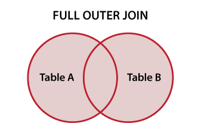
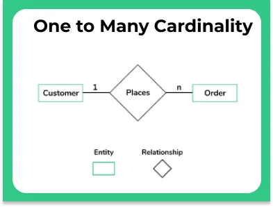
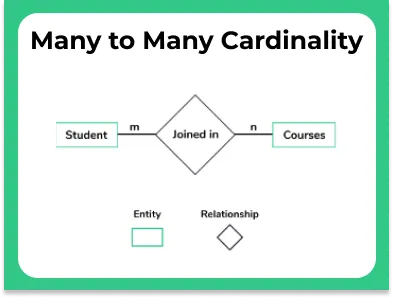
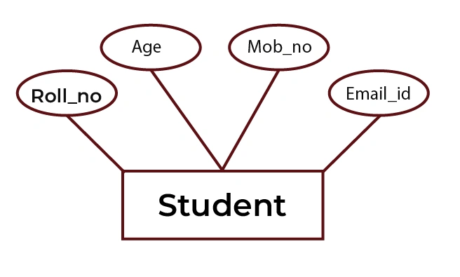
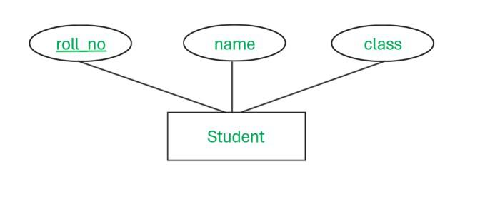

# DATABASE CONCEPTS - NOTES PART 1

In the context of database software, data is stored in a persistent medium. It can be retrieved as and when required.

Prior to database software, data was stored in the **Flat File System (FFS)**.

A **delimiter** was used to separate fields within these files.

## Properties of Flat File System:

1. The entire data is stored in a **single file**. No physical or logical division is done.
2. A heavy amount of **data redundancy** (repetition of data).
3. **Unnecessary disk space** is consumed due to redundant data.
4. **More processing time** is required for data retrieval and manipulation.
5. No support for **data types** (only text data was stored).
6. No inherent support for **data validation** (e.g., ensuring a date is valid).
7. No built-in support for **data security** (no control over who can access the data).
8. Lack of a built-in **backup strategy** to safeguard data.
9. Difficult to create reports quickly. **Programming languages** were often needed to generate reports, making it challenging.
10. **Data updates** required inserting a new record. Overriding existing values wasn't feasible.
11. No easy mechanism to **delete records**.

---

**RDBMS** (Relational Database Management System) was introduced by **Dr. E.F. Codd** in the late 1970s.


## Properties of RDBMS:

1. Data is not stored in a single table or file. Use **subject- or context-specific** tables.
2. **Heavy data redundancy** is eliminated. Only a marginal amount of data, like **IDs**, may be repeated.
3. **Unnecessary disk space** usage is avoided.
4. **Processing time** is optimized, reducing overhead.
5. You don't need to enter new records for updates. You can **override existing values**.
6. **Datatype support** is provided (e.g., integer, date, varchar, etc.).
7. Inherent support for **data validation** (ensuring data meets specific criteria).
8. Inherent support for **data security** (restricting access to authorized users).
9. Inherent support for a **backup strategy** (this may vary depending on the database).
10. Provides an easy mechanism to **generate reports** without relying on programming languages.
11. **Simple mechanisms** are available for **deleting records**.

---

## SQL

1. **RDBMS** is a framework.
2. **SQL** implements RDBMS through **scripting**.
3. SQL is a **fourth-generation language (4GL)**.
4. It is based on **English-like syntax**.
5. **SQL keywords** are **not case-sensitive**.
6. No coding knowledge is required for basic queries.
7. **Data validation** can be done easily using SQL.

## ANSI SQL:

1. SQL syntaxes are **common across all databases**.
2. **Supported by all DBMS** platforms.

---


## Data Integrity Rules:

1. **Primary Key (PK)**: A value or set of values that uniquely identifies a record in the SQL database table.
   - It must be **unique**.
   - It **cannot** be **blank** or **NULL**.
   - There can be **only one PK per table**.

2. **Unique Key (UK)**: The value must be **unique** across the column.

3. **Not Null (NN)**: The value is **mandatory**; it cannot be left blank.

4. **Foreign Key (FK)**: A value that references the PK or UK of a different or the same table.
   - **FK can repeat** (e.g., a student may issue multiple books).
   - **FK can be NULL** (e.g., a book may not be issued by any student).

   `The table containing the PK is called the Parent Table (Master Table).`
   
   `The table containing the FK is called the Child Table.`

   `A table containing both FK and PK can act as both Parent and Child Table.`

5. **Check Constraint (Ch)**: Ensures that specific rules are followed for the values being entered.
   - Examples:
     - Salary must be greater than 50000.
     - City should be either Pune, Mumbai, or Bangalore.
     - Return Date must be **greater than or equal to** the Issue Date.

### Combining Data Integrity Rules for a Single Column:
1. **UK + NN**: Ensures uniqueness and that the value is mandatory.
2. **PK + Ch**: Combines uniqueness and a condition that must be met.
3. **NN + Ch**: Ensures the value is mandatory and must satisfy a condition.
4. **FK + Ch**: Ensures the foreign key follows certain validation rules.

### Composite Primary Key (Composite PK):
- A **combination of columns** that together form a unique key. The combination must be unique, though individual values in those columns may repeat.

---

## Example Tables

### Student_Master Table:
| Rollno (PK) | Name | Address | Mobile_No |
|-------------|------|---------|-----------|
| 1           | A    | Pune    | xxxxx     |
| 2           | B    | Mumbai  | rrrr      |
| 3           | C    | Pune    | tttt      |
| 4           | D    | Delhi   | tttt      |

---

### Result_Details Table:
| Rollno (FK) + (PK) | Marks |
|--------------------|-------|
| 2                  | 89    |
| 3                  | 78    |

---

### Certificate_Details Table:
| Rollno (FK from Result_Details) | Certificate_ID |
|---------------------------------|----------------|
| 2                               | C1             |
| 3                               | C2             |

---

### Additional Explanation:
- **Foreign Keys (FK)** can also act as **Primary Keys (PK)** for another table. For example, in the `Result_Details` table, `Rollno` acts as both a **Foreign Key (FK)** (referencing `Rollno` in `Student_Master`) and a **Primary Key (PK)** in the `Result_Details` table itself.

## Types of SQL Commands

1. **DDL (Data Definition Language)**: `CREATE`, `DROP`, `ALTER`
   - Focuses on the **structure of data** (defining and modifying database objects like tables, indexes, etc.).

2. **DML (Data Manipulation Language)**: `INSERT`, `UPDATE`, `DELETE`, `MERGE`
   - Focuses on the **manipulation of data** (adding, updating, or removing records in tables).

3. **DQL (Data Query Language)** OR **DRL (Data Retrieval Language)**: `SELECT`, `FROM`, `WHERE`, etc.
   - Focuses on **retrieving data** from the database using queries.

---

4. **DCL (Data Control Language)**: `GRANT`, `REVOKE`
   - Focuses on **controlling access** to data by granting or revoking permissions.

5. **TCL (Transactional Control Language)**: `COMMIT`, `ROLLBACK`
   - Manages **transactions** in the database, ensuring data consistency by committing or rolling back changes.

---

## SQL Database Structure:

1. **Client-Server Architecture**:
   - **Server**: Refers to the physical copy of the database where data is stored on a machine.
   - **Client**: Refers to the software that has the necessary networking configuration to connect and access the server remotely.

2. There will be an implicit set of **default users**, usually **DBA (Database Administrator)** users.

3. Some implicit databases are created during installation. A **database** is a collection of related data and objects like tables, views, and indexes.

4. **Editors** available for interacting with the database:
   - **CUI** (Character User Interface): Command-line interfaces like the command prompt.
   - **GUI** (Graphical User Interface): Visual tools for interacting with the database without using commands.

5. **Sample tables** are provided, often used for training purposes to help learn SQL `SELECT` commands and other operations.

6. **Service Configuration** is required to connect the database with the **operating system**.

7. Database **booting or starting** is necessary to initiate the database services.

---


```sql
SELECT user();  -- To show current user.
```

```
+----------------+
| user()         |
+----------------+
| root@localhost |
+----------------+
```

```sql
System cls; -- To clear screen.
```

```sql
SELECT user FROM mysql.user; -- To show all users.
```

```
+------------------+
| user             |
+------------------+
| mysql.infoschema |
| mysql.session    |
| mysql.sys        |
| root             |
+------------------+
```

```sql
SHOW TABLES; --To show tables.
```

```
+-----------------+
| Tables_in_mydb3 |
+-----------------+
| australia       |
| comp            |
| d               |
| dept            |
| dept1           |
| e               |
| emp             |
| emp1            |
| india           |
| mech            |
| p               |
| pcodes          |
| period          |
| rates           |
+-----------------+
```

### Display records of employees who earns sal greater than or equal to 3000.

```sql
SELECT *
FROM emp
WHERE SAL >= 3000;
```
```
+-------+-------+-----------+------+------------+------+------+--------+
| EMPNO | ENAME | JOB       | MGR  | HIREDATE   | SAL  | COMM | DEPTNO |
+-------+-------+-----------+------+------------+------+------+--------+
|  7788 | SCOTT | ANALYST   | 7566 | 1982-12-09 | 3000 | NULL |     20 |
|  7839 | KING  | PRESIDENT | NULL | 1981-11-17 | 5000 | NULL |     10 |
|  7902 | FORD  | ANALYST   | 7566 | 1981-03-06 | 3000 | NULL |     20 |
+-------+-------+-----------+------+------------+------+------+--------+
```


## Types of Compile-Time Errors in SQL:

1. **Incorrect table name or column name**.
2. **Wrong keywords** used in the SQL statement.
3. **Permission denied** to access a table or database.
4. **Tables are locked**, preventing access or modification.
5. **Tables or databases are offline** or unavailable.
6. **Cannot reach the server**, possibly due to network or configuration issues.

`Note: MySQL is super case-insensitive.`  
`Tip: Use single quotes (' ') for string values in SQL queries.`

---

### Example Queries:

- **Display clerks who earn a salary greater than 1000**:
  ```sql
  SELECT * FROM emp WHERE job = 'clerk' AND sal > 1000;

- **Select all employees with the job 'manager' or salary less than 1000**:
  
  ```sql
  SELECT * FROM emp WHERE job = 'manager' OR sal < 1000;

### Combining Different Conditions:

- **Display clerks earning less than 1000, as well as salesmen earning less than 1300**:

  ```sql
  SELECT * FROM emp 
  WHERE (job = 'clerk' AND sal < 1000) 
  OR (job = 'salesman' AND sal < 1300);

## Special SQL Operators:

1. Between (Range of values)
```sql
SELECT *
FROM emp 
WHERE sal BETWEEN 1250 AND 3000;
```

  NOT BETWEEN
```sql
SELECT *
FROM emp 
WHERE sal NOT BETWEEN 1250 AND 3000;
```

2. IN Operator (Used to filter rows by checking if a value matches any value in a given list)
```sql
SELECT * FROM emp
WHERE job IN ('CLERK', 'MANAGER');
```

  NOT IN Operator
```sql
SELECT * FROM emp
WHERE job NOT IN ('CLERK', 'MANAGER');
```

3. IS NULL (Used to show records where a column value is null)
```SQL
SELECT * FROM emp
WHERE comm IS NULL;
```

IS NOT NULL
```SQL
SELECT * FROM emp
WHERE comm is NOT NULL;
```

## Pattern Matching Operators of SQL:

### Two Wildcard Characters:
- **Percentage (%)**: Represents zero or more characters.
- **Underscore (_)**: Represents a single character.

---

### Display Records that Start with 'S':
```sql
SELECT * 
FROM emp 
WHERE ename LIKE 'S%';
```
```
+-------+-------+---------+------+------------+------+------+--------+
| EMPNO | ENAME | JOB     | MGR  | HIREDATE   | SAL  | COMM | DEPTNO |
+-------+-------+---------+------+------------+------+------+--------+
|  7369 | SMITH | CLERK   | 7902 | 1980-12-17 |  800 | NULL |     20 |
|  7788 | SCOTT | ANALYST | 7566 | 1982-12-09 | 3000 | NULL |     20 |
+-------+-------+---------+------+------------+------+------+--------+
```
## Display Records that ends with 'R'
```sql
SELECT *
FROM emp
WHERE ename LIKE '%R';
```
```
+-------+--------+----------+------+------------+------+------+--------+
| EMPNO | ENAME  | JOB      | MGR  | HIREDATE   | SAL  | COMM | DEPTNO |
+-------+--------+----------+------+------------+------+------+--------+
|  7844 | TURNER | SALESMAN | 7698 | 1981-08-09 | 1500 |    0 |     30 |
|  7934 | MILLER | CLERK    | 7782 | 1982-01-23 | 1300 | NULL |     10 |
+-------+--------+----------+------+------------+------+------+--------+
```
### Command: Display Records with Specific Pattern Matching Using Underscore

This SQL command retrieves all records from the `PCODES` table where the `CODE` column matches the pattern `'pq_%01'`. The `LIKE` operator is used with the underscore (`_`) wildcard to match exactly one character in the third position.

Example:
```sql
SELECT * 
FROM PCODES 
WHERE CODE LIKE 'pq_%01';
```
```
+-------+------+
| Code  | Qty  |
+-------+------+
| PQR01 |   29 |
+-------+------+
```

## ESCAPE OPERATOR

The `ESCAPE` operator allows you to define an escape character, which can be used to treat special wildcard characters (like `%` and `_`) as literal characters in pattern matching.

```SQL
SELECT *
FROM pcodes
WHERE code LIKE 'A?%C01' ESCAPE '?';
```

In this query:

- The **?** is defined as the escape character.
- The **%** after the escape character **?** is treated as a literal **%**, not as a wildcard.

## COLUMN ALIASES

Column aliases are used to temporarily rename a column heading in the result set of an SQL query. This is particularly useful for improving readability or when working with complex expressions.

```sql
SELECT ename AS "Name Of Employee",
sal AS "Salary"
FROM emp;
```
```
+------------------+--------+
| Name Of Employee | Salary |
+------------------+--------+
| SMITH            |    800 |
| ALLEN            |   1600 |
| WARD             |   1250 |
| JONES            |   2975 |
| MARTIN           |   1250 |
| BLAKE            |   2850 |
| CLARK            |   2450 |
| SCOTT            |   3000 |
| KING             |   5000 |
| TURNER           |   1500 |
| ADAMS            |   1100 |
| JAMES            |    950 |
| FORD             |   3000 |
| MILLER           |   1300 |
+------------------+--------+
```

## ORDER BY (Sorting)

The `ORDER BY` clause is used to sort the result set of a query by one or more columns. Sorting can be done in ascending (default) or descending order.

### Syntax:
```sql
SELECT column1, column2, ...
FROM table_name
ORDER BY column1 [ASC|DESC], column2 [ASC|DESC], ...;
```

- **ASC**: Sorts the data in ascending order (smallest to largest). This is the default.

- **DESC**: Sorts the data in descending order (largest to smallest).

- You can sort by multiple columns by separating them with commas.

### Notes:
- Sorting can be performed on numeric, string, or date columns.
- You can sort by columns that are not selected in the result set.

```sql
SELECT * FROM emp
ORDER BY sal DESC;
```
```
+-------+--------+-----------+------+------------+------+------+--------+
| EMPNO | ENAME  | JOB       | MGR  | HIREDATE   | SAL  | COMM | DEPTNO |
+-------+--------+-----------+------+------------+------+------+--------+
|  7839 | KING   | PRESIDENT | NULL | 1981-11-17 | 5000 | NULL |     10 |
|  7788 | SCOTT  | ANALYST   | 7566 | 1982-12-09 | 3000 | NULL |     20 |
|  7902 | FORD   | ANALYST   | 7566 | 1981-03-06 | 3000 | NULL |     20 |
|  7566 | JONES  | MANAGER   | 7839 | 1981-04-02 | 2975 | NULL |     20 |
|  7698 | BLAKE  | MANAGER   | 7839 | 1981-05-01 | 2850 | NULL |     30 |
|  7782 | CLARK  | MANAGER   | 7839 | 1981-06-08 | 2450 | NULL |     10 |
|  7499 | ALLEN  | SALESMAN  | 7698 | 1981-05-20 | 1600 |  300 |     30 |
|  7844 | TURNER | SALESMAN  | 7698 | 1981-08-09 | 1500 |    0 |     30 |
|  7934 | MILLER | CLERK     | 7782 | 1982-01-23 | 1300 | NULL |     10 |
|  7521 | WARD   | SALESMAN  | 7698 | 1981-05-22 | 1250 |  500 |     30 |
|  7654 | MARTIN | SALESMAN  | 7698 | 1981-09-20 | 1250 | 1400 |     30 |
|  7876 | ADAMS  | CLERK     | 7788 | 1983-12-01 | 1100 | NULL |     20 |
|  7900 | JAMES  | CLERK     | 7698 | 1981-12-03 |  950 | NULL |     30 |
|  7369 | SMITH  | CLERK     | 7902 | 1980-12-17 |  800 | NULL |     20 |
+-------+--------+-----------+------+------------+------+------+--------+
```

## ORDER BY (Multiple Column Sorting)

The `ORDER BY` clause can be used to sort the result set by multiple columns. When sorting by multiple columns, the rows are first sorted by the first column specified, and then by the subsequent columns.

### Syntax:
```sql
SELECT column1, column2, ...
FROM table_name
ORDER BY column1 [ASC|DESC], column2 [ASC|DESC], ...;
```

- **Primary Sort**: The first column in the `ORDER BY` clause.

- **Secondary Sort**: The second column (and subsequent columns) that the result set is sorted by if there are ties in the primary sort.

### Notes:
- The sorting order for each column can be specified independently (ascending or descending).
- Multiple columns allow for more refined sorting, with the first column being sorted first, followed by subsequent columns.

```sql
SELECT DEPTNO, ENAME, SAL
FROM EMP
ORDER BY DEPTNO, SAL DESC;
```
```
+--------+--------+------+
| DEPTNO | ENAME  | SAL  |
+--------+--------+------+
|     10 | KING   | 5000 |
|     10 | CLARK  | 2450 |
|     10 | MILLER | 1300 |
|     20 | SCOTT  | 3000 |
|     20 | FORD   | 3000 |
|     20 | JONES  | 2975 |
|     20 | ADAMS  | 1100 |
|     20 | SMITH  |  800 |
|     30 | BLAKE  | 2850 |
|     30 | ALLEN  | 1600 |
|     30 | TURNER | 1500 |
|     30 | WARD   | 1250 |
|     30 | MARTIN | 1250 |
|     30 | JAMES  |  950 |
+--------+--------+------+
```

## ALIAS with ORDER BY

You can use column aliases in the `ORDER BY` clause to sort the result set based on the renamed columns. This improves readability and makes it easier to reference columns, especially when using complex expressions or calculations in the `SELECT` statement.

### Syntax:
```sql
SELECT column_name AS alias_name
FROM table_name
ORDER BY alias_name [ASC|DESC];
```
### Notes:
- Column aliases can be used in the `ORDER BY` clause even if the original column name is complex or derived from an expression.
- Aliases used in `ORDER BY` help in making queries more readable and easier to maintain.
- Aliases can include spaces or special characters, but they must be enclosed in double quotes (`" "`).

```sql
SELECT ENAME AS Name,
SAL AS Salary,
DEPTNO FROM EMP
ORDER BY Name;
```
```
+--------+--------+--------+
| Name   | Salary | DEPTNO |
+--------+--------+--------+
| ADAMS  |   1100 |     20 |
| ALLEN  |   1600 |     30 |
| BLAKE  |   2850 |     30 |
| CLARK  |   2450 |     10 |
| FORD   |   3000 |     20 |
| JAMES  |    950 |     30 |
| JONES  |   2975 |     20 |
| KING   |   5000 |     10 |
| MARTIN |   1250 |     30 |
| MILLER |   1300 |     10 |
| SCOTT  |   3000 |     20 |
| SMITH  |    800 |     20 |
| TURNER |   1500 |     30 |
| WARD   |   1250 |     30 |
+--------+--------+--------+
```

## ORDER BY Column Number

In SQL, you can also use the column number (position) in the `ORDER BY` clause to specify the sort order. This is an alternative to specifying the actual column names or aliases. The column number refers to the position of the column in the `SELECT` list.

### Syntax:
```sql
SELECT column1, column2, ...
FROM table_name
ORDER BY column_position [ASC|DESC];
```
- **column_position**: The number representing the position of the column in the `SELECT` statement (starting from 1).

- This method can be useful when you want to sort by a column that is difficult to reference by name, or when using complex calculations.

### Notes:
- Using the column number can make the query less readable, so it’s generally recommended to use column names or aliases.
- The column numbers must correspond to the order of columns in the `SELECT` clause, starting from 1.
- If you change the column order in the `SELECT` clause, make sure to adjust the column number accordingly in the `ORDER BY` clause.

```sql
SELECT * FROM EMP
ORDER BY 3;
```
```
+-------+--------+-----------+------+------------+------+------+--------+
| EMPNO | ENAME  | JOB       | MGR  | HIREDATE   | SAL  | COMM | DEPTNO |
+-------+--------+-----------+------+------------+------+------+--------+
|  7788 | SCOTT  | ANALYST   | 7566 | 1982-12-09 | 3000 | NULL |     20 |
|  7902 | FORD   | ANALYST   | 7566 | 1981-03-06 | 3000 | NULL |     20 |
|  7369 | SMITH  | CLERK     | 7902 | 1980-12-17 |  800 | NULL |     20 |
|  7876 | ADAMS  | CLERK     | 7788 | 1983-12-01 | 1100 | NULL |     20 |
|  7900 | JAMES  | CLERK     | 7698 | 1981-12-03 |  950 | NULL |     30 |
|  7934 | MILLER | CLERK     | 7782 | 1982-01-23 | 1300 | NULL |     10 |
|  7566 | JONES  | MANAGER   | 7839 | 1981-04-02 | 2975 | NULL |     20 |
|  7698 | BLAKE  | MANAGER   | 7839 | 1981-05-01 | 2850 | NULL |     30 |
|  7782 | CLARK  | MANAGER   | 7839 | 1981-06-08 | 2450 | NULL |     10 |
|  7839 | KING   | PRESIDENT | NULL | 1981-11-17 | 5000 | NULL |     10 |
|  7499 | ALLEN  | SALESMAN  | 7698 | 1981-05-20 | 1600 |  300 |     30 |
|  7521 | WARD   | SALESMAN  | 7698 | 1981-05-22 | 1250 |  500 |     30 |
|  7654 | MARTIN | SALESMAN  | 7698 | 1981-09-20 | 1250 | 1400 |     30 |
|  7844 | TURNER | SALESMAN  | 7698 | 1981-08-09 | 1500 |    0 |     30 |
+-------+--------+-----------+------+------------+------+------+--------+
```

## Column Expressions or Derived Columns in the Projections

In SQL, column expressions or derived columns refer to the use of expressions in the `SELECT` clause to compute values based on the existing data. These computed values can be returned as part of the result set.

### Syntax:
```sql
SELECT expression AS alias_name
FROM table_name;
```
- **expression**: Any calculation or combination of columns, constants, operators, and functions that results in a new derived value.

- **alias_name**: The optional name given to the derived column for easier reference.

### Examples of Column Expressions:
- Arithmetic operations (e.g., `sal * 12` to calculate annual salary).
- String concatenation (e.g., `fname || ' ' || lname` to combine first and last names).
- Functions like `UPPER()`, `LOWER()`, `ROUND()`, `SUBSTRING()`, etc.

### Notes:
- Aliases can be used to provide meaningful names for derived columns.
- Derived columns can be referenced in the `ORDER BY` clause using either the expression or its alias.

```sql
SELECT ENAME, SAL, SAL * 12 FROM EMP;
```
```
+--------+------+----------+
| ENAME  | SAL  | SAL * 12 |
+--------+------+----------+
| SMITH  |  800 |     9600 |
| ALLEN  | 1600 |    19200 |
| WARD   | 1250 |    15000 |
| JONES  | 2975 |    35700 |
| MARTIN | 1250 |    15000 |
| BLAKE  | 2850 |    34200 |
| CLARK  | 2450 |    29400 |
| SCOTT  | 3000 |    36000 |
| KING   | 5000 |    60000 |
| TURNER | 1500 |    18000 |
| ADAMS  | 1100 |    13200 |
| JAMES  |  950 |    11400 |
| FORD   | 3000 |    36000 |
| MILLER | 1300 |    15600 |
+--------+------+----------+
```
```sql
SELECT ENAME, SAL, SAL * 12 AS "Annual Salary" FROM EMP;
```
```
+--------+------+---------------+
| ENAME  | SAL  | Annual Salary |
+--------+------+---------------+
| SMITH  |  800 |          9600 |
| ALLEN  | 1600 |         19200 |
| WARD   | 1250 |         15000 |
| JONES  | 2975 |         35700 |
| MARTIN | 1250 |         15000 |
| BLAKE  | 2850 |         34200 |
| CLARK  | 2450 |         29400 |
| SCOTT  | 3000 |         36000 |
| KING   | 5000 |         60000 |
| TURNER | 1500 |         18000 |
| ADAMS  | 1100 |         13200 |
| JAMES  |  950 |         11400 |
| FORD   | 3000 |         36000 |
| MILLER | 1300 |         15600 |
+--------+------+---------------+
```

## Types of BUILT-IN SQL Functions as per their execution:

1. **Single Row Functions (Scalar Functions)**: 
   - These functions operate on a single row and return one result per row.
   - Examples: `UPPER()`, `LOWER()`, `ROUND()`, `LENGTH()`, `SUBSTRING()`, etc.

2. **Multi Row Functions (Aggregate Functions or Group Functions)**: 
   - These functions operate on multiple rows and return a single result for a group of rows.
   - Examples: `SUM()`, `COUNT()`, `AVG()`, `MAX()`, `MIN()`, etc.

### **Single Row Functions**: 
   - These functions return one result for each row in the result set. 
   - They operate on individual row values and can modify or return values based on specific operations or calculations.

   Examples include:
   - **UPPER()**: Converts a string to uppercase.
   - **LOWER()**: Converts a string to lowercase.
   - **ROUND()**: Rounds a number to a specified number of decimal places.
   - **LENGTH()**: Returns the length of a string.

```sql
SELECT ENAME, LOWER(ENAME) FROM EMP;
```
```
+--------+--------------+
| ENAME  | LOWER(ENAME) |
+--------+--------------+
| SMITH  | smith        |
| ALLEN  | allen        |
| WARD   | ward         |
| JONES  | jones        |
| MARTIN | martin       |
| BLAKE  | blake        |
| CLARK  | clark        |
| SCOTT  | scott        |
| KING   | king         |
| TURNER | turner       |
| ADAMS  | adams        |
| JAMES  | james        |
| FORD   | ford         |
| MILLER | miller       |
+--------+--------------+
```
```sql
SELECT 5 + NULL;
```
```
+----------+
| 5 + NULL |
+----------+
|     NULL |
+----------+
```
```sql
SELECT ENAME, SAL, COMM, SAL + COMM AS "Total" FROM EMP;
```
```
+--------+------+------+-------+
| ENAME  | SAL  | COMM | Total |
+--------+------+------+-------+
| SMITH  |  800 | NULL |  NULL |
| ALLEN  | 1600 |  300 |  1900 |
| WARD   | 1250 |  500 |  1750 |
| JONES  | 2975 | NULL |  NULL |
| MARTIN | 1250 | 1400 |  2650 |
| BLAKE  | 2850 | NULL |  NULL |
| CLARK  | 2450 | NULL |  NULL |
| SCOTT  | 3000 | NULL |  NULL |
| KING   | 5000 | NULL |  NULL |
| TURNER | 1500 |    0 |  1500 |
| ADAMS  | 1100 | NULL |  NULL |
| JAMES  |  950 | NULL |  NULL |
| FORD   | 3000 | NULL |  NULL |
| MILLER | 1300 | NULL |  NULL |
+--------+------+------+-------+
```

### IFNULL Function

The `IFNULL` function in SQL is used to return an alternate value or expression if the first parameter is `NULL`. If the first parameter is not `NULL`, it will return the original value.

#### Syntax:
```sql
IFNULL(column_name_or_expression, value_or_expression_if_null)
```
- **column_name_or_expression**: The column or expression to be evaluated.

- **value_or_expression_if_null**: The value or expression returned if the first parameter is `NULL`.

### Example:
```sql
SELECT IFNULL(comm, 0) AS commission
FROM emp;
```

This query will return `0` in place of `NULL` values in the `comm` column.

```sql
SELECT ENAME, SAL, COMM, SAL + ifnull (COMM,0) AS "Total" FROM EMP;
```
```
+--------+------+------+-------+
| ENAME  | SAL  | COMM | Total |
+--------+------+------+-------+
| SMITH  |  800 | NULL |   800 |
| ALLEN  | 1600 |  300 |  1900 |
| WARD   | 1250 |  500 |  1750 |
| JONES  | 2975 | NULL |  2975 |
| MARTIN | 1250 | 1400 |  2650 |
| BLAKE  | 2850 | NULL |  2850 |
| CLARK  | 2450 | NULL |  2450 |
| SCOTT  | 3000 | NULL |  3000 |
| KING   | 5000 | NULL |  5000 |
| TURNER | 1500 |    0 |  1500 |
| ADAMS  | 1100 | NULL |  1100 |
| JAMES  |  950 | NULL |   950 |
| FORD   | 3000 | NULL |  3000 |
| MILLER | 1300 | NULL |  1300 |
+--------+------+------+-------+
```

## COALESCE Function

The `COALESCE` function in SQL returns the first non-NULL value from a list of expressions. It is commonly used to handle `NULL` values by providing an alternative in case all values are `NULL`.

### Syntax:
```sql
COALESCE(expression1, expression2, ..., expressionN)
```
- **expression1, expression2, ..., expressionN**: The list of expressions to be evaluated in order. The function returns the first non-NULL value in this list.

### Example:
```sql
SELECT COALESCE(comm, bonus, 0) AS final_value
FROM emp;
```

This query will return the value from `comm` if it is not `NULL`. If `comm` is `NULL`, it will check `bonus`. If both are `NULL`, it will return `0`.

```sql
SELECT ENAME, SAL, COMM, SAL + coalesce(COMM,0) AS "Total" FROM EMP;
```
```
+--------+------+------+-------+
| ENAME  | SAL  | COMM | Total |
+--------+------+------+-------+
| SMITH  |  800 | NULL |   800 |
| ALLEN  | 1600 |  300 |  1900 |
| WARD   | 1250 |  500 |  1750 |
| JONES  | 2975 | NULL |  2975 |
| MARTIN | 1250 | 1400 |  2650 |
| BLAKE  | 2850 | NULL |  2850 |
| CLARK  | 2450 | NULL |  2450 |
| SCOTT  | 3000 | NULL |  3000 |
| KING   | 5000 | NULL |  5000 |
| TURNER | 1500 |    0 |  1500 |
| ADAMS  | 1100 | NULL |  1100 |
| JAMES  |  950 | NULL |   950 |
| FORD   | 3000 | NULL |  3000 |
| MILLER | 1300 | NULL |  1300 |
+--------+------+------+-------+
```
```sql
SELECT COALESCE(null, null, 78, null, 76, null, 54);
```
```
+----------------------------------------------+
| COALESCE(null, null, 78, null, 76, null, 54) |
+----------------------------------------------+
|                                           78 |
+----------------------------------------------+
```

## Conditional Function: CASE

The `CASE` function is an ANSI SQL conditional function that can be used for conditional logic similar to a switch-case or if-else statement in programming. It allows you to return specific values based on conditions.

### Types of CASE:

1. **Switch (Based on Values)**:
   - This type of `CASE` checks for specific values and returns a corresponding result.

2. **If-else, If...-Else (Based on Boolean Conditions)**:
   - This type of `CASE` is based on evaluating boolean conditions, returning results accordingly.

### Syntax (Switch Based on Values):
```sql
SELECT CASE column_name
    WHEN value1 THEN result1
    WHEN value2 THEN result2
    ELSE default_result
END AS alias_name
FROM table_name;
```

### Syntax (If-Else Based on Conditions):
```sql
SELECT CASE
    WHEN condition1 THEN result1
    WHEN condition2 THEN result2
    ELSE default_result
END AS alias_name
FROM table_name;
```

Notes:
The `CASE` function ensures more complex conditional logic directly within your SQL queries.
It helps in writing cleaner and more readable SQL code when conditional evaluation is needed.

```sql
SELECT ename,
    deptno,
    case deptno
        when 10 then 'A'
        when 20 then 'B'
        else
        'C'
    end as "Deptno Grade"
from emp;
```
```
+--------+--------+--------------+
| ename  | deptno | Deptno Grade |
+--------+--------+--------------+
| SMITH  |     20 | B            |
| ALLEN  |     30 | C            |
| WARD   |     30 | C            |
| JONES  |     20 | B            |
| MARTIN |     30 | C            |
| BLAKE  |     30 | C            |
| CLARK  |     10 | A            |
| SCOTT  |     20 | B            |
| KING   |     10 | A            |
| TURNER |     30 | C            |
| ADAMS  |     20 | B            |
| JAMES  |     30 | C            |
| FORD   |     20 | B            |
| MILLER |     10 | A            |
+--------+--------+--------------+
```

```
Display ename, sal and salary class.
Salary class should be High if sal is >= 2700
It should be medium if sal >= 1800
else if should be "Low"
```
```sql
SELECT ename, sal,
    case
        when sal >= 2700 then 'High'
        when sal >= 1800 then 'Medium'
        else
        'Low'
    end as "Salary Class"
from emp;
```
```
+--------+------+--------------+
| ename  | sal  | Salary Class |
+--------+------+--------------+
| SMITH  |  800 | Low          |
| ALLEN  | 1600 | Low          |
| WARD   | 1250 | Low          |
| JONES  | 2975 | High         |
| MARTIN | 1250 | Low          |
| BLAKE  | 2850 | High         |
| CLARK  | 2450 | Medium       |
| SCOTT  | 3000 | High         |
| KING   | 5000 | High         |
| TURNER | 1500 | Low          |
| ADAMS  | 1100 | Low          |
| JAMES  |  950 | Low          |
| FORD   | 3000 | High         |
| MILLER | 1300 | Low          |
+--------+------+--------------+
```

`Aliases should be enclosed in Double Inverted Commas and the Condition Output in Single Inverted Commas.'`

```sql
SELECT ename, sal,
    case
         when sal between 2001 and 3000 then 'A'
         when sal between 1001 and 2000 then 'B'
         when sal between 3001 and 5000 then 'c'
    else
    'D'
    end
    as "salary Class"
    From emp;
```
```
+--------+------+--------------+
| ename  | sal  | salary Class |
+--------+------+--------------+
| SMITH  |  800 | D            |
| ALLEN  | 1600 | B            |
| WARD   | 1250 | B            |
| JONES  | 2975 | A            |
| MARTIN | 1250 | B            |
| BLAKE  | 2850 | A            |
| CLARK  | 2450 | A            |
| SCOTT  | 3000 | A            |
| KING   | 5000 | c            |
| TURNER | 1500 | B            |
| ADAMS  | 1100 | B            |
| JAMES  |  950 | D            |
| FORD   | 3000 | A            |
| MILLER | 1300 | B            |
+--------+------+--------------+
```

## CONCAT Function

The `CONCAT` function in SQL is used to concatenate two or more strings into one string.

### Syntax:
```sql
SELECT CONCAT(string1, string2, ..., stringN) AS alias_name
FROM table_name;
```
string1, string2, ..., stringN: These are the strings (or columns) that you want to concatenate.

alias_name: The optional name given to the concatenated result.

### Example:
```sql
SELECT CONCAT(first_name, ' ', last_name) AS "Full Name"
FROM employees;
```

This query will concatenate the `first_name` and `last_name` columns with a space in between and display the result as "Full Name".

### Notes:
- The `CONCAT` function can take two or more arguments.
- If any argument is `NULL`, `CONCAT` will return the non-null values. If all arguments are `NULL`, it will return `NULL`.

```sql
 SELECT CONCAT('mysql', 'cdac');
```
```
+-------------------------+
| CONCAT('mysql', 'cdac') |
+-------------------------+
| mysqlcdac               |
+-------------------------+
```

```sql
SELECT CONCAT('mysql', 'cdac', 'DBDA');
```
```
+---------------------------------+
| CONCAT('mysql', 'cdac', 'DBDA') |
+---------------------------------+
| mysqlcdacDBDA                   |
+---------------------------------+
```
```sql
SELECT CONCAT(ename, job) from emp;
```
```
+--------------------+
| CONCAT(ename, job) |
+--------------------+
| SMITHCLERK         |
| ALLENSALESMAN      |
| WARDSALESMAN       |
| JONESMANAGER       |
| MARTINSALESMAN     |
| BLAKEMANAGER       |
| CLARKMANAGER       |
| SCOTTANALYST       |
| KINGPRESIDENT      |
| TURNERSALESMAN     |
| ADAMSCLERK         |
| JAMESCLERK         |
| FORDANALYST        |
| MILLERCLERK        |
+--------------------+
```

```sql
SELECT CONCAT('Dear ', ENAME, ', Your salary is: ', SAL) AS "SALARY DETAILS" FROM emp;
```
```
+-----------------------------------+
| SALARY DETAILS                    |
+-----------------------------------+
| Dear SMITH, Your salary is: 800   |
| Dear ALLEN, Your salary is: 1600  |
| Dear WARD, Your salary is: 1250   |
| Dear JONES, Your salary is: 2975  |
| Dear MARTIN, Your salary is: 1250 |
| Dear BLAKE, Your salary is: 2850  |
| Dear CLARK, Your salary is: 2450  |
| Dear SCOTT, Your salary is: 3000  |
| Dear KING, Your salary is: 5000   |
| Dear TURNER, Your salary is: 1500 |
| Dear ADAMS, Your salary is: 1100  |
| Dear JAMES, Your salary is: 950   |
| Dear FORD, Your salary is: 3000   |
| Dear MILLER, Your salary is: 1300 |
+-----------------------------------+
```

### Literal Characters
These are the characters which are repeated for every record.

```sql
select ename,sal,comm,concat(sal,coalesce(comm,'N/A'))from emp;
```
```
+--------+------+------+----------------------------------+
| ename  | sal  | comm | concat(sal,coalesce(comm,'N/A')) |
+--------+------+------+----------------------------------+
| SMITH  |  800 | NULL | 800N/A                           |
| ALLEN  | 1600 |  300 | 1600300                          |
| WARD   | 1250 |  500 | 1250500                          |
| JONES  | 2975 | NULL | 2975N/A                          |
| MARTIN | 1250 | 1400 | 12501400                         |
| BLAKE  | 2850 | NULL | 2850N/A                          |
| CLARK  | 2450 | NULL | 2450N/A                          |
| SCOTT  | 3000 | NULL | 3000N/A                          |
| KING   | 5000 | NULL | 5000N/A                          |
| TURNER | 1500 |    0 | 15000                            |
| ADAMS  | 1100 | NULL | 1100N/A                          |
| JAMES  |  950 | NULL | 950N/A                           |
| FORD   | 3000 | NULL | 3000N/A                          |
| MILLER | 1300 | NULL | 1300N/A                          |
+--------+------+------+----------------------------------+
```

## Create Table

```sql
CREATE TABLE Customer_Master
    (CustID Int Primary Key,
    CustName Varchar(40)Not NULL,
    CustDeposit Int Check(CustDeposit >=500),
    CustInvoice Varchar(10) Unique);

desc Customer_Master;
```
```
+-------------+-------------+------+-----+---------+-------+
| Field       | Type        | Null | Key | Default | Extra |
+-------------+-------------+------+-----+---------+-------+
| CustID      | int         | NO   | PRI | NULL    |       |
| CustName    | varchar(40) | NO   |     | NULL    |       |
| CustDeposit | int         | YES  |     | NULL    |       |
| CustInvoice | varchar(10) | YES  | UNI | NULL    |       |
+-------------+-------------+------+-----+---------+-------+
```

## INSERT INTO Table

The `INSERT INTO` statement is used to add new rows of data into a table.

### Syntax:

```sql
INSERT INTO table_name (column1, column2, column3, ...)
VALUES (value1, value2, value3, ...);
```

### Notes:
- You can specify the column names in the `INSERT INTO` statement. If you omit the column names, the values must be listed in the same order as the columns in the table.
- You must provide a value for every `NOT NULL` column.


```sql
INSERT INTO CUSTOMER_MASTER VALUES(1, 'ABC', 700, 'INV1');
```

```sql
SELECT * FROM CUSTOMER_MASTER;
```
```
+--------+----------+-------------+-------------+
| CustID | CustName | CustDeposit | CustInvoice |
+--------+----------+-------------+-------------+
|      1 | ABC      |         700 | INV1        |
+--------+----------+-------------+-------------+
```

We can also insert value by just specifying the column names.

# Foreign Key

A **Foreign Key (FK)** is a field (or collection of fields) in one table that refers to the **Primary Key (PK)** in another table. The foreign key establishes a relationship between two tables.

### Key Points:
- The table containing the foreign key is known as the **Child Table**.
- The table with the primary key referenced by the foreign key is called the **Parent Table**.
- Foreign keys can accept duplicate values and `NULL` values unless otherwise restricted.

### Syntax:

```sql
CREATE TABLE ChildTable (
    column1 datatype,
    column2 datatype,
    FOREIGN KEY (column_name) REFERENCES ParentTable (primary_key_column)
);
```

### Notes:
- A **foreign key** ensures referential integrity of the data in one table to match values in another table.
- It prevents actions that would destroy the links between tables.

```sql
CREATE TABLE CUSTOMER_TRANSACTION
(CustID INT REFERENCES CUSTOMER_MASTER,
CustAmount INT);
```
```sql
DESCRIBE CUSTOMER_TRANSACTION;
```
```
+------------+------+------+-----+---------+-------+
| Field      | Type | Null | Key | Default | Extra |
+------------+------+------+-----+---------+-------+
| CustID     | int  | YES  |     | NULL    |       |
| CustAmount | int  | YES  |     | NULL    |       |
+------------+------+------+-----+---------+-------+
```

```sql
SELECT * FROM CUSTOMER_TRANSACTION;
```
```
+--------+------------+
| CustID | CustAmount |
+--------+------------+
|     78 |        600 |
+--------+------------+
```

### Foreign Key Definition

- **Foreign Key** should be initialized at the table level, i.e., while creating the table.

```sql
Constraint FK Foreign Key(CustID) References CUSTOMER_MASTER(CustID);
```

Syntax for adding a foreign key constraint:

```sql
Constraint Constraint_Name Foreign Key(Column_name_of_child_table)
References Parent_Table_Name (Column_name_of_parent_table);
```

## COMPOSITE PRIMARY KEY
A **Composite Primary Key** is a primary key that consists of two or more columns.
```sql
CREATE TABLE orders
    (orderid varchar(10),
    itemid varchar(10),
    qty int,
    rate int,
    Primary Key (orderid, itemid)
    );

INSERT INTO orders
    VALUES('o1', 'i1', 10, 100);

SELECT * FROM orders;
```
```
+---------+--------+------+------+
| orderid | itemid | qty  | rate |
+---------+--------+------+------+
| o1      | i1     |   10 |  100 |
+---------+--------+------+------+
```

## CHECK CONSTRAINT AT TABLE LEVEL:

### Column Level Check Constraint:
A check constraint applied directly to a single column.

```sql
CREATE TABLE t2
    (a int,
    b int,
    c int,
    d int check(d > c)
    );
```
This defines a **column-level** constraint on the column `d`, ensuring that `d > c`.

---

### Table Level Check Constraint:
A check constraint applied at the **table level**, typically after all column definitions.

```sql
CREATE TABLE t2
    (a int,
    b int,
    c int,
    d int, check(d > c)
    );
```

This is a **table-level** constraint, ensuring that `d > c` is enforced across the table.

---

### Important Notes:
- **Constraints** should be added at the **table level** for consistency and flexibility.
- The **NOT NULL** constraint can only be defined at the **column level**.


## CHAR vs VARCHAR

| **Feature**               | **CHAR**                                 | **VARCHAR**                         |
|---------------------------|------------------------------------------|-------------------------------------|
| **Meaning**               | Fixed Length                             | Varying Length                      |
| **Storage Efficiency**     | Takes fixed space even for shorter data  | Space-efficient (only uses required space) |
| **Data Retrieval Speed**   | Faster retrieval                         | Slower compared to CHAR             |
| **Max Size**               | 255 characters                           | 16,383 characters (depends on version) |
| **Space Utilization**      | Less efficient (fixed-size storage)      | More efficient (space-saving for variable lengths) |
| **Size Variability**       | Fixed size, regardless of content length | Adjusts size based on content length |
| **Max Size Variability**   | Fixed at 255                             | Depends on version, generally much larger |


## DATE FUNCTION

```sql
SELECT ENAME,
    HIREDATE,
    YEAR(HIREDATE) AS "Year",
    MONTH(HIREDATE) AS "Month",
    DAY(HIREDATE) AS "Date"
    FROM emp;
```
This query retrieves employee names (`ENAME`) along with their hire dates (`HIREDATE`). Additionally, it extracts the **year**, **month**, and **day** from the `HIREDATE` field and displays them with aliases for better readability.

- `YEAR(HIREDATE)`: Extracts the year from the `HIREDATE`.
- `MONTH(HIREDATE)`: Extracts the month from the `HIREDATE`.
- `DAY(HIREDATE)`: Extracts the day from the `HIREDATE`.

```
+--------+------------+------+-------+------+
| ENAME  | HIREDATE   | Year | Month | Date |
+--------+------------+------+-------+------+
| SMITH  | 1980-12-17 | 1980 |    12 |   17 |
| ALLEN  | 1981-05-20 | 1981 |     5 |   20 |
| WARD   | 1981-05-22 | 1981 |     5 |   22 |
| JONES  | 1981-04-02 | 1981 |     4 |    2 |
| MARTIN | 1981-09-20 | 1981 |     9 |   20 |
| BLAKE  | 1981-05-01 | 1981 |     5 |    1 |
| CLARK  | 1981-06-08 | 1981 |     6 |    8 |
| SCOTT  | 1982-12-09 | 1982 |    12 |    9 |
| KING   | 1981-11-17 | 1981 |    11 |   17 |
| TURNER | 1981-08-09 | 1981 |     8 |    9 |
| ADAMS  | 1983-12-01 | 1983 |    12 |    1 |
| JAMES  | 1981-12-03 | 1981 |    12 |    3 |
| FORD   | 1981-03-06 | 1981 |     3 |    6 |
| MILLER | 1982-01-23 | 1982 |     1 |   23 |
+--------+------------+------+-------+------+
```

### Display employees joined in 1983

```sql
SELECT *
    FROM emp
    WHERE YEAR(HIREDATE) = 1983;
```
```
+-------+-------+-------+------+------------+------+------+--------+
| EMPNO | ENAME | JOB   | MGR  | HIREDATE   | SAL  | COMM | DEPTNO |
+-------+-------+-------+------+------------+------+------+--------+
|  7876 | ADAMS | CLERK | 7788 | 1983-12-01 | 1100 | NULL |     20 |
+-------+-------+-------+------+------------+------+------+--------+
```

`Internally, Date is treated as a numeric value in SQL.`

## Summary Queries:

ANSI SQL provides "Aggregate Functions" to summarize data values, such as:
- **SUM**: Adds up numeric values.
- **MIN**: Returns the minimum value.
- **MAX**: Returns the maximum value.
- **COUNT**: Counts the number of rows.
- **AVG**: Calculates the average value.

These functions return a single value for a group of values.

**Note**: If the `GROUP BY` clause is missing, the entire table or filtered rows become a single group.

```sql
SELECT SUM(SAL) FROM EMP;
```
```
+----------+
| SUM(SAL) |
+----------+
|    29025 |
+----------+
```

```sql
SELECT MAX(SAL) FROM EMP;
```
```
+----------+
| MAX(SAL) |
+----------+
|     5000 |
+----------+
```
```sql
SELECT MIN(SAL) FROM EMP;
```
```
+----------+
| MIN(SAL) |
+----------+
|      800 |
+----------+
```
```sql
SELECT AVG(SAL) FROM EMP;
```
```
+-----------+
| AVG(SAL)  |
+-----------+
| 2073.2143 |
+-----------+
```

### How the AVG() Function Handles NULL Values:

The `AVG()` function in SQL calculates the average of a numeric column. When there are `NULL` values in the column, it **ignores** those `NULL` values in the calculation.

- It only considers rows where the column has a non-NULL value.
- The total sum is divided by the number of non-NULL rows, not by the total number of rows.

#### Formula for Average:
`Average = (Sum of Non-NULL Values) / (Count of Non-NULL Values)`


#### Example:

Suppose we have the following data in the `COMM` column:

| EMPNO | COMM  |
|-------|-------|
| 7369  | NULL  |
| 7499  | 300   |
| 7521  | 500   |
| 7566  | NULL  |
| 7698  | 800   |

**Steps to calculate the average**:
1. Add the **non-NULL** values:  
   `300 + 500 + 800 = 1600`

2. Count the **non-NULL** values:  
   `3` values (300, 500, and 800)

3. Divide the sum by the count of non-NULL values:  
   `1600 / 3 = 533.33`

Thus, the `AVG(COMM)` will return **533.33** in this case, ignoring the `NULL` values.

#### SQL Query:
```sql
SELECT AVG(COMM) AS average_commission
FROM emp;
```
```
+--------------------+
| average_commission |
+--------------------+
| 550.0000           |
+--------------------+
```
NULL values are excluded from both the sum and the count when calculating averages, ensuring that only valid, non-NULL entries are considered.

This means that:
- The sum is calculated based only on the non-NULL values.
- The count of values is based only on the non-NULL values.
- `NULL` entries are completely ignored in the calculation of the average.

This behavior allows for accurate calculation of averages even when some data points are missing (i.e., are `NULL`).

```SQL
SELECT MAX(ENAME), MIN(ENAME) FROM EMP;
```
```
+------------+------------+
| MAX(ENAME) | MIN(ENAME) |
+------------+------------+
| WARD       | ADAMS      |
+------------+------------+
```
```SQL
SELECT MAX(HIREDATE), MIN(HIREDATE) FROM EMP;
```
```
+---------------+---------------+
| MAX(HIREDATE) | MIN(HIREDATE) |
+---------------+---------------+
| 1983-12-01    | 1980-12-17    |
+---------------+---------------+
```
```SQL
SELECT SUM(ENAME), AVG(ENAME) FROM EMP;
```
```
+------------+------------+
| SUM(ENAME) | AVG(ENAME) |
+------------+------------+
|          0 |          0 |
+------------+------------+
```

`COUNT(COLUMN_NAME)` ignores the `NULL` values if present.

- It only counts the rows where the column has a non-NULL value.
- `NULL` values are completely excluded from the count.

This ensures that the count reflects the number of meaningful entries in the column.

For example:
```sql
SELECT COUNT(COMM) 
FROM emp;
```
```
+-------------+
| COUNT(COMM) |
+-------------+
|           4 |
+-------------+
```

This query will return the count of non-NULL values in the `COMM` column.

`COUNT` is used to count rows with actual data, ignoring any `NULL` values. This makes it useful when you only want to consider valid or non-empty values for specific columns.

```SQL
SELECT COUNT(*) FROM EMP;
```
```
+----------+
| COUNT(*) |
+----------+
|       14 |
+----------+
```

`COUNT(1)` is considered to be faster than `COUNT('STRING')` and `COUNT(*)`.

- **COUNT(1)**: Counts all the rows in a table, but the "1" is a constant value for each row. It's efficient as the database engine just evaluates the constant.
  
- **COUNT('STRING')**: Counts all rows where the column contains non-null values, but using a string here can cause unnecessary evaluation overhead.

- **COUNT(*)**: Counts all rows, but involves counting every column, although most modern databases optimize this to just count rows.

Thus, `COUNT(1)` can be marginally faster due to simpler evaluation logic.

```SQL
SELECT COUNT('CDAC') FROM EMP;
```
```
+---------------+
| COUNT('CDAC') |
+---------------+
|            14 |
+---------------+
```
```SQL
SELECT COUNT(420) FROM EMP;
```
```
+------------+
| COUNT(420) |
+------------+
|         14 |
+------------+
```

### Display total of salaries of employees from job type 'Clerk'

```sql
SELECT SUM(SAL)
    FROM EMP
    WHERE JOB = 'CLERK';
```
```
+----------+
| SUM(SAL) |
+----------+
|     4150 |
+----------+
```

Above Aggregation Function (SUM) is fast, but the filtering process (WHERE clause) took more time.

The aggregation function like `SUM()` is optimized for fast execution because it only needs to add up the values, which is a simple operation. However, the filtering process (WHERE clause) takes more time because:

- **Row-by-Row Evaluation:** The filtering process checks each row in the table to see if it matches the condition (in this case, `JOB = 'CLERK'`). For large datasets, this can involve scanning a lot of rows.

- **Indexing Impact:** If the `JOB` column is not indexed, the database needs to perform a **full table scan**, checking each row individually, which is slower than reading from an indexed column.

- **Predicate Complexity:** The WHERE clause condition might involve additional overhead, such as comparing strings, which takes longer than simple arithmetic operations.

So, while the `SUM()` function itself is quick, the time-consuming part is filtering the rows before performing the aggregation. If the `JOB` column is indexed, the filtering process can be made faster.

## DISTINCT

`DISTINCT` is a clause in ANSI SQL that is used to eliminate duplicate rows from the result set.

### Syntax:
```sql
SELECT DISTINCT column1, column2, ...
FROM table_name;
```

Notes:
- `DISTINCT` applies to all selected columns, meaning the combination of values across all selected columns must be unique.
- It helps in retrieving only unique values, reducing redundancy in the result set.

```SQL
SELECT DISTINCT JOB FROM EMP;
```
```
+-----------+
| JOB       |
+-----------+
| CLERK     |
| SALESMAN  |
| MANAGER   |
| ANALYST   |
| PRESIDENT |
+-----------+
```

WHAT IF THERE ARE NULL VALUES IN THE COLUMN?

When using the `DISTINCT` clause with columns that contain `NULL` values, **`NULL` is treated as a distinct value**.

```sql
SELECT DISTINCT COMM FROM EMP;
```

The result set will include `NULL` as one of the distinct values because **`NULL` is treated as a unique entry**.

### Important Notes:
- **`NULL` is not compared with other values**; it is considered a separate, distinct entry.
- If there are multiple `NULL` values in the column, **only one `NULL`** will appear in the result set when using `DISTINCT`.

```
+------+
| COMM |
+------+
| NULL |
|  300 |
|  500 |
| 1400 |
|    0 |
+------+
```

## DISTINCT WITH MULTIPLE COLUMNS

```SQL
SELECT DISTINCT JOB, DEPTNO FROM EMP;
```
```
+-----------+--------+
| JOB       | DEPTNO |
+-----------+--------+
| CLERK     |     20 |
| SALESMAN  |     30 |
| MANAGER   |     20 |
| MANAGER   |     30 |
| MANAGER   |     10 |
| ANALYST   |     20 |
| PRESIDENT |     10 |
| CLERK     |     30 |
| CLERK     |     10 |
+-----------+--------+
```

### Important Notes:
- `DISTINCT` applies to **all columns** in the select statement.
- The uniqueness is determined by the **combination of values** across all selected columns.
- Even if individual columns have duplicate values, the result set will include **distinct combinations** of the selected columns.


## GROUP BY CLAUSE

The `GROUP BY` clause is used to arrange identical data into groups.

### Example:
```sql
SELECT JOB
FROM emp
GROUP BY JOB;
```

```
+-----------+
| JOB       |
+-----------+
| CLERK     |
| SALESMAN  |
| MANAGER   |
| ANALYST   |
| PRESIDENT |
+-----------+
```

### Notes:
- The `GROUP BY` clause groups rows that have the same values in the specified columns.
- It is typically used with **aggregate functions** (e.g., `SUM`, `COUNT`, `AVG`, etc.) to perform operations on each group of data.
- If an aggregate function is used, all columns in the `SELECT` statement must either be included in the `GROUP BY` clause or be part of an aggregate function.

## GROUP BY vs DISTINCT

### Similarity:
- Both `GROUP BY` and `DISTINCT` eliminate duplicate values from the result set.

### Differences:
- **GROUP BY** is an extension of `DISTINCT` and allows for performing **aggregations** (e.g., `SUM`, `COUNT`, `AVG`, etc.) on each distinct value or group.
- **DISTINCT** simply removes duplicates without performing any aggregation.

### Key Points:
- **GROUP BY** can aggregate values for each distinct group of data (e.g., calculating total salary for each job type).
- **DISTINCT** only removes duplicate rows and cannot perform aggregation.

### Display job wise total salaries.
```sql
SELECT JOB, SUM(SAL)
    FROM emp
    GROUP BY JOB;
```
```
+-----------+----------+
| JOB       | SUM(SAL) |
+-----------+----------+
| CLERK     |     4150 |
| SALESMAN  |     5600 |
| MANAGER   |     8275 |
| ANALYST   |     6000 |
| PRESIDENT |     5000 |
+-----------+----------+
```

### Display deptno wise employees count
```sql
SELECT DEPTNO, COUNT(*)
    FROM emp
    GROUP BY DEPTNO;
```
```
+--------+----------+
| DEPTNO | COUNT(*) |
+--------+----------+
|     20 |        5 |
|     30 |        6 |
|     10 |        3 |
+--------+----------+
```

### Display total salary for each deptno within each job type.

```sql
SELECT DEPTNO, JOB, SUM(SAL)
    FROM emp
    GROUP BY DEPTNO, JOB;
```
```
+--------+-----------+----------+
| DEPTNO | JOB       | SUM(SAL) |
+--------+-----------+----------+
|     20 | CLERK     |     1900 |
|     30 | SALESMAN  |     5600 |
|     20 | MANAGER   |     2975 |
|     30 | MANAGER   |     2850 |
|     10 | MANAGER   |     2450 |
|     20 | ANALYST   |     6000 |
|     10 | PRESIDENT |     5000 |
|     30 | CLERK     |      950 |
|     10 | CLERK     |     1300 |
+--------+-----------+----------+
```

- **Column Order in GROUP BY Clause:**
    - If the order of columns is changed in the `GROUP BY` clause, there is **no change in the output**. The grouping logic remains the same regardless of the order of the columns.

- **Aggregate Functions in SELECT:**
    - Whenever you use an aggregate function in the `SELECT` statement, the non-aggregated columns must also be included in the `GROUP BY` clause. This ensures that each unique group is calculated properly and the aggregation is done on each group.
    
    - If you don't include the non-aggregated columns in the `GROUP BY` clause, the query will likely result in an error or unexpected results.


## GROUP BY ON EXPRESSIONS

You can group data based on expressions or derived columns.

### Example:

```sql
SELECT DEPTNO, SAL + COMM AS Total_Compensation
FROM EMP
GROUP BY DEPTNO, SAL + COMM;
```

Notes:
The `GROUP BY` clause can include expressions or calculations such as `SAL + COMM`.

This allows you to group data based on the result of an expression rather than just a single column.

Each group will be based on the unique values of the expression.

### Display year wise count of employees getting hired

```sql
SELECT YEAR(HIREDATE), COUNT(*)
FROM EMP
GROUP BY YEAR(HIREDATE);
```
```
+----------------+----------+
| YEAR(HIREDATE) | COUNT(*) |
+----------------+----------+
|           1980 |        1 |
|           1981 |       10 |
|           1982 |        2 |
|           1983 |        1 |
+----------------+----------+
```

## HAVING CLAUSE

- The `WHERE` clause filters original rows of data.
- The `HAVING` clause is used to filter summarized or grouped data, typically based on **aggregate values**.

Notes:
- The `HAVING` clause is used in conjunction with the `GROUP BY` clause to filter the groups of rows returned by aggregate functions (e.g., `SUM`, `COUNT`).
- It is similar to `WHERE`, but `HAVING` operates on **aggregated data**, while `WHERE` operates on **individual rows**.

### Display deptno wise total where total > 10000

```sql
SELECT DEPTNO, SUM(SAL) AS "TOTAL" FROM emp
    GROUP BY DEPTNO
    HAVING TOTAL > 10000;
```
```
+--------+-------+
| DEPTNO | TOTAL |
+--------+-------+
|     20 | 10875 |
+--------+-------+
```

This query will return an empty result set because the `HAVING` clause filters out any groups where the `COUNT(EMPNO) > 1`. Since `EMPNO` is a unique column (no duplicates per employee number), no group will satisfy this condition.

```sql
SELECT EMPNO, MAX(SAL)
    FROM EMP
    GROUP BY EMPNO
    HAVING COUNT(EMPNO) > 1; -- No Output, but it is correct
```

Important Notes:

- The `HAVING` clause is applied **after** the grouping of data.
  
- In the `HAVING` clause, you can only refer to the columns mentioned in the `SELECT` clause or those in the `GROUP BY` clause.

## Execution Order of All 6 Clauses of a SELECT Statement

1. **FROM**: The first step is to specify the tables from which to retrieve data.

2. **WHERE**: This clause filters rows before grouping or aggregation is applied. It acts on individual rows.

3. **GROUP BY**: Groups rows that share the same values in specified columns. Used with aggregate functions.

4. **HAVING**: This filters the grouped records created by `GROUP BY`. It is applied after the aggregation.

5. **SELECT**: Specifies which columns or expressions to return, including applying aggregate functions.

6. **ORDER BY**: The last clause that sorts the result set based on one or more columns or expressions.

### Display job wise highest salaries, excluding president, for those jobs who have highest > 2800. Display output highest salary wise ascending.

### Optimized and Less Optimized Query Comparison

 The example shows two different approaches to solving the same problem, with one being more optimized than the other.
---

### Optimized Query

```sql
SELECT JOB, MAX(SAL)
FROM emp
WHERE JOB <> 'PRESIDENT' -- Filter out before grouping
GROUP BY JOB
HAVING MAX(SAL) > 2800 -- Condition on aggregated data
ORDER BY MAX(SAL); -- Sort the result by salary in ascending order
```

### Explanation:

- **WHERE Clause**: Filters out rows where `JOB` is `'PRESIDENT'` before the grouping and aggregation (`MAX(SAL)`).
  - By applying this condition early, the query reduces the number of rows that need to be processed.

- **GROUP BY JOB**: Groups the remaining rows by job type.
  - Now only the non-`'PRESIDENT'` jobs are grouped.

- **HAVING MAX(SAL) > 2800**: Filters the grouped data to keep only those job types where the maximum salary exceeds 2800.
  - Since the rows are already filtered, this condition is applied to a smaller set of aggregated results.

- **ORDER BY MAX(SAL)**: Orders the result set based on the maximum salary in ascending order.

### Less Optimized Query

```sql
SELECT JOB, MAX(SAL)
FROM emp
GROUP BY JOB
HAVING MAX(SAL) > 2800 AND JOB <> 'PRESIDENT' -- Filter after grouping and aggregation
ORDER BY MAX(SAL);
```

### Explanation:

- **GROUP BY JOB**: The grouping is applied to **all** jobs, including `'PRESIDENT'`.
  - No filtering is done at this stage, so the aggregation (`MAX(SAL)`) will calculate the maximum salary for each job, even for jobs that will later be discarded.

- **HAVING MAX(SAL) > 2800 AND JOB <> 'PRESIDENT'**: Both the conditions (`MAX(SAL) > 2800` and `JOB <> 'PRESIDENT'`) are checked **after** aggregation.
  - The `JOB <> 'PRESIDENT'` filter is applied **after** the maximum salary is already calculated, meaning the aggregation was unnecessarily done for `'PRESIDENT'` as well, which is then discarded.

- **ORDER BY MAX(SAL)**: Orders the result set based on the maximum salary, the same as in the optimized query.

### Key Differences in Optimization:

- **Early Filtering (Optimized Query)**:
  - The first query filters rows before grouping using the `WHERE` clause, which reduces the number of rows the database needs to process for the aggregation.

- **Late Filtering (Less Optimized Query)**:
  - The second query performs the aggregation for all job types, including `'PRESIDENT'`, and then removes `'PRESIDENT'` afterward in the `HAVING` clause, which is less efficient since resources are wasted on unneeded calculations.

---

### Conclusion:

- The **Optimized Query** performs filtering **before** grouping and aggregation, making it more efficient.
- The **Less Optimized Query** performs filtering **after** the aggregation, which results in unnecessary calculations. This leads to slower performance, especially on larger datasets.

---

### Why is the Filtering Process Important?

- **Filter Early, Work Less**: Filtering rows before grouping (using the `WHERE` clause) reduces the number of rows that need to be processed by the `GROUP BY` and aggregation functions, saving computational resources.
  
- **Post-Aggregation Filtering**: Filtering after aggregation (using the `HAVING` clause) leads to unnecessary work being done on rows that will ultimately be discarded, which can slow down query execution.

Thus, applying the `WHERE` clause for early filtering is a good practice to optimize query performance, particularly when dealing with large datasets.


## JOINS IN SQL

- In relational database management systems (RDBMS), data is often spread across multiple tables with common fields.
- To retrieve data from multiple tables based on matching values in those common fields, we use the SQL **JOIN** technique.

### Types of JOINS:
1. **INNER JOIN**
2. **OUTER JOIN**
3. **CROSS JOIN**

---

### 1. INNER JOIN
An **INNER JOIN** returns only the rows that have matching values in both tables.

#### A) Equi-Joins:
- Join based on equality between columns in both tables (e.g., `table1.column = table2.column`).

#### B) Non-Equi Joins:
- Joins based on a non-equality condition (e.g., `table1.column > table2.column`).


### a) Equi-Join: Based on Matching Values of Common Fields

An **Equi-Join** retrieves rows from two or more tables based on matching values in common fields (columns). The result will only show rows where the join condition is satisfied.

---

### Example: Display `ename` and `dname` from `emp` and `dept` tables

#### **ANSI 89 Syntax:**

```sql
SELECT ENAME, DNAME
FROM EMP, DEPT
WHERE EMP.DEPTNO = DEPT.DEPTNO;
```
```
+--------+------------+
| ENAME  | DNAME      |
+--------+------------+
| SMITH  | RESEARCH   |
| ALLEN  | SALES      |
| WARD   | SALES      |
| JONES  | RESEARCH   |
| MARTIN | SALES      |
| BLAKE  | SALES      |
| CLARK  | ACCOUNTING |
| SCOTT  | RESEARCH   |
| KING   | ACCOUNTING |
| TURNER | SALES      |
| ADAMS  | RESEARCH   |
| JAMES  | SALES      |
| FORD   | RESEARCH   |
| MILLER | ACCOUNTING |
+--------+------------+
```

#### **ANSI 92 Syntax:**
```sql
SELECT ENAME, DNAME
FROM EMP INNER JOIN DEPT
ON EMP.DEPTNO = DEPT.DEPTNO;
```
```
+--------+------------+
| ENAME  | DNAME      |
+--------+------------+
| SMITH  | RESEARCH   |
| ALLEN  | SALES      |
| WARD   | SALES      |
| JONES  | RESEARCH   |
| MARTIN | SALES      |
| BLAKE  | SALES      |
| CLARK  | ACCOUNTING |
| SCOTT  | RESEARCH   |
| KING   | ACCOUNTING |
| TURNER | SALES      |
| ADAMS  | RESEARCH   |
| JAMES  | SALES      |
| FORD   | RESEARCH   |
| MILLER | ACCOUNTING |
+--------+------------+
```

**Notes:**

- In the **ANSI 89** syntax, the tables are separated by commas, and the join condition is specified in the `WHERE` clause.
  
- In the **ANSI 92** syntax, the `INNER JOIN` keyword is used, and the join condition is specified with the `ON` clause. 

- The **ANSI 92** syntax is preferred for better readability and separation of the join condition from the filtering logic.

### Best Practice to Write Join Operations is using ALIAS

```SQL
SELECT e.ENAME, d.DNAME, e.DEPTNO
FROM EMP e JOIN DEPT d
ON e.DEPTNO = d.DEPTNO;
```
```
+--------+------------+--------+
| ENAME  | DNAME      | DEPTNO |
+--------+------------+--------+
| SMITH  | RESEARCH   |     20 |
| ALLEN  | SALES      |     30 |
| WARD   | SALES      |     30 |
| JONES  | RESEARCH   |     20 |
| MARTIN | SALES      |     30 |
| BLAKE  | SALES      |     30 |
| CLARK  | ACCOUNTING |     10 |
| SCOTT  | RESEARCH   |     20 |
| KING   | ACCOUNTING |     10 |
| TURNER | SALES      |     30 |
| ADAMS  | RESEARCH   |     20 |
| JAMES  | SALES      |     30 |
| FORD   | RESEARCH   |     20 |
| MILLER | ACCOUNTING |     10 |
+--------+------------+--------+
```

**Notes:**

- Using **table aliases** (e for EMP and d for DEPT) helps in making the query cleaner and more readable.
- Table aliases reduce the repetition of table names when referencing columns, making the SQL code more concise and easier to maintain.

### Display ename, dname, sal for those who earn sal > 2000

```SQL
SELECT EMP.ENAME, DEPT.DNAME, EMP.SAL
    FROM EMP
    INNER JOIN
    DEPT ON
    EMP.DEPTNO = DEPT.DEPTNO
    WHERE EMP.SAL > 2000;
```
```
+-------+------------+------+
| ENAME | DNAME      | SAL  |
+-------+------------+------+
| JONES | RESEARCH   | 2975 |
| BLAKE | SALES      | 2850 |
| CLARK | ACCOUNTING | 2450 |
| SCOTT | RESEARCH   | 3000 |
| KING  | ACCOUNTING | 5000 |
| FORD  | RESEARCH   | 3000 |
+-------+------------+------+
```

### Non-Equi Join Example:

A **Non-Equi Join** is a join where the common field between tables is matched using conditions other than equality (`=`), such as greater than (`>`), less than (`<`), etc.

#### Scenario:
We want to match records from two tables based on a range of values rather than exact equality.

```sql
SELECT e.ENAME, s.GRADE
FROM EMP e, SALGRADE s
WHERE e.SAL BETWEEN s.LOSAL AND s.HISAL;
```

### Explanation:
- **e.SAL BETWEEN s.LOSAL AND s.HISAL**: This condition checks whether the salary (SAL) of an employee falls within the salary grade range (LOSAL to HISAL) in the SALGRADE table.

### Output Example:
```
+--------+-------+
| ENAME  | GRADE |
+--------+-------+
| SMITH  |     1 |
| ALLEN  |     3 |
| WARD   |     2 |
| JONES  |     4 |
| MARTIN |     2 |
| BLAKE  |     4 |
| CLARK  |     4 |
| SCOTT  |     4 |
| KING   |     5 |
| TURNER |     3 |
| ADAMS  |     1 |
| JAMES  |     1 |
| FORD   |     4 |
| MILLER |     2 |
+--------+-------+
```

### Notes:
- Non-equi joins are commonly used when the join condition is based on ranges or complex comparisons.

## SUBSTR

**SUBSTR** is a function that extracts a part of a string.

### Syntax: 
```sql
SUBSTR(Column_Name_Or_String, 
       From_Position_To_Extract, 
       [Number_Of_Characters_To_Extract]
)
```

- **Column_Name_Or_String**: The string or column from which you want to extract a substring.

- **From_Position_To_Extract**: The position in the string from where the extraction starts.

- **Number_Of_Characters_To_Extract** *(optional)*: The number of characters to extract from the starting position.

  - If the number of characters is omitted, the substring will start from the given position and continue to the end of the string.

```sql
SELECT SUBSTR('ABCDEFGHIJ', 3, 4);
SELECT SUBSTR('ABCDEFGHIJ', 3);
SELECT SUBSTR('ABCDEFGHIJ', 85);
```
```
+----------------------------+
| SUBSTR('ABCDEFGHIJ', 3, 4) |
+----------------------------+
| CDEF                       |
+----------------------------+

+-------------------------+
| SUBSTR('ABCDEFGHIJ', 3) |
+-------------------------+
| CDEFGHIJ                |
+-------------------------+

+--------------------------+
| SUBSTR('ABCDEFGHIJ', 85) |
+--------------------------+
|                          |
+--------------------------+
```

### Explanation:
- **`SUBSTR('ABCDEFGHIJ', 3, 4)`**: Extracts 4 characters starting from position 3, resulting in `'CDEF'`.

- **`SUBSTR('ABCDEFGHIJ', 3)`**: Extracts the substring starting from position 3 to the end, resulting in `'CDEFGHIJ'`.

- **`SUBSTR('ABCDEFGHIJ', 85)`**: Since position 85 exceeds the length of the string, it returns an empty result.

## MUL

In databases, **MUL** is a term commonly used in database management systems (especially MySQL) to describe a **"Multiple Key"** or an index that is not unique. This term can be seen when looking at table structures, specifically when foreign keys or non-unique indexes are created.

## What is MUL?

- **MUL** stands for "Multiple." It indicates that the column is indexed but does **not require uniqueness**. The same value can appear multiple times in the indexed column.
- This is typically associated with **foreign keys** or regular indexes in cases where duplicates are allowed.

### How MUL Relates to Foreign Keys

When a **foreign key** is created in a table, the corresponding column often gets marked with **MUL** in the database's internal description of the table (like when you use the `SHOW COLUMNS` command in MySQL). This happens because foreign keys are not unique; multiple rows can have the same foreign key value. For example, multiple orders can reference the same customer ID.

### Example

Consider the following tables in MySQL:

```sql
CREATE TABLE Customers (
    CustomerID INT PRIMARY KEY,
    CustomerName VARCHAR(255) NOT NULL
);

CREATE TABLE Orders (
    OrderID INT PRIMARY KEY,
    CustomerID INT,
    OrderDate DATE,
    FOREIGN KEY (CustomerID) REFERENCES Customers(CustomerID)
);
```
## Example Explanation

In this example:

- The `CustomerID` in the `Customers` table is a **primary key** (hence unique).
- The `CustomerID` in the `Orders` table is a **foreign key**, and in MySQL’s internal schema, this column might be marked as **MUL** because it allows multiple orders to reference the same `CustomerID`.

### Viewing MUL in MySQL

If you use `SHOW COLUMNS` or `DESCRIBE` on the `Orders` table, you might see something like this for the `CustomerID`:

```sql
SHOW COLUMNS FROM Orders;
```

The output might look like this:

| Field      | Type    | Null | Key | Default | Extra |
|------------|---------|------|-----|---------|-------|
| OrderID    | int(11) | NO   | PRI | NULL    |       |
| CustomerID | int(11) | YES  | MUL | NULL    |       |
| OrderDate  | date    | YES  |     | NULL    |       |

Here, **MUL** for `CustomerID` means that it can have multiple (non-unique) occurrences and is indexed for faster lookups.

### Summary

- **MUL** indicates that a column is indexed but allows non-unique values.
- In the case of foreign keys, MySQL often designates the foreign key column with **MUL** because multiple rows can reference the same foreign key value.

## Joining Three Tables

The SQL query for joining three tables would look like this:

```sql
SELECT ename, dname, pname
FROM e 
JOIN d
ON e.deptno = d.deptno
JOIN p
ON d.pcode = p.pcode;
```

## Explanation of SQL Query for Joining Tables

In this query:

- **`e`** represents the employee table.
- **`d`** represents the department table.
- **`p`** represents the project table.

The `JOIN` conditions ensure that you're matching records across these tables using `deptno` (department number) and `pcode` (project code).

### Adding a 4th Table

You can continue joining additional tables like this:

```sql
SELECT ename, dname, pname
FROM e 
JOIN d
ON e.deptno = d.deptno
JOIN p
ON d.pcode = p.pcode
JOIN s
ON p.sid = s.sid;
```
In this example:

- **`s`** represents the new table you're joining, and the condition `p.sid = s.sid` connects it to the previous table.

## General Rule for N Tables

If there are 'N' tables, then you need at least **N-1 Join Conditions** to properly connect them. For example, to join 5 tables, you'll need at least 4 join conditions.

```sql
-- Example for joining N tables:
SELECT col1, col2, col3, ..., colN
FROM table1
JOIN table2 ON condition1
JOIN table3 ON condition2
...
JOIN tableN ON condition(N-1);
```

### Key Points:

- **N-1 Join Conditions** are necessary to join **N** tables.
  
- Always ensure that there’s a proper condition to match rows across the tables.

## OUTER JOIN

- **OUTER JOIN** is an extension of **INNER JOIN**.
- Sometimes, we don't see matching records across tables.
- To view both matching and non-matching records, we use **OUTER JOIN**.

### Types of OUTER JOIN:
1. **LEFT OUTER JOIN** (or **LEFT JOIN**): Returns all records from the left table and the matched records from the right table. If no match, the result is `NULL` from the right table.
   
2. **RIGHT OUTER JOIN** (or **RIGHT JOIN**): Returns all records from the right table and the matched records from the left table. If no match, the result is `NULL` from the left table.
   
3. **FULL OUTER JOIN**: Returns all records when there is a match in either the left or right table. If there is no match, the result is `NULL` for unmatched rows.

We have two tables:
- emp1
```
+-------+----------+--------+
| empno | ename    | deptno |
+-------+----------+--------+
| E1    | Smith    |     10 |
| E2    | Roger    |     20 |
| E3    | Martin   |     10 |
| E4    | Kim      |     30 |
| E5    | Glen     |     77 |
| E6    | Richards |     80 |
+-------+----------+--------+
```

- dept1
```
+--------+------------+
| deptno | dname      |
+--------+------------+
|     10 | Accounts   |
|     20 | Production |
|     30 | Marketing  |
|     40 | Inspection |
|     50 | R&D        |
+--------+------------+
```

### LEFT OUTER JOIN

- **LEFT OUTER JOIN** (or **LEFT JOIN**) returns all records from the **left** table and the matched records from the **right** table.
- If there are no matches from the right table, the result is `NULL` for the columns from the right table.
- This allows you to see **all records from the left table** regardless of whether there is a match in the right table.


```sql
SELECT ename, dname, emp1.deptno
    FROM emp1 LEFT OUTER JOIN dept1
    ON emp1.deptno = dept1.deptno;
```
```
+----------+------------+--------+
| ename    | dname      | deptno |
+----------+------------+--------+
| Smith    | Accounts   |     10 |
| Roger    | Production |     20 |
| Martin   | Accounts   |     10 |
| Kim      | Marketing  |     30 |
| Glen     | NULL       |     77 |
| Richards | NULL       |     80 |
+----------+------------+--------+
```

### Key Points

- **LEFT OUTER JOIN** includes all records from the left table.
  
- If no match exists in the right table, the columns from the right table will show `NULL`.


### RIGHT OUTER JOIN

- **RIGHT OUTER JOIN** (or **RIGHT JOIN**) returns all records from the **right** table and the matched records from the **left** table.
- If there are no matches from the left table, the result is `NULL` for the columns from the left table.
- This allows you to see **all records from the right table**, even if there is no matching record in the left table.


```sql
SELECT ename, dname, dept1.deptno
    FROM emp1 RIGHT OUTER JOIN dept1
    ON emp1.deptno = dept1.deptno;
```
```
+--------+------------+--------+
| ename  | dname      | deptno |
+--------+------------+--------+
| Martin | Accounts   |     10 |
| Smith  | Accounts   |     10 |
| Roger  | Production |     20 |
| Kim    | Marketing  |     30 |
| NULL   | Inspection |     40 |
| NULL   | R&D        |     50 |
+--------+------------+--------+
```

### Key Points

- **RIGHT OUTER JOIN** includes all records from the right table.

- If no match exists in the left table, the columns from the left table will show `NULL`.


### FULL OUTER JOIN

- **FULL OUTER JOIN** is a combination of **Inner Join**, the **remaining unmatched records from the Left table**, and the **remaining unmatched records from the Right table**.



### Example

```sql
SELECT ename, dname, dept1.deptno, emp1.deptno
FROM emp1 
FULL OUTER JOIN dept1
ON emp1.deptno = dept1.deptno;
```
### Note: MySQL Doesn't Support FULL OUTER JOIN. Why?

- MySQL doesn't support **FULL OUTER JOIN** because it is not typically built for complex transactional processes that require full joins.

### Workaround for FULL OUTER JOIN in MySQL

You can perform a **FULL OUTER JOIN** using the **UNION** of **LEFT OUTER JOIN** and **RIGHT OUTER JOIN**:

```sql
SELECT * FROM emp1 e
LEFT JOIN dept1 d
ON e.deptno = d.deptno
UNION
SELECT * FROM emp1 e
RIGHT JOIN dept1 d
ON e.deptno = d.deptno;
```
```
+-------+----------+--------+--------+------------+
| empno | ename    | deptno | deptno | dname      |
+-------+----------+--------+--------+------------+
| E1    | Smith    |     10 |     10 | Accounts   |
| E2    | Roger    |     20 |     20 | Production |
| E3    | Martin   |     10 |     10 | Accounts   |
| E4    | Kim      |     30 |     30 | Marketing  |
| E5    | Glen     |     77 |   NULL | NULL       |
| E6    | Richards |     80 |   NULL | NULL       |
| NULL  | NULL     |   NULL |     40 | Inspection |
| NULL  | NULL     |   NULL |     50 | R&D        |
+-------+----------+--------+--------+------------+
```

This approach combines the results from both **LEFT OUTER JOIN** and **RIGHT OUTER JOIN**, effectively simulating a **FULL OUTER JOIN**.

## Using WHERE Clause in JOINS (Data Filtering Using JOINS)

You can use the **WHERE** clause to filter data when performing joins. This is especially useful when you want to return specific records based on conditions.

### Example:

```sql
SELECT ename, dname, emp1.deptno, dept1.deptno
FROM emp1 
LEFT JOIN dept1
ON emp1.deptno = dept1.deptno
WHERE dept1.deptno IS NULL;
```
```
+----------+-------+--------+--------+
| ename    | dname | deptno | deptno |
+----------+-------+--------+--------+
| Glen     | NULL  |     77 |   NULL |
| Richards | NULL  |     80 |   NULL |
+----------+-------+--------+--------+
```

### Explanation:
- In this example, a **LEFT JOIN** is performed between the `emp1` and `dept1` tables.
  
- The **WHERE** clause filters the result to show only the records where `dept1.deptno` is `NULL`, meaning these employees do not have a matching department.


# CROSS JOIN

A **CROSS JOIN** gives the **Cartesian Product** of two tables. It pairs every row from the first table with every row from the second table.

- No requirement to give an **ON** clause.
- **CROSS JOIN** can be used on any group of tables.
- It can work on **non-relational tables**, while **Inner** and **Outer Joins** are used for **relational tables**.

### Example 1:

```sql
SELECT ename, dname
FROM emp 
CROSS JOIN dept;
```
The above query will give a Cartesian product of the `emp` and `dept` tables.

If `emp` has 7 rows and `dept` has 8 rows, the result will contain **56 rows** (7 x 8 = 56).

### Example 2:

```sql
SELECT scheme, roi, code, month, (roi * month) AS "Final Value"
FROM rates 
CROSS JOIN period;
```
This query multiplies every row in the `rates` table by every row in the `period` table.

If `rates` has 12 rows and `period` has 7 rows, the result will contain **84 rows** (12 x 7 = 84).

### Key Points:
- **CROSS JOIN** produces a **Cartesian product**, where each row from the first table is combined with every row from the second.

### Self Join

A **Self Join** is when a table is joined with itself. The key points to remember while building logic for a Self Join are:

- Have a replica of the table with different aliases.
- There is no specific **SELF JOIN** keyword in SQL.
- Joining the same table with itself.

### Example:

```sql
SELECT e.ename AS "Sub Ordinate", m.ename AS "Manager"
FROM emp e 
JOIN emp m
ON e.mgr = m.empno;
```
```
+--------------+---------+
| Sub Ordinate | Manager |
+--------------+---------+
| SMITH        | FORD    |
| ALLEN        | BLAKE   |
| WARD         | BLAKE   |
| JONES        | KING    |
| MARTIN       | BLAKE   |
| BLAKE        | KING    |
| CLARK        | KING    |
| SCOTT        | JONES   |
| TURNER       | BLAKE   |
| ADAMS        | SCOTT   |
| JAMES        | BLAKE   |
| FORD         | JONES   |
| MILLER       | CLARK   |
+--------------+---------+
```
It gives 13 Rows as Output

Using **LEFT JOIN** with **Self Join**:

```sql
SELECT e.ename AS "Sub Ordinate", m.ename AS "Manager"
FROM emp e 
LEFT JOIN emp m
ON e.mgr = m.empno;
```
```
+--------------+---------+
| Sub Ordinate | Manager |
+--------------+---------+
| SMITH        | FORD    |
| ALLEN        | BLAKE   |
| WARD         | BLAKE   |
| JONES        | KING    |
| MARTIN       | BLAKE   |
| BLAKE        | KING    |
| CLARK        | KING    |
| SCOTT        | JONES   |
| TURNER       | BLAKE   |
| ADAMS        | SCOTT   |
| JAMES        | BLAKE   |
| FORD         | JONES   |
| MILLER       | CLARK   |
+--------------+---------+
```
It gives 14 rows as Output.

### Key Points:
- **Self Join** is useful when comparing rows in a table with other rows in the same table.
- You can use **LEFT JOIN** in a **Self Join** to include unmatched rows.
- When only the **Primary Key** is different but the rest of the data is the same, **Self Join** can be used.
- **Primary Keys** are system-generated, ensuring uniqueness.


#### To display the duplicate rows which have unique PK but the remaining entire record getting duplicated.

```sql
INSERT INTO emp VALUES
(7999, 'MARTIN', 'SALESMAN', 7698, '1981-09-20', 1250, 1400, 30);

SELECT e.*
FROM emp e JOIN emp m
ON e.empno <> m.empno
AND e.ename = m.ename
AND e.job = m.job
AND e.sal = m.sal;
```
```
+-------+--------+----------+------+------------+------+------+--------+
| EMPNO | ENAME  | JOB      | MGR  | HIREDATE   | SAL  | COMM | DEPTNO |
+-------+--------+----------+------+------------+------+------+--------+
|  7999 | MARTIN | SALESMAN | 7698 | 1981-09-20 | 1250 | 1400 |     30 |
|  7654 | MARTIN | SALESMAN | 7698 | 1981-09-20 | 1250 | 1400 |     30 |
+-------+--------+----------+------+------------+------+------+--------+
```

```sql
SELECT ename
FROM emp
GROUP BY ename
HAVING COUNT(ename) > 1;
```
```
+--------+
| ename  |
+--------+
| MARTIN |
+--------+
```

If cardinality is **one-to-one** or **one-to-many**, then only **outer** and **inner join** will work.  
Otherwise, it will not work when it is **many-to-many** cardinality.

## With Respect To Emp and Dept Tables

### Display dname wise total salaries.

```sql
SELECT d.dname, SUM(e.sal) FROM emp e
JOIN dept d ON e.deptno = d.deptno
GROUP BY d.dname;
```
```        
+------------+------------+
| dname      | SUM(e.sal) |
+------------+------------+
| RESEARCH   |      10875 |
| SALES      |      10650 |
| ACCOUNTING |       8750 |
+------------+------------+
```

## Normalization

Normalization is a process used in databases to reduce redundancy and improve data integrity. It involves organizing the data in such a way that it becomes easier to maintain, update, and query without unnecessary duplication.

The primary goal of normalization is to break down large, complex tables into smaller, more manageable ones, ensuring that each table has a clear and unique purpose. This process is achieved by following several "normal forms," each with specific rules and criteria.

### 1NF (First Normal Form):
- Ensures that the table has a **primary key** and that all columns contain atomic values (i.e., no repeating groups or arrays).
- **No multivalued attributes** are allowed; every value must be singular (no lists or multiple values in a single cell).
- If a column contains multiple sets of values for a single row, separate them into different rows or tables.
- Example: If an "Order" table has multiple products in a single cell, split them into separate rows with a reference to the same order.

### 2NF (Second Normal Form):
- Builds on **1NF** and applies only when the table has a **composite primary key**.
- All **non-key** attributes must be **fully dependent** on the entire composite key, not just part of it.
- If an attribute depends only on a part of the composite key, it must be moved to a different table.
- Example: In a table with `OrderID` and `ProductID` as a composite key, if `ProductName` depends only on `ProductID`, it should be in a separate product table.

### 3NF (Third Normal Form):
- Builds on **2NF** and aims to remove **transitive dependencies**.
- In 3NF, all columns that are not part of the primary key must be dependent **only** on the primary key.
- **Transitive dependency**: When a non-key column depends on another non-key column rather than the primary key.
- Example: If `CustomerID` is the primary key, and `CustomerAddress` depends on `CustomerID`, that’s correct. But if `CustomerCity` depends on `CustomerAddress`, that’s a transitive dependency and should be removed by creating a new table for addresses.

### 4NF (Fourth Normal Form):
- Deals with **multivalued dependencies**, where one column in a table can have multiple independent values for a single record.
- **Multivalued dependency**: When a primary key maps to multiple independent values of two or more attributes, it can lead to redundancy.
- Example: If a student can enroll in multiple courses and also have multiple skills, having both in the same table can create unnecessary duplication. 4NF would split these into separate tables (e.g., Student-Course and Student-Skills).

### 5NF (Fifth Normal Form) – Optional:
- Ensures that the table is split into smaller tables in such a way that it can be **rejoined** to recreate the original table without data redundancy.
- Deals with cases where data relationships become complex, ensuring that a table can be split into multiple tables without losing data integrity or introducing redundancy.

### Key Benefits of Normalization:
1. **Reduces Data Redundancy**: By breaking down large tables, you avoid storing duplicate information.
2. **Increases Data Integrity**: Reduces the likelihood of anomalies during insert, update, or delete operations.
3. **Simplifies Data Maintenance**: Smaller, more focused tables are easier to maintain and query.
4. **Improves Query Performance**: Well-structured tables can lead to more efficient queries by the database engine.

### Drawbacks of Normalization:
- **Complex Joins**: The more tables you have, the more joins are required for queries, which can sometimes impact performance.
- **Over-Normalization**: Over-normalizing can lead to unnecessary complexity, with too many small tables that make it harder to retrieve data.

### Denormalization – When to Use It:
In some cases, it might be more practical to **denormalize** your database, particularly when read performance is critical. Denormalization involves merging some tables back together to avoid complex joins at the cost of some redundancy.

---

**Normalization Example:**

| **Orders** (Before 1NF) |  
|-------------------------|  
| OrderID | Customer | Products  |  
| 1       | John     | Product1, Product2 |  
| 2       | Sarah    | Product3, Product4 |  

**Orders** (After 1NF):
| OrderID | Customer | Product   |  
|---------|----------|-----------|  
| 1       | John     | Product1  |  
| 1       | John     | Product2  |  
| 2       | Sarah    | Product3  |  
| 2       | Sarah    | Product4  |  

This example shows the transformation of a table that violates 1NF (repeating groups of products) into a table that adheres to 1NF by making each product atomic.

---

Following these normalization forms helps in creating efficient, scalable, and reliable databases that reduce anomalies and make data management easier.


## LIMIT

The `LIMIT` clause is used in SQL to restrict the number of rows returned in the result set of a query. It is particularly useful when you only want to retrieve a subset of data, such as the first few rows or a specific range of rows, for performance optimization or data exploration.

### Basic Syntax

```sql
SELECT column1, column2, ...
FROM table_name
LIMIT number_of_rows;
```

```sql
SELECT *
FROM emp
LIMIT 5;
```
```
+-------+--------+----------+------+------------+------+------+--------+
| EMPNO | ENAME  | JOB      | MGR  | HIREDATE   | SAL  | COMM | DEPTNO |
+-------+--------+----------+------+------------+------+------+--------+
|  7369 | SMITH  | CLERK    | 7902 | 1980-12-17 |  800 | NULL |     20 |
|  7499 | ALLEN  | SALESMAN | 7698 | 1981-05-20 | 1600 |  300 |     30 |
|  7521 | WARD   | SALESMAN | 7698 | 1981-05-22 | 1250 |  500 |     30 |
|  7566 | JONES  | MANAGER  | 7839 | 1981-04-02 | 2975 | NULL |     20 |
|  7654 | MARTIN | SALESMAN | 7698 | 1981-09-20 | 1250 | 1400 |     30 |
+-------+--------+----------+------+------------+------+------+--------+
```

```sql
SELECT * FROM emp
    WHERE SAL <= 2800
    LIMIT 2;
```
```
+-------+-------+----------+------+------------+------+------+--------+
| EMPNO | ENAME | JOB      | MGR  | HIREDATE   | SAL  | COMM | DEPTNO |
+-------+-------+----------+------+------------+------+------+--------+
|  7369 | SMITH | CLERK    | 7902 | 1980-12-17 |  800 | NULL |     20 |
|  7499 | ALLEN | SALESMAN | 7698 | 1981-05-20 | 1600 |  300 |     30 |
+-------+-------+----------+------+------------+------+------+--------+
```
```sql
SELECT DISTINCT SAL
From emp
ORDER BY SAL DESC
LIMIT 4;
```
```
+------+
| SAL  |
+------+
| 5000 |
| 3000 |
| 2975 |
| 2850 |
+------+
```

## Internal Execution of a Query with LIMIT

When a query is executed in SQL with the `LIMIT` clause, the steps are processed in a specific internal order to ensure the results are returned correctly. Here’s how the execution proceeds step by step:

1. **FROM**: 
   - The first step is to retrieve data from the specified table(s).
   
2. **DISTINCT SAL**: 
   - If you have a `DISTINCT` keyword, SQL filters out duplicate values from the selected column(s). In this case, it ensures distinct salary (`sal`) values.

3. **ORDER BY SAL DESC**: 
   - The result set is then ordered based on the salary (`sal`) in descending order, with the highest salary appearing first.

4. **LIMIT 4**: 
   - Finally, after sorting, the `LIMIT` clause restricts the result set to only 4 rows.

### Example:

```sql
SELECT DISTINCT sal
FROM employees
ORDER BY sal DESC
LIMIT 4;
```

## LIMIT with OFFSET

The `OFFSET` clause is used in conjunction with `LIMIT` to skip a specified number of rows before starting to return the rows. This is particularly useful for pagination or when you want to skip a certain number of rows from the top of a result set.

### Syntax for LIMIT with OFFSET

```sql
SELECT column1, column2, ...
FROM table_name
LIMIT number_of_rows OFFSET start_position;
```

### LIMIT with OFFSET

- **number_of_rows**: Specifies the number of rows to return.
- **start_position**: Defines the starting point by skipping a specific number of rows before returning the result.

### Example:

```sql
SELECT ename, sal
FROM employees
ORDER BY sal DESC
LIMIT 4 OFFSET 3;
```

### In this query:

- It skips the first 3 rows after sorting by salary.
- Then it returns the next 4 rows from the result set.

### Key Points:

- **Offset for Pagination**:
  - `OFFSET` is particularly useful for pagination. When paginating, you want to skip a specific number of rows. For example, if you're displaying 10 records per page and need to show the 2nd page, you would use:

  ```sql
  SELECT ename, sal
  FROM employees
  ORDER BY sal DESC
  LIMIT 10 OFFSET 10;
  ```

This query skips the first 10 rows and returns the next 10 rows.

### Zero Offset:
- If you set `OFFSET 0`, the query will start returning rows from the very first row.

### Efficient Data Fetching:
- By using `LIMIT` and `OFFSET` together, you can efficiently fetch a portion of the dataset. This approach is especially helpful for paginating large datasets, as it allows you to control which portion of the data you need to display or process.
```

#### Display 4th to 8th Records.

```sql
SELECT *
FROM emp
LIMIT 5 OFFSET 3;
```
```
+-------+--------+----------+------+------------+------+------+--------+
| EMPNO | ENAME  | JOB      | MGR  | HIREDATE   | SAL  | COMM | DEPTNO |
+-------+--------+----------+------+------------+------+------+--------+
|  7566 | JONES  | MANAGER  | 7839 | 1981-04-02 | 2975 | NULL |     20 |
|  7654 | MARTIN | SALESMAN | 7698 | 1981-09-20 | 1250 | 1400 |     30 |
|  7698 | BLAKE  | MANAGER  | 7839 | 1981-05-01 | 2850 | NULL |     30 |
|  7782 | CLARK  | MANAGER  | 7839 | 1981-06-08 | 2450 | NULL |     10 |
|  7788 | SCOTT  | ANALYST  | 7566 | 1982-12-09 | 3000 | NULL |     20 |
+-------+--------+----------+------+------------+------+------+--------+
```

## Referential Integrity

- **Referential Integrity** ensures that relationships between tables remain consistent.
- When records are present in both parent and child tables, the records from the parent table **cannot be deleted** if they are referenced by records in the child table.

### Key Points:
- **Parent-Child Relationship**: The parent table contains the primary key, while the child table contains a foreign key that references the parent.
- If a record exists in the **child table**, you **cannot delete** the corresponding record from the **parent table**.
- You also cannot delete the **child table** when it depends on the **parent table**.

This rule maintains the integrity of the database by preventing orphaned records or inconsistencies.

## Entity Types

In a relational database, an **Entity** refers to a subject area or a table name. It can be a **person**, **place**, **object**, **event**, or **concept** that an organization or user wants to maintain or track data about.

### Types of Entities in RDBMS:
1. **Weak Entity**
2. **Strong Entity**

These two types are only applicable to **child tables**, i.e., tables where there is a **Foreign Key** relationship.

### 1. Weak Entity
- A **Weak Entity** is dependent on other tables (typically a parent table).
- It does not have a **primary key** of its own and relies on a **foreign key** to establish its identity.
- Weak entities are often associated with **On Delete Cascade**, where deleting a parent record automatically deletes corresponding child records.

### 2. Strong Entity
- A **Strong Entity** is independent and does not rely on any other table.
- It has a **primary key** that uniquely identifies each record in the table and does not depend on foreign keys from other tables.

### Foreign Key Clause:
- **On Delete Cascade**: This clause is used in foreign key definitions to ensure that when parent records are deleted, corresponding child records in the weak entity (dependent table) are also deleted automatically.

In summary, weak entities depend on other tables, while strong entities are self-sufficient and independent.

### ON DELETE SET NULL

- The **ON DELETE SET NULL** clause is used in a **foreign key** definition to specify that when a record in the parent table is deleted, the corresponding foreign key values in the child table will be set to **NULL**.
- This is useful when the relationship between the parent and child should be broken upon deletion, but the child record itself should not be deleted.

#### Key Points:
- **NULL** is set only for the foreign key column(s), leaving the rest of the child record intact.
- It works only if the foreign key column allows **NULL** values.
  
#### Example:

```sql
CREATE TABLE orders (
    order_id INT PRIMARY KEY,
    customer_id INT,
    order_date DATE,
    FOREIGN KEY (customer_id) REFERENCES customers(customer_id)
    ON DELETE SET NULL
);
```

In this example, if a **customer** is deleted from the `customers` table, the `customer_id` in the `orders` table for that customer will be set to **NULL**, but the order record itself will remain intact.

### Use Case:
The **ON DELETE SET NULL** clause is particularly useful when you want to retain records in the child table but allow the relationship with the parent table to be nullified upon deletion. 

For example, in a scenario where an order might still be relevant even after a customer has been removed (such as for historical record-keeping), the relationship can be broken by setting the `customer_id` to **NULL**, while the order details remain in the system for reference or auditing purposes.

## Attributes

**Attributes** describe the properties or characteristics of an entity. They provide more details about the entity and help define its specific traits.

- **Attributes** represent data fields in a table.
- They describe **properties** of an entity.
- Every entity has at least one attribute, which defines its characteristics.
- For example, in an **employee** entity, attributes could include `ename` (employee name), `emp_id`, `salary`, and `department`.

### Key Points:
- Attributes define **specific characteristics** of an entity.
- They help in describing and identifying each instance of the entity.
- In a database, **columns** represent attributes of an entity (i.e., a table).

Example:
For an **Employee** entity:
- Attributes: `EmployeeID`, `Name`, `DOB`, `Position`, `Salary`.

## ER Diagram (Entity-Relationship Diagram)

- **ER Diagram** (Entity-Relationship Diagram) is a visual representation of entities and their relationships in a database.
- It uses **symbolic notations** to represent tables (entities) and relationships.
- ER Diagrams are primarily used for **conceptual data modeling** to represent the structure of a database.
- Developed by **Peter Chen** in **1976**.
- An ER Diagram is composed of three main components:
  - **Entities**: Represented as rectangles, these are the tables or subjects of interest.
  - **Attributes**: Represented as ovals, these are the properties that describe entities.
  - **Relationships**: Represented as diamonds, they depict the association between entities.
  - **Cardinality**: Specifies the relationship's numeric mapping (one-to-one, one-to-many, many-to-many) between entities.
 
  - 


### Key Points:
- **Entities**: Represent real-world objects (e.g., Employee, Department).
- **Attributes**: Describe the characteristics of entities (e.g., Employee ID, Name, Salary).
- **Relationships**: Define how entities are related (e.g., an employee works in a department).
- **Cardinality**: Defines the numeric relationship (e.g., one department has many employees).

### Example Notations:
- **Rectangle**: Represents an entity (e.g., Employee, Department).
- **Oval**: Represents an attribute (e.g., Name, Salary).
- **Diamond**: Represents a relationship between entities (e.g., Works_In).
- **Lines**: Connect entities and attributes or relationships, indicating associations.

## Cardinality

**Cardinality** refers to the number of instances of a common column in one entity that can or must be linked with the number of instances of a common column in another entity.

There are three types of cardinalities in database relationships:

1. **One-to-One (1:1)**: One instance of an entity is associated with only one instance of another entity.
   
   - **Example**: An **Employee** is assigned to one **Office**.

3. **One-to-Many (1:M)**: One instance of an entity is associated with multiple instances of another entity.
   
   - **Example**: One **Faculty** teaches multiple **Students**. In this case, the **Faculty** is related to many **Students**.
   - **Note**: There can be **total participation** at both ends or **total participation at one end** and **partial participation at the other**.

4. **Many-to-Many (M:N)**: Many instances of one entity are associated with many instances of another entity.
   
   - **Example**: A **Salesperson** is assigned to call on many **Customers**, and each **Customer** may be called on by many **Salespersons**.
   - **Important**: In practice, M:N relationships should be separated into additional **1:M relationships** for easier management.

### Cardinality Representation
Cardinality is often represented in ERDs using specific notation:
- **(1, M)** or **(1, *)** for one-to-many.
- **(M, N)** for many-to-many.

### Types of Cardinality Relationships

#### One-to-One Relationship
- **Example**: An **Employee** has a unique **Office**.
- **Mapping**: Each employee can only be linked to one office, and each office is assigned to only one employee.

#### One-to-Many Relationship
- **Example**: One **Faculty** can teach multiple **Students**.
- **Mapping**: One entity instance is related to many instances of another entity.
- **Participation**:
  - **Total participation** at both ends or **partial participation** at one end, as seen when a **System Analyst** is in charge of multiple **Projects**.

#### Many-to-Many Relationship
- **Example**: **Users** have multiple **Permissions**, and **Permissions** are assigned to multiple **Users**.
- **Mapping**: Many instances of one entity relate to many instances of another entity.
- **Important**: Many-to-many relationships should be broken down into **one-to-many relationships** using an intermediate table.

### Junction/Link/Bridge/Associative Table
When dealing with many-to-many relationships, an additional table called a **Junction Table** (also known as a **Link Table**, **Bridge Table**, or **Associative Table**) is used to split the M:N relationship into two 1:M relationships.
- **Example**: For **Salespersons** and **Customers**, a junction table may contain entries for each pair, establishing the relationships between the two entities.

### Example Notations:
- **(1, M)**: One-to-many.
- **(M, N)**: Many-to-many.
- **Crow’s foot notation**: A common way of representing cardinality visually in ER diagrams, where a single line represents "one" and a "crow’s foot" represents "many."

## Attribute Types

Attributes define the properties or characteristics of an entity in a database. There are different types of attributes based on their nature and structure:

### 1. Simple Attribute

- A simple attribute is one that cannot be further divided into smaller subparts.
- **Example**: `Customer_ID`, `RollNo`, `SSN`.

### 2. Composite Attribute

- A composite attribute can be subdivided into smaller parts, each representing more basic attributes with independent meanings of their own.
- **Example**: The `Address` attribute can be divided into `Street`, `City`, `State`, and `Zip`.

### 3. Single-Valued Attribute

- A single-valued attribute holds only one value for a particular entity.
- **Example**: `Date_of_Birth`, `Phone_Number` (if restricted to one phone number per person).

### 4. Multi-Valued Attribute

- A multi-valued attribute can have more than one value for a single entity.
- **Example**: The `Colors` attribute of a car may have multiple values if a car can have multiple colors. If a car can have at most five colors, the attribute would have a lower bound of one and an upper bound of five.

### 5. Derived Attribute

- A derived attribute is calculated from other attributes. It is not stored directly in the database but is derived when needed.
- **Example**: `Age` is derived from the `Date_of_Birth` attribute.

### Example Summary:
- **Simple Attribute**: Cannot be divided, e.g., `Customer_ID`.
- **Composite Attribute**: Can be divided, e.g., `Address` → `Street`, `City`, `State`.
- **Single-Valued Attribute**: Holds one value, e.g., `SSN`.
- **Multi-Valued Attribute**: Holds multiple values, e.g., `Colors` of a car.
- **Derived Attribute**: Calculated from other data, e.g., `Age` derived from `Date_of_Birth`.

## SUB QUERIES

A **Sub Query** is a query nested inside another query, allowing complex operations and logic to be applied when retrieving data. There are two types of subqueries:

### 1. Correlated Sub Query
- In a **correlated subquery**, the inner query depends on the outer query for its execution. The subquery is executed repeatedly, once for each row processed by the outer query.
- The subquery refers to columns from the outer query.

### 2. Non-Correlated Sub Query
- In a **non-correlated subquery**, the inner query is independent of the outer query and executes only once.
- The result of the subquery is passed to the outer query, which then uses this result to filter or process its own data.

---

### Example of a Non-Correlated Sub Query

The following query displays records of employees who earn a salary greater than **Smith's** salary. Here, the inner query retrieves Smith's salary first, and this result is used in the outer query to filter employees:

```sql
SELECT *
FROM emp
WHERE SAL > (SELECT SAL
             FROM emp
             WHERE ENAME = 'SMITH');
```
```
+-------+--------+-----------+------+------------+------+------+--------+
| EMPNO | ENAME  | JOB       | MGR  | HIREDATE   | SAL  | COMM | DEPTNO |
+-------+--------+-----------+------+------------+------+------+--------+
|  7499 | ALLEN  | SALESMAN  | 7698 | 1981-05-20 | 1600 |  300 |     30 |
|  7521 | WARD   | SALESMAN  | 7698 | 1981-05-22 | 1250 |  500 |     30 |
|  7566 | JONES  | MANAGER   | 7839 | 1981-04-02 | 2975 | NULL |     20 |
|  7654 | MARTIN | SALESMAN  | 7698 | 1981-09-20 | 1250 | 1400 |     30 |
|  7698 | BLAKE  | MANAGER   | 7839 | 1981-05-01 | 2850 | NULL |     30 |
|  7782 | CLARK  | MANAGER   | 7839 | 1981-06-08 | 2450 | NULL |     10 |
|  7788 | SCOTT  | ANALYST   | 7566 | 1982-12-09 | 3000 | NULL |     20 |
|  7839 | KING   | PRESIDENT | NULL | 1981-11-17 | 5000 | NULL |     10 |
|  7844 | TURNER | SALESMAN  | 7698 | 1981-08-09 | 1500 |    0 |     30 |
|  7876 | ADAMS  | CLERK     | 7788 | 1983-12-01 | 1100 | NULL |     20 |
|  7900 | JAMES  | CLERK     | 7698 | 1981-12-03 |  950 | NULL |     30 |
|  7902 | FORD   | ANALYST   | 7566 | 1981-03-06 | 3000 | NULL |     20 |
|  7934 | MILLER | CLERK     | 7782 | 1982-01-23 | 1300 | NULL |     10 |
|  7999 | MARTIN | SALESMAN  | 7698 | 1981-09-20 | 1250 | 1400 |     30 |
+-------+--------+-----------+------+------------+------+------+--------+
```

### Display the name and salary of the highest earner(s).

```sql
SELECT ENAME, SAL AS "Highest Salary"
FROM emp
WHERE SAL = (SELECT MAX(SAL)
FROM emp);
```
```
+-------+----------------+
| ENAME | Highest Salary |
+-------+----------------+
| KING  |           5000 |
+-------+----------------+
```

### Hints for When to Use a Sub Query

1. **Derived Values in WHERE Clause**: Use subqueries when you need to compare a derived or calculated value in the `WHERE` clause of your main query.
   
   - Example: Filtering records based on a comparison with a specific value obtained from another query.

2. **Aggregate Value Comparison**: Subqueries are useful when you want to compare an aggregate value (e.g., `MAX`, `SUM`) without using a `GROUP BY` clause.

---

### Single Row Sub Query
- A **Single Row Sub Query** occurs when the inner (child) query returns **only one value** to the outer (parent) query.
  
- These subqueries are typically used when the comparison requires a single value for conditions like `=`, `>`, `<`.

---

### Multi Row Sub Query
- A **Multi Row Sub Query** occurs when the inner (child) query returns **more than one value** to the outer (parent) query.

- In these cases, operators such as `IN`, `ANY`, or `ALL` must be used to handle multiple rows of data.

- **Operators Used in Multi Row Sub Queries**:
  - `IN`: Compares if a value exists within a list of values returned by the subquery.
  - `ANY`: Compares the outer query's value to **any one** of the values returned by the subquery.
  - `ALL`: Compares the outer query's value to **all** values returned by the subquery, acting as a **Logical AND**.

---

### Key Points:
- **Single Row Sub Query**: Returns a single value; typically used with operators like `=`, `<`, `>`.
- **Multi Row Sub Query**: Returns multiple values; operators like `IN`, `ANY`, `ALL` should be used.
- **ALL** acts as a **Logical AND**, meaning the condition must be true for all returned values.

```sql
SELECT *
    FROM emp
    WHERE SAL > ANY(SELECT SAL
    FROM emp
    WHERE DEPTNO = 20);
```
```
+-------+--------+-----------+------+------------+------+------+--------+
| EMPNO | ENAME  | JOB       | MGR  | HIREDATE   | SAL  | COMM | DEPTNO |
+-------+--------+-----------+------+------------+------+------+--------+
|  7499 | ALLEN  | SALESMAN  | 7698 | 1981-05-20 | 1600 |  300 |     30 |
|  7521 | WARD   | SALESMAN  | 7698 | 1981-05-22 | 1250 |  500 |     30 |
|  7566 | JONES  | MANAGER   | 7839 | 1981-04-02 | 2975 | NULL |     20 |
|  7654 | MARTIN | SALESMAN  | 7698 | 1981-09-20 | 1250 | 1400 |     30 |
|  7698 | BLAKE  | MANAGER   | 7839 | 1981-05-01 | 2850 | NULL |     30 |
|  7782 | CLARK  | MANAGER   | 7839 | 1981-06-08 | 2450 | NULL |     10 |
|  7788 | SCOTT  | ANALYST   | 7566 | 1982-12-09 | 3000 | NULL |     20 |
|  7839 | KING   | PRESIDENT | NULL | 1981-11-17 | 5000 | NULL |     10 |
|  7844 | TURNER | SALESMAN  | 7698 | 1981-08-09 | 1500 |    0 |     30 |
|  7876 | ADAMS  | CLERK     | 7788 | 1983-12-01 | 1100 | NULL |     20 |
|  7900 | JAMES  | CLERK     | 7698 | 1981-12-03 |  950 | NULL |     30 |
|  7902 | FORD   | ANALYST   | 7566 | 1981-03-06 | 3000 | NULL |     20 |
|  7934 | MILLER | CLERK     | 7782 | 1982-01-23 | 1300 | NULL |     10 |
|  7999 | MARTIN | SALESMAN  | 7698 | 1981-09-20 | 1250 | 1400 |     30 |
+-------+--------+-----------+------+------------+------+------+--------+
```
```sql
SELECT *
    FROM emp
    WHERE SAL > ALL(SELECT SAL
    FROM emp
    WHERE DEPTNO = 20);
```
```
+-------+-------+-----------+------+------------+------+------+--------+
| EMPNO | ENAME | JOB       | MGR  | HIREDATE   | SAL  | COMM | DEPTNO |
+-------+-------+-----------+------+------------+------+------+--------+
|  7839 | KING  | PRESIDENT | NULL | 1981-11-17 | 5000 | NULL |     10 |
+-------+-------+-----------+------+------------+------+------+--------+
```

### Example: Display ENAME, DEPTNO, and SAL for Employees with Matching DEPTNO in the dept Table

1. **Using JOIN**:
   The following query uses a `JOIN` to match employees' `DEPTNO` with the department `DEPTNO`:

   ```sql
   SELECT e.ENAME, e.DEPTNO, e.SAL
   FROM emp e 
   JOIN dept d
   ON e.deptno = d.deptno;
   ```
   This query joins the `emp` and `dept` tables based on the `DEPTNO` field, retrieving the `ENAME`, `DEPTNO`, and `SAL` of employees whose `DEPTNO` matches a department in the `dept` table.

### Using Subquery
The following query uses a subquery to achieve the same result by checking if the `DEPTNO` exists in the `dept` table:

```sql
SELECT ENAME, DEPTNO, SAL
FROM emp
WHERE DEPTNO IN (SELECT DEPTNO
                 FROM dept);
```


```
+--------+--------+------+
| ENAME  | DEPTNO | SAL  |
+--------+--------+------+
| SMITH  |     20 |  800 |
| ALLEN  |     30 | 1600 |
| WARD   |     30 | 1250 |
| JONES  |     20 | 2975 |
| MARTIN |     30 | 1250 |
| BLAKE  |     30 | 2850 |
| CLARK  |     10 | 2450 |
| SCOTT  |     20 | 3000 |
| KING   |     10 | 5000 |
| TURNER |     30 | 1500 |
| ADAMS  |     20 | 1100 |
| JAMES  |     30 |  950 |
| FORD   |     20 | 3000 |
| MILLER |     10 | 1300 |
| MARTIN |     30 | 1250 |
+--------+--------+------+
```

In this query, the **subquery** retrieves all `DEPTNO` values from the `dept` table.

The outer query then selects employees from the `emp` table whose `DEPTNO` matches any of the values returned by the subquery.

---

### Key Points:

- **JOIN**: Efficient for combining data from two or more related tables when the relationships between them are clearly defined. It typically improves performance and is suitable for fetching data from multiple tables in a single query.

- **SUBQUERY**: Useful when retrieving a derived set of data from another table to be used for comparison or filtering in the main query. Subqueries are often used when the main query depends on the output of another query for conditions.


The same output can be fetched using the `ANY` operator.

This method is often more effective than a **JOIN** operation in certain cases because we are not displaying columns from the other table (in this case, `dept`). The **JOIN** fetches data from both tables, whereas using **SUBQUERY** with `ANY` or `IN` limits data retrieval to only the relevant columns from one table.

Example using `ANY`:

```sql
SELECT ENAME, DEPTNO, SAL
FROM emp
WHERE DEPTNO = ANY (SELECT DEPTNO FROM dept);
```

### Key Points:

- **Efficiency with Subqueries**: Subqueries can be more optimized compared to joins, particularly when you do not need to display data from the related table (e.g., `dept`). This method focuses only on the target table (e.g., `emp`), simplifying the query and potentially improving performance.

- **ANSI SQL Limitation**: In **ANSI SQL** and most databases, the `ORDER BY` clause cannot be used in a **SUBQUERY**. However, this is supported in **MySQL**, where `ORDER BY` can be used within a subquery to sort the result.

  For example, this query is valid in MySQL:

  ```sql
  SELECT ENAME, SAL
  FROM emp
  WHERE DEPTNO IN (SELECT DEPTNO FROM dept ORDER BY DEPTNO DESC);
  ```

This type of query with `ORDER BY` is valid in **MySQL** but not in other databases.

In most databases that adhere to **ANSI SQL standards**, the `ORDER BY` clause is not allowed in a **subquery**. However, in MySQL, you can use `ORDER BY` within subqueries to sort results, providing additional flexibility in how data is processed before it's passed to the outer query.

### Display the entire records of employees as per TOP 4 Salary Values.

```sql
SELECT E.*
FROM (SELECT DISTINCT SAL
      FROM emp
      ORDER BY SAL DESC
      LIMIT 4) S JOIN EMP E
ON S.SAL = E.SAL;
```
### Explanation:

- **Inner Query**: 
   - Retrieves the **top 4 distinct salary values** from the `emp` table in descending order using `ORDER BY SAL DESC` and `LIMIT 4`.
   - This query ensures that only the highest 4 distinct salaries are selected.

- **Outer Query**:
   - The **outer query** then performs a `JOIN` between the top 4 salaries returned by the inner query and the `emp` table.
   - This `JOIN` is based on matching the salary (`SAL`) from the inner query with the salary in the `emp` table.
   - The result displays the **entire records** (all columns) of the employees who have one of these top 4 salary values.

```
+-------+-------+-----------+------+------------+------+------+--------+
| EMPNO | ENAME | JOB       | MGR  | HIREDATE   | SAL  | COMM | DEPTNO |
+-------+-------+-----------+------+------------+------+------+--------+
|  7566 | JONES | MANAGER   | 7839 | 1981-04-02 | 2975 | NULL |     20 |
|  7698 | BLAKE | MANAGER   | 7839 | 1981-05-01 | 2850 | NULL |     30 |
|  7788 | SCOTT | ANALYST   | 7566 | 1982-12-09 | 3000 | NULL |     20 |
|  7839 | KING  | PRESIDENT | NULL | 1981-11-17 | 5000 | NULL |     10 |
|  7902 | FORD  | ANALYST   | 7566 | 1981-03-06 | 3000 | NULL |     20 |
+-------+-------+-----------+------+------------+------+------+--------+
```
```sql
CREATE TABLE EmpC1
AS
SELECT * FROM emp;

CREATE TABLE EmpC2
AS
SELECT * FROM emp;

CREATE TABLE EmpC3
AS
SELECT * FROM emp;
```

### Delete Records of Highest Earner(s) from `EmpC1` Table

```sql
DELETE FROM EmpC1
WHERE SAL = (SELECT MAX(SAL)
             FROM EmpC1
);
```

### Explanation:

- This query deletes the records of employees who have the **highest salary** in the `EmpC1` table.
  
- The **subquery** (`SELECT MAX(SAL)`) retrieves the highest salary from the `EmpC1` table.
  
- The **main query** deletes all records where the salary (`SAL`) matches the highest salary returned by the subquery.

### Important Notes:

- This query works in **Oracle**, but may not work in **MySQL** due to potential restrictions on modifying a table referenced in the subquery.
  
- The **Child Query** (subquery) must always be a `SELECT` statement.
  
- The **Parent Query** (outer query) can be any DML (Data Manipulation Language) operation, such as `DELETE`, `UPDATE`, or `SELECT`.


## Nested Sub Query: 
A **Nested Sub Query** occurs when a subquery is placed inside another subquery.

### Example: Display records of employees whose salary is greater than the highest salary for Ford's job.

```sql
SELECT *
FROM emp
WHERE SAL > (SELECT MAX(SAL)
             FROM emp
             WHERE JOB = (SELECT JOB
                          FROM emp
                          WHERE ENAME = 'FORD'
                          )
             );
```
```
+-------+-------+-----------+------+------------+------+------+--------+
| EMPNO | ENAME | JOB       | MGR  | HIREDATE   | SAL  | COMM | DEPTNO |
+-------+-------+-----------+------+------------+------+------+--------+
|  7839 | KING  | PRESIDENT | NULL | 1981-11-17 | 5000 | NULL |     10 |
+-------+-------+-----------+------+------------+------+------+--------+
```

### Explanation:

1. **Innermost Subquery**: 
   - This part of the query retrieves the job title of 'FORD' from the `emp` table:
   ```sql
   (SELECT JOB FROM emp WHERE ENAME = 'FORD')
   ```

   It identifies the specific job that 'FORD' holds.

### Middle Subquery:

Using the job retrieved from the innermost query, this subquery finds the highest salary (`MAX(SAL)`) for employees with the same job as 'FORD':

```sql
(SELECT MAX(SAL) FROM emp WHERE JOB = ...)
```

2. **Outermost Subquery**:
   - The outer query retrieves all employee records from the `emp` table where the salary is greater than the maximum salary found in the middle subquery:

   ```sql
   SELECT * FROM emp WHERE SAL > ...
   ```

### Summary:
This query combines multiple layers of subqueries. 

- The innermost subquery retrieves Ford's job from the `emp` table.
- The middle subquery finds the highest salary for employees with that same job.
- The outer query filters and displays employees whose salary exceeds that highest salary.

This multi-level approach helps to break down complex filtering logic into manageable steps, with each subquery refining the results passed to the outer query.

## EXISTS Operator

The `EXISTS` operator is used to check for the existence of rows in a subquery. It returns `TRUE` if the subquery returns one or more rows, and `FALSE` if it returns no rows.

### Example 1: Display records of employees who earn more than Smith's salary

```sql
SELECT *
FROM emp
WHERE SAL > (SELECT SAL
             FROM emp
             WHERE ENAME = 'SMITH');
```

### Example 2: EXISTS Operator Example
This query will return an empty set because there are no rows where `deptno = 108` in the `dept` table:

```sql
SELECT *
FROM emp
WHERE EXISTS (SELECT *
              FROM dept
              WHERE deptno = 108);
```

### Example 3: Another EXISTS Example
This query will output 14 rows, as there are rows in the `dept` table where `deptno = 20`:

```sql
SELECT *
FROM emp
WHERE EXISTS (SELECT *
              FROM dept
              WHERE deptno = 20);
```

### Optimized Query using EXISTS
When using the `EXISTS` operator, the subquery doesn't need to return actual values. It only checks for the existence of rows, so the query can be optimized by using `SELECT NULL`:

```sql
SELECT *
FROM emp
WHERE EXISTS (SELECT NULL
              FROM dept
              WHERE deptno = 20);
```

This version of the query is more optimal, as it avoids unnecessary data retrieval while still checking for the existence of matching rows.

By using `SELECT NULL` in the subquery, we focus purely on whether the condition is met (i.e., if there are any matching rows in the `dept` table with `deptno = 20`), without pulling any actual data. This reduces overhead and improves performance, especially in cases with large datasets.

## CURDATE()

Date Functions are always proprietory.
The `CURDATE()` function is used to retrieve the current date in SQL.

```sql
SELECT CURDATE();
```
```
+------------+
| CURDATE()  |
+------------+
| 2025-03-27 |
+------------+
```
The above query returns the current date in the format `YYYY-MM-DD`.

### Example - Getting the Day Name:

```sql
SELECT DAYNAME(CURDATE());
```
```
+--------------------+
| DAYNAME(CURDATE()) |
+--------------------+
| Thursday           |
+--------------------+
```

In this query, `DAYNAME()` is used to retrieve the name of the day corresponding to the current date returned by `CURDATE()`. This function is useful when you need to extract the weekday name from a date in SQL.

## NOT EXISTS

The `NOT EXISTS` operator is the opposite of the `EXISTS` operator. It checks whether no rows are returned by the subquery. 

### Example with `EXISTS`

```sql
SELECT *
FROM emp
WHERE EXISTS (SELECT *
              FROM dept
              WHERE deptno = 108);
```

This query checks for the existence of rows in the `dept` table with `deptno = 108`. Since no such records exist in the `dept` table, the `EXISTS` condition evaluates to `FALSE`, and the query will return an empty result.

If you were to use `NOT EXISTS` in place of `EXISTS`, it would return all 14 records in the `emp` table, because the condition evaluates to `TRUE` (as no rows with `deptno = 108` exist in the `dept` table).

### Example with `NOT EXISTS`

```sql
SELECT *
FROM emp
WHERE NOT EXISTS (SELECT *
                  FROM dept
                  WHERE deptno = 108);
```

This query will show all 14 records from the `emp` table because the `NOT EXISTS` condition is true.

## SET OPERATORS

Set operators are used to combine the output rows of two or more `SELECT` statements. They are especially useful for working with non-relational tables, where the structure of the tables may not be fully aligned.

### Key Points:
- **Non-relational Tables**: Used when tables do not share all the same columns or structure.
- **Relational Tables**: If one or more columns are the same between tables, they are considered relational, and you would typically use **JOINS** to combine them.
- **Sets vs Joins**: 
  - **Joins** are used with relational tables to combine rows based on related columns.
  - **Sets** are used with non-relational tables to combine outputs where relationships are not directly defined by common columns.


### Difference Between Sets and Joins

| **Criteria**             | **Sets**                                        | **Joins**                                        |
|--------------------------|------------------------------------------------|--------------------------------------------------|
| **Definition**            | Combines results of two or more `SELECT` queries | Combines rows from two or more tables based on related columns |
| **Usage**                 | Used for **non-relational** tables             | Used for **relational** tables                    |
| **Required Conditions**   | Tables don't need to have common columns       | Requires at least one common column between tables |
| **Key Operators**         | `UNION`, `INTERSECT`, `EXCEPT`, `MINUS`        | `INNER JOIN`, `LEFT JOIN`, `RIGHT JOIN`, `FULL JOIN` |
| **Duplicate Handling**    | Handles duplicates differently depending on operator (`UNION ALL` vs `UNION`) | Automatically returns matching rows between tables |
| **Performance**           | Generally faster for simple combinations       | Can be slower depending on the complexity of joins |
| **Example Use Case**      | Merging two lists with non-relational data     | Joining customer and orders tables based on a common `customer_id` |

**Summary**:
- **Sets** are useful when combining outputs from **non-relational** data sources.
- **Joins** are best for combining rows from **related** tables based on common columns.

## Set Operators

There are 4 Set Operators:
1. **UNION ALL**
2. **UNION**
3. **INTERSECT**
4. **EXCEPT** (or **MINUS**)

### 1. UNION ALL

- The `UNION ALL` operator combines the result sets of two or more `SELECT` queries.
- It **does not remove** duplicates, meaning all rows from both queries will be included in the final result, even if they are the same.

#### Example 1: Combine all records from two tables

```sql
SELECT * FROM India
UNION ALL
SELECT * FROM Australia;
```

This query will combine all records from the `India` and `Australia` tables, including duplicates, if any.

### Example 2: Combine specific column from two tables

```sql
SELECT Pname 
FROM India
UNION ALL
SELECT Pname 
FROM Australia;
```

In this query, the `Pname` (Player Name) column from the `India` table is combined with the `Pname` column from the `Australia` table. Again, duplicates will not be removed, so all player names from both tables will be included in the result.

**Key Point**: When using `UNION ALL`, no duplicate rows are removed, which can be useful when you want to keep all entries.

### UNION

The `UNION` operator is used to combine the result sets of two or more `SELECT` statements and removes duplicate entries.

```sql
SELECT Pname FROM India
UNION
SELECT Pname FROM Australia;
```

```
+-----------------+
| Pname           |
+-----------------+
| Washing Machine |
| LCD             |
| Refrigerator    |
| Chairs          |
| Dinning Table   |
| Sofa            |
+-----------------+
```

### Rules:

1. The number of columns in each `SELECT` statement must be identical.
2. If the columns are not identical, `NULL` can be used to balance the column count.

**Key Point**: `UNION` automatically removes duplicate rows, while `UNION ALL` retains all duplicates.

```sql
SELECT Pname, Qty
FROM India
UNION
SELECT Pname, NULL
FROM Australia;
```
```
+-----------------+------+
| Pname           | Qty  |
+-----------------+------+
| Washing Machine |    1 |
| LCD             |    1 |
| Refrigerator    |    1 |
| Chairs          |    4 |
| Chairs          |    6 |
| LCD             |    2 |
| LCD             | NULL |
| Dinning Table   | NULL |
| Sofa            | NULL |
| Washing Machine | NULL |
| Refrigerator    | NULL |
+-----------------+------+
```

### INTERSECT

The `INTERSECT` operator returns only the common rows between the two tables.

```sql
SELECT pname FROM India
INTERSECT
SELECT pname FROM Australia;
```
```
+-----------------+
| Pname           |
+-----------------+
| Washing Machine |
| LCD             |
| Refrigerator    |
+-----------------+
```

### EXCEPT

```sql
SELECT pname FROM India
EXCEPT
SELECT pname FROM Australia;
```
```
+--------+
| Pname  |
+--------+
| Chairs |
+--------+
```

In this case, the `EXCEPT` operator returns rows that are present in the first table (`India`) but not in the second table (`Australia`).

### Interchanging the Table Names Alters the Result:

```sql
SELECT pname FROM Australia
EXCEPT
SELECT pname FROM India;
```
```
+---------------+
| Pname         |
+---------------+
| Dinning Table |
| Sofa          |
+---------------+
```

When the tables are swapped, the `EXCEPT` operator returns rows that are in `Australia` but not in `India`.

### Key Point:
- **INTERSECT**: Returns only the common rows between the two tables.
- **EXCEPT**: Returns rows that are in the first table but not in the second.
- **Order matters** with the `EXCEPT` operator; swapping the tables changes the result.

# Derived Tables

"Derived Tables," also known as "Inline Views" or "Subquery in the FROM Clause," are subqueries that act as temporary tables within the main query. These derived tables are often used to simplify complex queries by breaking them into smaller, more manageable steps.

### Example of a Working Query with a Derived Table:
```sql
SELECT * 
FROM (SELECT ENAME, DEPTNO, SAL FROM EMP) abc;
```

In this query:

A subquery in the `FROM` clause creates a derived table `abc` with the columns `ENAME`, `DEPTNO`, and `SAL`.

The main query selects all columns (`*`) from the derived table.

### Example of a Non-Working Query:
```sql
SELECT JOB 
FROM (SELECT ENAME, DEPTNO, SAL FROM EMP) abc;
```

This query will not work because the derived table `abc` contains only the columns `ENAME`, `DEPTNO`, and `SAL`. The `JOB` column is not part of this derived table, so trying to select it in the outer query results in an error.

### Key Point:
The columns available in the outer query are restricted to those specified in the derived table (the subquery). You cannot reference columns that are not included in the derived table.

### To display, names, salaries, job, average salary and difference(raise) with average salary of those employees who earn more than the average salary in their own jobs.
```sql
SELECT A.ENAME, A.SAL, A.JOB, B.SALAVG,(A.SAL-B.SALAVG) AS "Raise"
FROM EMP A INNER JOIN (SELECT JOB,
                       ROUND(AVG(SAL), 2) AS SALAVG
                       FROM EMP
                       GROUP BY JOB) B
ON A.JOB = B.JOB
WHERE A.SAL > B.SALAVG;
```
```
+--------+------+----------+---------+--------+
| ENAME  | SAL  | JOB      | SALAVG  | Raise  |
+--------+------+----------+---------+--------+
| ALLEN  | 1600 | SALESMAN | 1400.00 | 200.00 |
| JONES  | 2975 | MANAGER  | 2758.33 | 216.67 |
| BLAKE  | 2850 | MANAGER  | 2758.33 |  91.67 |
| TURNER | 1500 | SALESMAN | 1400.00 | 100.00 |
| ADAMS  | 1100 | CLERK    | 1037.50 |  62.50 |
| MILLER | 1300 | CLERK    | 1037.50 | 262.50 |
+--------+------+----------+---------+--------+
```

### Display the name, salary, department number, highest salary of the department, and the difference for employees earning less than the highest salary in their department.

```sql
SELECT E.ENAME, E.SAL, E.DEPTNO, D.HIGHEST, (D.HIGHEST-E.SAL) AS "LESS"
FROM EMP E JOIN (SELECT DEPTNO, MAX(SAL) AS HIGHEST
                 FROM EMP
                 GROUP BY DEPTNO) D
ON E.DEPTNO = D.DEPTNO
WHERE E.SAL < D.HIGHEST
ORDER BY E.DEPTNO;
```
```
+--------+------+--------+---------+------+
| ENAME  | SAL  | DEPTNO | HIGHEST | LESS |
+--------+------+--------+---------+------+
| CLARK  | 2450 |     10 |    5000 | 2550 |
| MILLER | 1300 |     10 |    5000 | 3700 |
| SMITH  |  800 |     20 |    3000 | 2200 |
| JONES  | 2975 |     20 |    3000 |   25 |
| ADAMS  | 1100 |     20 |    3000 | 1900 |
| ALLEN  | 1600 |     30 |    2850 | 1250 |
| WARD   | 1250 |     30 |    2850 | 1600 |
| MARTIN | 1250 |     30 |    2850 | 1600 |
| TURNER | 1500 |     30 |    2850 | 1350 |
| JAMES  |  950 |     30 |    2850 | 1900 |
+--------+------+--------+---------+------+
```

### Explanation:
- The **subquery** in the FROM clause calculates the highest salary (`HIGHEST`) for each department (`DEPTNO`).
- The **main query** retrieves employees whose salary (`SAL`) is less than the highest salary in their respective department.
- The final output includes:
  - The employee's name (`ENAME`)
  - Their salary (`SAL`)
  - Their department number (`DEPTNO`)
  - The highest salary in that department (`HIGHEST`)
  - The difference between the highest salary and the employee's salary (`LESS`)

### Display Entire Records of Top 4 Salary Values

```sql
SELECT E.*
FROM (SELECT DISTINCT SAL
      FROM EMP
      ORDER BY SAL DESC
      LIMIT 4) TOP4 
JOIN EMP E
ON TOP4.SAL = E.SAL;
```

This query retrieves the entire records for employees who have the top 4 highest salary values.

### Explanation:

**Subquery**:  
The subquery selects distinct salary values (`SAL`) from the `EMP` table, orders them in descending order, and limits the results to the top 4 highest salaries.

**Main Query**:  
The main query joins the result of the subquery (`TOP4`) with the `EMP` table to match employees whose salary is one of the top 4 highest values.

### Output Example:
```
+-------+-------+-----------+------+------------+------+------+
| EMPNO | ENAME | JOB       | MGR  | HIREDATE   | SAL  | COMM |
+-------+-------+-----------+------+------------+------+------+
|  7566 | JONES | MANAGER   | 7839 | 1981-04-02 | 2975 | NULL |
|  7698 | BLAKE | MANAGER   | 7839 | 1981-05-01 | 2850 | NULL |
|  7788 | SCOTT | ANALYST   | 7566 | 1982-12-09 | 3000 | NULL |
|  7839 | KING  | PRESIDENT | NULL | 1981-11-17 | 5000 | NULL |
|  7902 | FORD  | ANALYST   | 7566 | 1981-03-06 | 3000 | NULL |
+-------+-------+-----------+------+------------+------+------+
```

### Display the 4th Highest Salary Value:

```sql
SELECT MIN(SAL) AS "4TH HIGHEST SALARY"
FROM (SELECT DISTINCT SAL
      FROM EMP
      ORDER BY SAL DESC
      LIMIT 4) TOP4;
```

### Output Example:
```
+--------------------+
| 4TH HIGHEST SALARY |
+--------------------+
|               2850 |
+--------------------+
```

**Explanation:**

The subquery selects distinct salary values from the `EMP` table, orders them in descending order, and limits the result to the top 4 highest salaries.

The main query uses `MIN(SAL)` to return the smallest salary from the subquery result, which corresponds to the 4th highest salary.

### Display ename, dname, sal, loc for employees who earn a salary greater than 2000 and are from locations Dallas and New York.

```sql
SELECT ENAME, DNAME, SAL, LOC
FROM EMP E JOIN DEPT D
ON E.DEPTNO = D.DEPTNO
WHERE E.SAL > 2000 AND D.LOC IN ('DALLAS', 'NEW YORK');
```

```
+-------+------------+------+----------+
| ENAME | DNAME      | SAL  | LOC      |
+-------+------------+------+----------+
| JONES | RESEARCH   | 2975 | DALLAS   |
| CLARK | ACCOUNTING | 2450 | NEW YORK |
| SCOTT | RESEARCH   | 3000 | DALLAS   |
| KING  | ACCOUNTING | 5000 | NEW YORK |
| FORD  | RESEARCH   | 3000 | DALLAS   |
+-------+------------+------+----------+
```

### Optimized Version:

```sql
SELECT ENAME, DNAME, SAL, LOC
FROM (SELECT * FROM EMP WHERE SAL > 2000) E
JOIN (SELECT * FROM DEPT WHERE LOC IN ('DALLAS', 'NEW YORK')) D
ON E.DEPTNO = D.DEPTNO;
```
```
+-------+------------+------+----------+
| ENAME | DNAME      | SAL  | LOC      |
+-------+------------+------+----------+   
| JONES | RESEARCH   | 2975 | DALLAS   |
| CLARK | ACCOUNTING | 2450 | NEW YORK |
| SCOTT | RESEARCH   | 3000 | DALLAS   |
| KING  | ACCOUNTING | 5000 | NEW YORK |
| FORD  | RESEARCH   | 3000 | DALLAS   |
+-------+------------+------+----------+
```

### Explanation:

- **Conventional Way:** In the first query, we use a direct `JOIN` between the `EMP` and `DEPT` tables, applying the filters for salary greater than 2000 and locations `Dallas` and `New York` in the `WHERE` clause.

- **Optimized Way:** In the optimized version, we first filter the `EMP` and `DEPT` tables separately in subqueries and then perform the `JOIN`. This approach can be more efficient, especially with large datasets, as the filtering is done before the join operation.

## Valid Column Combination Hints

When writing SQL queries, especially those involving joins, subqueries, and set operations, it's important to follow certain guidelines to ensure valid column combinations. Here’s a summary of key hints:

1. **Matching Data Types**  
   Ensure that columns used in conditions (like in `JOIN` or `WHERE` clauses) have matching or compatible data types.

2. **Column Count in Set Operations**  
   For set operations like `UNION`, `INTERSECT`, or `EXCEPT`, the number of columns in each `SELECT` statement must be the same. Corresponding columns must have compatible data types.

3. **Using NULL for Non-Identical Columns**  
   If the number of columns in two `SELECT` statements is not the same in a set operation, `NULL` can be used to fill in missing columns to ensure uniformity.

4. **Derived Tables (Subqueries in FROM Clause)**  
   When using derived tables (subqueries in the `FROM` clause), the outer query can only reference columns that are returned by the subquery.

5. **Aliases for Disambiguation**  
   Use table or column aliases to differentiate between columns from different tables when they have the same name.

6. **Handling Duplicate Columns in Joins**  
   If columns with the same name exist in different tables being joined, qualify the column names using the table or alias to avoid ambiguity.

7. **Using GROUP BY with Aggregates**  
   When using aggregate functions (like `SUM`, `COUNT`), all non-aggregated columns in the `SELECT` list must be included in the `GROUP BY` clause.

8. **Join Keys Must Be Unique or Well-Defined**  
   Ensure that columns used in joins represent unique or well-defined relationships, such as primary keys or foreign keys, to avoid unnecessary data duplication.

By following these guidelines, we can ensure proper column combinations in our SQL queries, which will help avoid common errors and improve the accuracy and efficiency of query results.

## Correlated Subqueries

A **correlated subquery** is a subquery that depends on the outer query for its values. In other words, the inner query is executed repeatedly for each row processed by the outer query.

### Key Points:

1. **Dependent on Outer Query**  
   A correlated subquery references columns from the outer query, meaning it cannot be executed independently of the outer query.

2. **Row-by-Row Execution**  
   Unlike a regular subquery, which is executed once, a correlated subquery is executed once for every row in the outer query, which can affect performance for large datasets.

3. **Uses in Filtering**  
   Correlated subqueries are commonly used in the `WHERE` clause to filter rows based on complex conditions that involve other rows in the table.

4. **Comparison to Joins**  
   Correlated subqueries can often be rewritten as `JOIN` queries, but they offer more flexibility for certain types of row-by-row comparisons.

### Example Structure:
```sql
SELECT column1, column2
FROM table1 outer
WHERE column1 > (SELECT AVG(column3)
                 FROM table2 inner
                 WHERE inner.column4 = outer.column4);
```

In this example, the subquery calculates an average for each row in the outer query based on the value of `column4`, which exists in both the outer and inner query.

### Benefits:
- Allows for more complex filtering and data manipulation that cannot be easily achieved using `JOIN` operations.
- Useful for comparing each row to an aggregate value derived from other rows in the same or different tables.

### Drawbacks:
- Can lead to performance issues on large datasets due to the repeated execution of the subquery.
- May be less efficient compared to `JOIN` operations in certain cases.

By understanding how correlated subqueries work, you can apply them to solve problems that require row-level comparisons and advanced filtering logic.

### Display employees records who earn salary less than the average salary **of their own job.**

```sql
SELECT * FROM EMP
WHERE SAL < (SELECT AVG(SAL)
             FROM EMP
             WHERE JOB = 'CLERK'
             )
AND
JOB = 'CLERK';
```
```
+-------+-------+-------+------+------------+------+------+--------+
| EMPNO | ENAME | JOB   | MGR  | HIREDATE   | SAL  | COMM | DEPTNO |
+-------+-------+-------+------+------------+------+------+--------+
|  7369 | SMITH | CLERK | 7902 | 1980-12-17 |  800 | NULL |     20 |
|  7900 | JAMES | CLERK | 7698 | 1981-12-03 |  950 | NULL |     30 |
+-------+-------+-------+------+------------+------+------+--------+
```

```sql
SELECT * FROM EMP E
WHERE SAL < (SELECT AVG(SAL)
             FROM EMP
             WHERE JOB = E.JOB);
```
```
+-------+--------+----------+------+------------+------+------+--------+
| EMPNO | ENAME  | JOB      | MGR  | HIREDATE   | SAL  | COMM | DEPTNO |
+-------+--------+----------+------+------------+------+------+--------+
|  7369 | SMITH  | CLERK    | 7902 | 1980-12-17 |  800 | NULL |     20 |
|  7521 | WARD   | SALESMAN | 7698 | 1981-05-22 | 1250 |  500 |     30 |
|  7654 | MARTIN | SALESMAN | 7698 | 1981-09-20 | 1250 | 1400 |     30 |
|  7782 | CLARK  | MANAGER  | 7839 | 1981-06-08 | 2450 | NULL |     10 |
|  7900 | JAMES  | CLERK    | 7698 | 1981-12-03 |  950 | NULL |     30 |
+-------+--------+----------+------+------------+------+------+--------+
```

### Explanation:

This query retrieves all employees whose salary (`SAL`) is less than the average salary of their respective job roles (`JOB`).

#### Query Breakdown:

- **Outer Query**: `SELECT * FROM EMP E` retrieves all columns from the `EMP` table for each employee.
- **Subquery**: `(SELECT AVG(SAL) FROM EMP WHERE JOB = E.JOB)` calculates the average salary for each specific job (`JOB`) within the outer query.
  
  The subquery is correlated with the outer query using `E.JOB`, meaning it executes for each row of the outer query and compares the salary of the employee to the average salary for employees with the same job title.

#### Result:

The result displays the employee details where their salary is below the average salary for their job category.

### Key Point:
This is an example of a correlated subquery, where the inner query relies on a value from the outer query (`E.JOB`) to perform its calculation for each row.

### Correlated Subquery Explanation:

In a **correlated subquery**, the child query depends on values from the parent query for its execution. Here's a deeper breakdown of the process:

1. **Parent Query Execution**: The parent query processes each row one by one.
2. **Child Query Execution**: For each row in the parent query, the child query (or subquery) is executed, using values from the current row of the parent query.
3. **Reference to Parent Table**: If the **parent table's alias** is used in the child query's `WHERE` clause, SQL treats the query as **correlated**. This is because the child query needs a value from the current row in the parent query to execute its operation.

#### Key Points:
- The **child query** runs **once for every row** in the parent query.
- The **table alias** in the parent query is used to uniquely identify the specific row being passed to the child query for processing.
  
#### Why Table Alias is Necessary:
Since the parent and child queries both operate on the same table, the alias (e.g., `E`) is necessary to distinguish between the instance of the table being referenced in the parent query and the instance in the child query.

#### Example:
In the example query below, the parent query processes each employee, and for each employee, the subquery calculates the average salary for the same job role:

```sql
SELECT * FROM EMP E
WHERE SAL < (SELECT AVG(SAL) 
             FROM EMP 
             WHERE JOB = E.JOB);
```

In this case:

- `E.JOB` refers to the current row in the **parent query**.
- The **child query** calculates the average salary for employees with the same job as the one currently being processed by the parent query.

This type of query is considered **correlated** because the result of the subquery depends on the value (`E.JOB`) from the parent query.

By using a correlated subquery, we can compare each row against an aggregate (such as average salary) that is recalculated for each row being evaluated.

### MECHANISM:

Correlated subqueries can be **slow** when used with `SELECT` statements on large datasets due to the repeated execution of the subquery for each row. Because of this, correlated subqueries are less commonly used in `SELECT` statements. Instead, techniques such as **inline views (derived tables)**, **Common Table Expressions (CTEs)**, or **window functions** are preferred for efficient querying.

However, correlated subqueries are highly effective and commonly used with `UPDATE` and `DELETE` statements in real-world projects. They provide a powerful way to target specific rows for updates or deletions based on complex conditions.

The process works as follows:

1. The mechanism starts with the **Outer Query (OQ)**.
2. The OQ gives the **first row** to the **Sub Query (SQ)**.
3. The SQ is executed for **that specific row**.
4. The OQ then gives the **next row** to the SQ.
5. The SQ is executed again for **that next row**.
6. This process continues until the OQ has submitted all rows to the SQ for evaluation.

This row-by-row mechanism can be resource-intensive when used in `SELECT` statements but is highly valuable for targeted updates and deletions.

## Correlated Queries in `UPDATE` Statement

Correlated subqueries can be highly useful in `UPDATE` statements when updating one table with values derived from another. In this example, we use a correlated subquery to update the **emp_1** table with department names from the **dept** table based on the **deptno** (department number) column.

### Example:

```sql
ALTER TABLE table_name
ADD column_name data_type [constraints];
```
In this `ALTER TABLE` statement, we add a new column to an existing table.

### Correlated Update Query:

```sql
UPDATE emp_1
SET dname = (SELECT dname
             FROM dept
             WHERE emp_1.deptno = dept.deptno);
```
### Explanation:

- The **emp_1** table is updated with the department name (**dname**) fetched from the **dept** table.
- The **correlated subquery** in the `SET` clause selects the department name where the **deptno** (department number) in the **emp_1** table matches the **deptno** in the **dept** table.
- The query is **correlated** because the subquery depends on each row of the outer query (**emp_1** table) during execution.

This type of query is commonly used to **synchronize data** between tables or to update a table based on related information from another table.

```sql
SELECT DISTINCT SAL AS "Fourth Highest Salary"
FROM EMP e
WHERE 4 = (SELECT COUNT(DISTINCT SAL) FROM EMP
WHERE SAL >= e.SAL);
```
```
+-----------------------+
| Fourth Highest Salary |
+-----------------------+
|                  2850 |
+-----------------------+
```

### Explanation:

This query retrieves the **fourth highest salary** from the **EMP** table.

- The **outer query** selects distinct salary values and labels them as "Fourth Highest Salary."
- The **subquery** counts the number of distinct salaries that are greater than or equal to the salary in the current row of the outer query.
- When the count equals 4, it means the current salary (`e.SAL`) is the fourth highest.

#### Execution Process:
- The query starts with the lowest salary (e.g., 800).
- For each salary, it counts how many salaries are greater than or equal to the current one.
- This process continues until the count equals 4, at which point it identifies the fourth highest salary (in this case, 2850).

This approach works but is **complex** and **execution-heavy**, as the subquery needs to be re-evaluated for each row in the outer query.

Although this method is not optimal, it does use **DISTINCT** to ensure accuracy, avoiding duplicate salary values.

> **Note**: There are multiple ways to achieve the same result in SQL, each with varying levels of complexity and efficiency. SQL can be tricky!

## EXISTS AND NOT EXISTS WITH CORRELATED SUBQUERIES

### To display employee name (ename) and salary (sal) from the `emp` table for employees whose department number (deptno) matches the department number in the `dept` table:

#### Using IN Clause:
```sql
SELECT ename, sal
FROM emp
WHERE deptno IN (SELECT deptno
                 FROM dept);
```

### Using EXISTS Clause (Optimized Method):
```sql
SELECT ename, sal
FROM emp
WHERE EXISTS (SELECT NULL
              FROM dept
              WHERE emp.deptno = dept.deptno);
```

### Explanation:
- The **IN** clause method checks if an employee's `deptno` exists in the `dept` table. While this works, it may not be the most efficient for larger datasets because it retrieves and compares each matching value.

- The **EXISTS** clause method is faster because it uses a **Boolean check**. Instead of retrieving and comparing all matching values, it checks if there is at least one row in the `dept` table where `deptno` matches the employee's department number in the `emp` table. The subquery returns `TRUE` or `FALSE`, improving efficiency by avoiding unnecessary data retrieval.

### Key Point:
- When you need to display columns from only one table (like `emp`) based on matching conditions in another table (like `dept`), the **EXISTS** clause is usually faster and more efficient than the **IN** clause.

- This approach is particularly useful with **UPDATE** and **DELETE** statements, where correlated subqueries help optimize complex filtering and matching logic.

- **CORRELATED subqueries** with **EXISTS** and **NOT EXISTS** are part of **Advanced SQL** techniques and provide a powerful method to filter data with optimal performance.

## VIEWS

Views allow us to display specific columns or rows of a base table to the user while hiding unwanted columns/rows as per business requirements. This helps in controlling access to sensitive or unnecessary data.

Views are **virtual tables**, meaning they don't store data themselves but display data derived from the base tables.

### Example 1:

```sql
CREATE VIEW emp_data
    AS
    SELECT EMPNO, ENAME, DEPTNO, JOB, MGR
    FROM emp;

SELECT * FROM emp_data;
```
```
+-------+--------+--------+-----------+------+
| EMPNO | ENAME  | DEPTNO | JOB       | MGR  |
+-------+--------+--------+-----------+------+
|  7369 | SMITH  |     20 | CLERK     | 7902 |
|  7499 | ALLEN  |     30 | SALESMAN  | 7698 |
|  7521 | WARD   |     30 | SALESMAN  | 7698 |
|  7566 | JONES  |     20 | MANAGER   | 7839 |
|  7654 | MARTIN |     30 | SALESMAN  | 7698 |
|  7698 | BLAKE  |     30 | MANAGER   | 7839 |
|  7782 | CLARK  |     10 | MANAGER   | 7839 |
|  7788 | SCOTT  |     20 | ANALYST   | 7566 |
|  7839 | KING   |     10 | PRESIDENT | NULL |
|  7844 | TURNER |     30 | SALESMAN  | 7698 |
|  7876 | ADAMS  |     20 | CLERK     | 7788 |
|  7900 | JAMES  |     30 | CLERK     | 7698 |
|  7902 | FORD   |     20 | ANALYST   | 7566 |
|  7934 | MILLER |     10 | CLERK     | 7782 |
+-------+--------+--------+-----------+------+
```
In this example:

- A view named `emp_data` is created, which includes only selected columns (`EMPNO`, `ENAME`, `DEPTNO`, `JOB`, `MGR`) from the `emp` table.
- The `SELECT * FROM emp_data;` query retrieves data from the view, displaying only the specified columns while hiding the rest of the data from the `emp` table.

### Benefits of Views:
- **Data Abstraction**: Views allow you to show only the necessary columns or rows to the user while abstracting irrelevant or sensitive data.
- **Security**: They provide an additional layer of security by limiting access to specific parts of a table.
- **Simplicity**: Views can simplify complex queries by encapsulating frequently used joins or filtering logic.
- **Logical Independence**: If the base tables' structure changes (e.g., column names), the view can often remain the same without altering the application code.

Views offer great flexibility in controlling what information is visible to different users without modifying the underlying base tables. This makes them an essential tool in database management and security.

### Example 2:
```sql
CREATE VIEW clerk_data
AS
SELECT *
FROM emp
WHERE job = 'CLERK';

SELECT * FROM clerk_data;
```
```
+-------+--------+-------+------+------------+------+------+--------+
| EMPNO | ENAME  | JOB   | MGR  | HIREDATE   | SAL  | COMM | DEPTNO |
+-------+--------+-------+------+------------+------+------+--------+
|  7369 | SMITH  | CLERK | 7902 | 1980-12-17 |  800 | NULL |     20 |
|  7876 | ADAMS  | CLERK | 7788 | 1983-12-01 | 1100 | NULL |     20 |
|  7900 | JAMES  | CLERK | 7698 | 1981-12-03 |  950 | NULL |     30 |
|  7934 | MILLER | CLERK | 7782 | 1982-01-23 | 1300 | NULL |     10 |
+-------+--------+-------+------+------------+------+------+--------+
```

### Dropping a View:
```sql
DROP VIEW VIEW_NAME;
```

### Impact of Dropping a View:
- Dropping a view only removes the virtual table (view) from the database.
- It does not affect the underlying base table.
- The data in the original table remains intact.

### Impact of Dropping a Table:
- Dropping a base table will cause the view to break since views are dependent on the original table.
- A view is a virtual representation of the table, so if the base table is dropped, the view will no longer function because its source data is lost.

### Key Points:
- Dropping a **view** has no effect on the base table.
- Dropping the **base table** renders the view unusable, as the view depends on the table.

## Types of Views

### 1. Simple View:
- Based on a single table.
- Does not include functions, joins, or groupings.
- Typically allows DML (Data Manipulation Language) operations like `INSERT`, `UPDATE`, or `DELETE`.

#### Example:
```sql
CREATE VIEW clerk_data2
AS
SELECT *
FROM emp
WHERE JOB = 'CLERK'
WITH CHECK OPTION;
```

### WITH CHECK OPTION in Views:
The `WITH CHECK OPTION` ensures that any DML (Data Manipulation Language) operations on the view conform to the condition in the `WHERE` clause.

- Only rows where `JOB = 'CLERK'` can be inserted, updated, or deleted in the view.

#### Example Queries:
```sql
INSERT INTO clerk_data2(empno, ename, job, deptno)
VALUES (3, 'C', 'MANAGER', 10); 
-- Error: Only 'CLERK' can be entered.

INSERT INTO clerk_data2(empno, ename, job, deptno)
VALUES (3, 'C', 'CLERK', 10); 
-- Works fine.
```

### Explanation:
The `WHERE` clause of the view restricts insertions to rows where `JOB = 'CLERK'`. Only entries satisfying this condition will be allowed for DML operations like `INSERT`, `UPDATE`, or `DELETE`.

---

### Complex View:
- **Based on multiple tables.**
- Includes **functions, joins, groupings**, and **aggregations**.
- Often **read-only**, meaning that DML operations like `INSERT`, `UPDATE`, and `DELETE` may not be allowed.

#### Example:
```sql
CREATE VIEW emp_summary
AS
SELECT deptno, SUM(SAL) AS "Total"
FROM emp
GROUP BY deptno;
```

Output:
```
+--------+-------+
| deptno | Total |
+--------+-------+
|     20 | 10875 |
|     30 |  9400 |
|     10 |  8750 |
+--------+-------+
```

### Explanation:
This view provides a summary of salaries (`SUM(SAL)`) grouped by department number (`deptno`). It is classified as a **complex view** because it uses an aggregate function (`SUM`) and the `GROUP BY` clause to calculate total salaries for each department.

---

### Key Points:
- **Simple View:**  
  - Based on a single table.  
  - Allows DML operations (`INSERT`, `UPDATE`, `DELETE`).  
  - Does not involve complex logic, such as functions, joins, or groupings.
  
- **Complex View:**  
  - Based on multiple tables.  
  - Includes complex logic such as **groupings**, **aggregate functions**, and **joins**.  
  - Often **read-only**, meaning DML operations may not be allowed.

Further views can be made from existing views. This means that **we can create a VIEW from another VIEW** to further refine or filter the data.

### Example:
```sql
CREATE VIEW clerk_20_data
    AS
    SELECT *
    FROM clerk_data
    WHERE deptno = 20;

SELECT * FROM clerk_20_data;
```

```
+-------+-------+-------+------+------------+------+------+--------+
| EMPNO | ENAME | JOB   | MGR  | HIREDATE   | SAL  | COMM | DEPTNO |
+-------+-------+-------+------+------------+------+------+--------+
|  7369 | SMITH | CLERK | 7902 | 1980-12-17 |  800 | NULL |     20 |
|  7876 | ADAMS | CLERK | 7788 | 1983-12-01 | 1100 | NULL |     20 |
+-------+-------+-------+------+------------+------+------+--------+
```

### Key Points:

#### Complex Views are Read-Only:
- **Complex Views**, especially those involving **groupings**, **aggregate functions**, or **multiple tables**, are typically **read-only**.
- You **cannot** perform DML (Data Manipulation Language) operations like `INSERT`, `UPDATE`, or `DELETE` on complex views.
  
#### Views in MySQL:
- In MySQL, **views** are referred to as **virtual tables**. They allow you to retrieve data, but modifying data directly is **not always possible**, especially for complex views.
  
### Example of a Read-Only View:
```sql
DELETE FROM emp_summary;
-- ERROR 1288 (HY000): The target table emp_summary of the DELETE is not updatable
```

This error occurs because `emp_summary` is a **complex view** and cannot be updated or deleted directly due to its use of **aggregated data** and **grouping**. Since complex views often involve calculations or multiple tables, they become **read-only**, preventing direct DML operations like `UPDATE`, `DELETE`, or `INSERT`. To modify the data, changes need to be made to the underlying base tables rather than the view itself.

## Commit & Rollback Commands

### Auto-Commit in MySQL:
- By default, **MySQL** has **AutoCommit** enabled for **DML commands** (e.g., `INSERT`, `UPDATE`, `DELETE`).
- This means that changes are automatically saved to the database unless you explicitly start a transaction.

### Transaction Handling:
- **Commit** and **Rollback** commands allow manual control over transactions.
- You can explicitly begin a transaction using the command:
  
  ```sql
  START TRANSACTION;
  ```

A transaction will end when either a **COMMIT** or **ROLLBACK** command is issued:

- **COMMIT**: Saves all changes made during the transaction.
- **ROLLBACK**: Undoes all changes made during the transaction.

### Important Notes:
- **DDL commands** (Data Definition Language, such as `CREATE`, `DROP`, `ALTER`) and **DCL commands** (Data Control Language, such as `GRANT`, `REVOKE`) are **AutoCommit** commands in MySQL.
- This means that changes made by **DDL** and **DCL** commands cannot be rolled back, as they are committed automatically.

### Example:
```sql
CREATE TABLE tr4(a int);    -- Creates a new table "tr4"
START TRANSACTION;          -- Begins a new transaction
DROP TABLE tr4;             -- Drops the table "tr4"
SELECT * FROM tr4;          -- Attempts to select from "tr4" (shows an error as the table is dropped)
ROLLBACK;                   -- Rolls back the transaction
SELECT * FROM tr4;          -- Still shows an error because the table "tr4" was dropped by a DDL command (not rolled back)
```

### Key Point:
Even after issuing a **ROLLBACK**, the table `tr4` does not come back because **DDL commands** like `DROP TABLE` are **AutoCommit**. Once executed, they cannot be rolled back within a transaction.

This highlights the difference in behavior between **DML** and **DDL** when handling transactions in MySQL.

### Summary:
- **DML commands** (e.g., `INSERT`, `UPDATE`, `DELETE`) can be controlled within a transaction using **COMMIT** and **ROLLBACK**.
- **DDL** and **DCL commands** are automatically committed and cannot be rolled back, even if a transaction is explicitly started.

## 12 Rules of Codd

### Rule 1: The Information Rule
"All information in a relational database is represented explicitly at the logical level and in exactly one way — **by values in tables**."

### Rule 2: Guaranteed Access Rule
"Each and every datum (atomic value) in a relational database is guaranteed to be logically accessible by resorting to a combination of table name, **primary key value, and column name**."

### Rule 3: Systematic Treatment of NULL Values
"NULL values (distinct from the empty character string or a string of blank characters, and distinct from zero or any other number) are supported in fully relational DBMS for representing missing or inapplicable information in a systematic way, independent of data type."

### Rule 4: Dynamic Online Catalog Based on the Relational Model
The database must contain certain **system tables** whose columns describe the structure of the database itself.

### Rule 5: Comprehensive Data Sub-language Rule
Mandates using a relational database language, such as SQL. The language must support all the central functions of a DBMS — creating a database, retrieving and entering data, implementing database security, etc.

### Rule 6: View Updating Rule
- "All views that are theoretically updatable are also updatable by the system."
- Not only can the user modify data, but so can the RDBMS when the user is not logged in.

### Rule 7: High-Level Insert, Update, and Delete
- Stresses the **set-oriented nature** of a relational database. It requires rows to be treated as sets in insert, delete, and update operations.
- This rule prevents implementations from supporting only row-at-a-time, navigational modifications.

### Rule 8: Physical Data Independence
"Application programs and terminal activities remain logically unimpaired whenever any changes are made in storage representations or access methods."
- Example: Moving the database from one disk to another or changing the physical layout of files should not affect the application.

### Rule 9: Logical Data Independence
"Application programs and terminal activities remain logically unimpaired when information-preserving changes (such as adding a table) are made to the base tables."
- The addition of a new table should not impact existing tables or applications.

### Rule 10: Integrity Independence
- "Integrity constraints specific to a relational database must be definable in the relational data sub-language and storable in the catalog, not in the application programs."
- Example: If a column only accepts certain values, it is the RDBMS that enforces this, preventing invalid data from being entered.

### Rule 11: Distribution Independence
A distributed database stores data on more than one computer, yet the database functions as a single unit.

### Rule 12: Non-subversion Rule
- Also known as the "no cheating" rule.
- "If a relational system has a low-level (single-record-at-a-time) language, that low level cannot be used to subvert or bypass the integrity rules and constraints expressed in the higher-level relational language (multiple-records-at-a-time)."

## Window Functions
aka Analytical Functions

```sql
SELECT ENAME,
SAL,
MAX(SAL) OVER()
FROM emp;
```
```
+--------+------+-----------------+
| ENAME  | SAL  | MAX(SAL) OVER() |
+--------+------+-----------------+
| SMITH  |  800 |            5000 |
| ALLEN  | 1600 |            5000 |
| WARD   | 1250 |            5000 |
| JONES  | 2975 |            5000 |
| MARTIN | 1250 |            5000 |
| BLAKE  | 2850 |            5000 |
| CLARK  | 2450 |            5000 |
| SCOTT  | 3000 |            5000 |
| KING   | 5000 |            5000 |
| TURNER | 1500 |            5000 |
| ADAMS  | 1100 |            5000 |
| JAMES  |  950 |            5000 |
| FORD   | 3000 |            5000 |
| MILLER | 1300 |            5000 |
+--------+------+-----------------+
```

Before OVER() either a aggregate function OR rank is needed.
Aggregate Function is used here to give output similar to somewhat like GROUP BY.
Window Functions are alternate for Derived Tables.
Aggregate Value gets returned with the help of OVER().
OVER(): Overriding the default use of GROUP BY Functions.

Example 2:

```sql
SELECT ENAME,
DEPTNO,
SAL,
MAX(SAL)
OVER(PARTITION BY DEPTNO)
FROM emp;
```

```
+--------+--------+------+------------------------------------+
| ENAME  | DEPTNO | SAL  | MAX(SAL) OVER(PARTITION BY DEPTNO) |
+--------+--------+------+------------------------------------+
| CLARK  |     10 | 2450 |                               5000 |
| KING   |     10 | 5000 |                               5000 |
| MILLER |     10 | 1300 |                               5000 |
| SMITH  |     20 |  800 |                               3000 |
| JONES  |     20 | 2975 |                               3000 |
| SCOTT  |     20 | 3000 |                               3000 |
| ADAMS  |     20 | 1100 |                               3000 |
| FORD   |     20 | 3000 |                               3000 |
| ALLEN  |     30 | 1600 |                               2850 |
| WARD   |     30 | 1250 |                               2850 |
| MARTIN |     30 | 1250 |                               2850 |
| BLAKE  |     30 | 2850 |                               2850 |
| TURNER |     30 | 1500 |                               2850 |
| JAMES  |     30 |  950 |                               2850 |
+--------+--------+------+------------------------------------+
```

GROUP BY will give you pure distinct summary and no details.
To get summary with actual rows combined, we use Window Functions.

### Difference between earlier method and this new method.
- No derived table is being created.
- No JOIN operation is being performed.
- No more logic building.
- In industry, Window Function is given higher preference.

## Multiple Columns in Partition By Clause

You can have Single Column as well as Multiple Columns in PARTITION BY Clause.

```sql
SELECT Trans_id, Continent, Country,
    SUM(Sales) OVER(PARTITION BY Continent, Country) AS "Total Sales"
    FROM Products2;
```
```
+----------+-----------+---------+-------------+
| Trans_id | Continent | Country | Total Sales |
+----------+-----------+---------+-------------+
|       47 | Asia      | China   |       22230 |
|       46 | Asia      | China   |       22230 |
|       45 | Asia      | China   |       22230 |
|       44 | Asia      | China   |       22230 |
|       43 | Asia      | China   |       22230 |
|       41 | Asia      | China   |       22230 |
|       40 | Asia      | China   |       22230 |
|       39 | Asia      | China   |       22230 |
|       38 | Asia      | China   |       22230 |
|       37 | Asia      | China   |       22230 |
|       36 | Asia      | China   |       22230 |
|       35 | Asia      | China   |       22230 |
|       42 | Asia      | China   |       22230 |
|       48 | Asia      | China   |       22230 |
|       49 | Asia      | China   |       22230 |
|       50 | Asia      | China   |       22230 |
|        4 | Asia      | India   |       18620 |
|        5 | Asia      | India   |       18620 |
|        6 | Asia      | India   |       18620 |
|        7 | Asia      | India   |       18620 |
|        8 | Asia      | India   |       18620 |
|        9 | Asia      | India   |       18620 |
|       10 | Asia      | India   |       18620 |
|       11 | Asia      | India   |       18620 |
|       12 | Asia      | India   |       18620 |
|       13 | Asia      | India   |       18620 |
|       19 | Asia      | India   |       18620 |
|       20 | Asia      | India   |       18620 |
|       21 | Asia      | India   |       18620 |
|       22 | Asia      | India   |       18620 |
|       23 | Asia      | India   |       18620 |
|       24 | Asia      | India   |       18620 |
|       25 | Asia      | India   |       18620 |
|       26 | Asia      | India   |       18620 |
|        1 | Asia      | India   |       18620 |
|        2 | Asia      | India   |       18620 |
|        3 | Asia      | India   |       18620 |
|       51 | Europe    | France  |       15100 |
|       52 | Europe    | France  |       15100 |
|       53 | Europe    | France  |       15100 |
|       54 | Europe    | France  |       15100 |
|       55 | Europe    | France  |       15100 |
|       56 | Europe    | France  |       15100 |
|       57 | Europe    | France  |       15100 |
|       58 | Europe    | France  |       15100 |
|       59 | Europe    | France  |       15100 |
|       60 | Europe    | France  |       15100 |
|       61 | Europe    | France  |       15100 |
|       62 | Europe    | France  |       15100 |
|       63 | Europe    | France  |       15100 |
|       64 | Europe    | France  |       15100 |
|       65 | Europe    | France  |       15100 |
|       66 | Europe    | France  |       15100 |
|       30 | Europe    | UK      |      328000 |
|       29 | Europe    | UK      |      328000 |
|       28 | Europe    | UK      |      328000 |
|       27 | Europe    | UK      |      328000 |
|       34 | Europe    | UK      |      328000 |
|       18 | Europe    | UK      |      328000 |
|       17 | Europe    | UK      |      328000 |
|       16 | Europe    | UK      |      328000 |
|       15 | Europe    | UK      |      328000 |
|       14 | Europe    | UK      |      328000 |
|       33 | Europe    | UK      |      328000 |
|       32 | Europe    | UK      |      328000 |
|       31 | Europe    | UK      |      328000 |
+----------+-----------+---------+-------------+
```

How to crack SQL Interview?
- When asked what you have learned in SQL, always start with Window Functions.

## Partitioning on Expression Values:

Especially suitable for date value analysis.

```sql
SELECT ENAME, YEAR(HIREDATE) AS "Year of Joining",
MAX(SAL) OVER (PARTITION BY YEAR(HIREDATE)) "Year Wise Max Sal"
FROM emp;
```
```
+--------+-----------------+-------------------+
| ENAME  | Year of Joining | Year Wise Max Sal |
+--------+-----------------+-------------------+
| SMITH  |            1980 |               800 |
| ALLEN  |            1981 |              5000 |
| WARD   |            1981 |              5000 |
| JONES  |            1981 |              5000 |
| MARTIN |            1981 |              5000 |
| BLAKE  |            1981 |              5000 |
| CLARK  |            1981 |              5000 |
| KING   |            1981 |              5000 |
| TURNER |            1981 |              5000 |
| JAMES  |            1981 |              5000 |
| FORD   |            1981 |              5000 |
| SCOTT  |            1982 |              3000 |
| MILLER |            1982 |              3000 |
| ADAMS  |            1983 |              1100 |
+--------+-----------------+-------------------+
```

## Ranking Functions

It is an ANSI SQL Window Function.
We give Ranking based on Merit, based on Data Values.
For Numeric Values, it makes more sense.

```sql
SELECT ENAME, SAL, RANK() OVER(ORDER BY SAL DESC) "Rank" FROM emp;
```
```
+--------+------+------+
| ENAME  | SAL  | Rank |
+--------+------+------+
| KING   | 5000 |    1 |
| SCOTT  | 3000 |    2 |
| FORD   | 3000 |    2 |
| JONES  | 2975 |    4 |
| BLAKE  | 2850 |    5 |
| CLARK  | 2450 |    6 |
| ALLEN  | 1600 |    7 |
| TURNER | 1500 |    8 |
| MILLER | 1300 |    9 |
| WARD   | 1250 |   10 |
| MARTIN | 1250 |   10 |
| ADAMS  | 1100 |   12 |
| JAMES  |  950 |   13 |
| SMITH  |  800 |   14 |
+--------+------+------+
```

The above output is not good.

Rank Problem: 
If there is a tie, same rank is given.
But the entries after that is not given proper ranking.
Instead they are given position number.
Therefore, the output is not efficient and is wrong.
This is pure statistics.

### Ranking Functions

RANK and DENSE_RANK both provide rank to the records based on some column value or expression.

1. RANK
2. DENSE_RANK
3. Row Num

```sql
SELECT ENAME, SAL, DENSE_RANK() OVER(ORDER BY SAL DESC) "Rank" FROM emp;
```
```
+--------+------+------+
| ENAME  | SAL  | Rank |
+--------+------+------+
| KING   | 5000 |    1 |
| SCOTT  | 3000 |    2 |
| FORD   | 3000 |    2 |
| JONES  | 2975 |    3 |
| BLAKE  | 2850 |    4 |
| CLARK  | 2450 |    5 |
| ALLEN  | 1600 |    6 |
| TURNER | 1500 |    7 |
| MILLER | 1300 |    8 |
| WARD   | 1250 |    9 |
| MARTIN | 1250 |    9 |
| ADAMS  | 1100 |   10 |
| JAMES  |  950 |   11 |
| SMITH  |  800 |   12 |
+--------+------+------+
```

```sql
SELECT ENAME, SAL, DENSE_RANK() OVER() "Rank" FROM emp;
```
```
+--------+------+------+
| ENAME  | SAL  | Rank |
+--------+------+------+
| SMITH  |  800 |    1 |
| ALLEN  | 1600 |    1 |
| WARD   | 1250 |    1 |
| JONES  | 2975 |    1 |
| MARTIN | 1250 |    1 |
| BLAKE  | 2850 |    1 |
| CLARK  | 2450 |    1 |
| SCOTT  | 3000 |    1 |
| KING   | 5000 |    1 |
| TURNER | 1500 |    1 |
| ADAMS  | 1100 |    1 |
| JAMES  |  950 |    1 |
| FORD   | 3000 |    1 |
| MILLER | 1300 |    1 |
+--------+------+------+
```

The above command will give error in Oracle.
And they have given correct error because the above command should have given error as GROUP BY CLAUSE is missing inside OVER.
It runs successfully in MySQL, but the output does not make any sense.

**ORDER BY becomes mandatory for RANK Function.**

### Display ename, deptno, sal and salary rank. The salary rank should be as per deptnos, i.e., for each deptno the ranking will start again.

```sql
SELECT ENAME, DEPTNO, SAL,
DENSE_RANK() OVER(PARTITION BY DEPTNO ORDER BY SAL DESC) AS "Salary Rank in DEPTNO"
FROM emp;
```
```
+--------+--------+------+------------------------+
| ENAME  | DEPTNO | SAL  | Salary Rank in DEPTNO  |
+--------+--------+------+------------------------+
| KING   |     10 | 5000 |                      1 |
| CLARK  |     10 | 2450 |                      2 |
| MILLER |     10 | 1300 |                      3 |
| SCOTT  |     20 | 3000 |                      1 |
| FORD   |     20 | 3000 |                      1 |
| JONES  |     20 | 2975 |                      2 |
| ADAMS  |     20 | 1100 |                      3 |
| SMITH  |     20 |  800 |                      4 |
| BLAKE  |     30 | 2850 |                      1 |
| ALLEN  |     30 | 1600 |                      2 |
| TURNER |     30 | 1500 |                      3 |
| WARD   |     30 | 1250 |                      4 |
| MARTIN |     30 | 1250 |                      4 |
| JAMES  |     30 |  950 |                      5 |
+--------+--------+------+------------------------+
```

```sql
SELECT ENAME, DEPTNO, SAL,
DENSE_RANK() OVER(PARTITION BY DEPTNO ORDER BY SAL DESC) AS "Salary Rank in DEPTNO ",
DENSE_RANK() OVER(ORDER BY SAL DESC) AS "Overall Salary Rank"
FROM emp;
```
```
+--------+--------+------+------------------------+---------------------+
| ENAME  | DEPTNO | SAL  | Salary Rank in DEPTNO  | Overall Salary Rank |
+--------+--------+------+------------------------+---------------------+
| KING   |     10 | 5000 |                      1 |                   1 |
| SCOTT  |     20 | 3000 |                      1 |                   2 |
| FORD   |     20 | 3000 |                      1 |                   2 |
| JONES  |     20 | 2975 |                      2 |                   3 |
| BLAKE  |     30 | 2850 |                      1 |                   4 |
| CLARK  |     10 | 2450 |                      2 |                   5 |
| ALLEN  |     30 | 1600 |                      2 |                   6 |
| TURNER |     30 | 1500 |                      3 |                   7 |
| MILLER |     10 | 1300 |                      3 |                   8 |
| WARD   |     30 | 1250 |                      4 |                   9 |
| MARTIN |     30 | 1250 |                      4 |                   9 |
| ADAMS  |     20 | 1100 |                      3 |                  10 |
| JAMES  |     30 |  950 |                      5 |                  11 |
| SMITH  |     20 |  800 |                      4 |                  12 |
+--------+--------+------+------------------------+---------------------+
```

```sql
SELECT ENAME, DEPTNO, SAL,
DENSE_RANK() OVER(PARTITION BY DEPTNO ORDER BY SAL DESC) AS "Salary Rank in DEPTNO ",
DENSE_RANK() OVER(ORDER BY SAL DESC) AS "Overall Salary Rank"
FROM emp
ORDER BY DEPTNO;
```
```
+--------+--------+------+------------------------+---------------------+
| ENAME  | DEPTNO | SAL  | Salary Rank in DEPTNO  | Overall Salary Rank |
+--------+--------+------+------------------------+---------------------+
| KING   |     10 | 5000 |                      1 |                   1 |
| CLARK  |     10 | 2450 |                      2 |                   5 |
| MILLER |     10 | 1300 |                      3 |                   8 |
| SCOTT  |     20 | 3000 |                      1 |                   2 |
| FORD   |     20 | 3000 |                      1 |                   2 |
| JONES  |     20 | 2975 |                      2 |                   3 |
| ADAMS  |     20 | 1100 |                      3 |                  10 |
| SMITH  |     20 |  800 |                      4 |                  12 |
| BLAKE  |     30 | 2850 |                      1 |                   4 |
| ALLEN  |     30 | 1600 |                      2 |                   6 |
| TURNER |     30 | 1500 |                      3 |                   7 |
| WARD   |     30 | 1250 |                      4 |                   9 |
| MARTIN |     30 | 1250 |                      4 |                   9 |
| JAMES  |     30 |  950 |                      5 |                  11 |
+--------+--------+------+------------------------+---------------------+
```

### ROW_NUMBER

It will provide the row numbers for the result et once the records are sorted.

```sql
SELECT ENAME, SAL, ROW_NUMBER() OVER(ORDER BY SAL DESC) FROM EMP;
```
```
+--------+------+--------------------------------------+
| ENAME  | SAL  | ROW_NUMBER() OVER(ORDER BY SAL DESC) |
+--------+------+--------------------------------------+
| KING   | 5000 |                                    1 |
| SCOTT  | 3000 |                                    2 |
| FORD   | 3000 |                                    3 |
| JONES  | 2975 |                                    4 |
| BLAKE  | 2850 |                                    5 |
| CLARK  | 2450 |                                    6 |
| ALLEN  | 1600 |                                    7 |
| TURNER | 1500 |                                    8 |
| MILLER | 1300 |                                    9 |
| WARD   | 1250 |                                   10 |
| MARTIN | 1250 |                                   11 |
| ADAMS  | 1100 |                                   12 |
| JAMES  |  950 |                                   13 |
| SMITH  |  800 |                                   14 |
+--------+------+--------------------------------------+
```

```sql
SELECT ENAME, SAL, ROW_NUMBER() OVER() FROM EMP;
```
```
+--------+------+---------------------+
| ENAME  | SAL  | ROW_NUMBER() OVER() |
+--------+------+---------------------+
| SMITH  |  800 |                   1 |
| ALLEN  | 1600 |                   2 |
| WARD   | 1250 |                   3 |
| JONES  | 2975 |                   4 |
| MARTIN | 1250 |                   5 |
| BLAKE  | 2850 |                   6 |
| CLARK  | 2450 |                   7 |
| SCOTT  | 3000 |                   8 |
| KING   | 5000 |                   9 |
| TURNER | 1500 |                  10 |
| ADAMS  | 1100 |                  11 |
| JAMES  |  950 |                  12 |
| FORD   | 3000 |                  13 |
| MILLER | 1300 |                  14 |
+--------+------+---------------------+
```

Above query works only in MySQL.

```sql
SELECT ROW_NUMBER() OVER(ORDER BY EMPNO) AS "No.",
emp.*
FROM emp;
```
```
+-----+-------+--------+-----------+------+------------+------+------+--------+
| No. | EMPNO | ENAME  | JOB       | MGR  | HIREDATE   | SAL  | COMM | DEPTNO |
+-----+-------+--------+-----------+------+------------+------+------+--------+
|   1 |  7369 | SMITH  | CLERK     | 7902 | 1980-12-17 |  800 | NULL |     20 |
|   2 |  7499 | ALLEN  | SALESMAN  | 7698 | 1981-05-20 | 1600 |  300 |     30 |
|   3 |  7521 | WARD   | SALESMAN  | 7698 | 1981-05-22 | 1250 |  500 |     30 |
|   4 |  7566 | JONES  | MANAGER   | 7839 | 1981-04-02 | 2975 | NULL |     20 |
|   5 |  7654 | MARTIN | SALESMAN  | 7698 | 1981-09-20 | 1250 | 1400 |     30 |
|   6 |  7698 | BLAKE  | MANAGER   | 7839 | 1981-05-01 | 2850 | NULL |     30 |
|   7 |  7782 | CLARK  | MANAGER   | 7839 | 1981-06-08 | 2450 | NULL |     10 |
|   8 |  7788 | SCOTT  | ANALYST   | 7566 | 1982-12-09 | 3000 | NULL |     20 |
|   9 |  7839 | KING   | PRESIDENT | NULL | 1981-11-17 | 5000 | NULL |     10 |
|  10 |  7844 | TURNER | SALESMAN  | 7698 | 1981-08-09 | 1500 |    0 |     30 |
|  11 |  7876 | ADAMS  | CLERK     | 7788 | 1983-12-01 | 1100 | NULL |     20 |
|  12 |  7900 | JAMES  | CLERK     | 7698 | 1981-12-03 |  950 | NULL |     30 |
|  13 |  7902 | FORD   | ANALYST   | 7566 | 1981-03-06 | 3000 | NULL |     20 |
|  14 |  7934 | MILLER | CLERK     | 7782 | 1982-01-23 | 1300 | NULL |     10 |
+-----+-------+--------+-----------+------+------------+------+------+--------+
```

```sql
SELECT ENAME, SAL, DENSE_RANK() OVER(ORDER BY SAL DESC) FROM emp;
```
```
+--------+------+--------------------------------------+
| ENAME  | SAL  | DENSE_RANK() OVER(ORDER BY SAL DESC) |
+--------+------+--------------------------------------+
| KING   | 5000 |                                    1 |
| SCOTT  | 3000 |                                    2 |
| FORD   | 3000 |                                    2 |
| JONES  | 2975 |                                    3 |
| BLAKE  | 2850 |                                    4 |
| CLARK  | 2450 |                                    5 |
| ALLEN  | 1600 |                                    6 |
| TURNER | 1500 |                                    7 |
| MILLER | 1300 |                                    8 |
| WARD   | 1250 |                                    9 |
| MARTIN | 1250 |                                    9 |
| ADAMS  | 1100 |                                   10 |
| JAMES  |  950 |                                   11 |
| SMITH  |  800 |                                   12 |
+--------+------+--------------------------------------+
```

How to improve the above query?

```sql
SELECT ENAME, SAL,
DENSE_RANK() OVER(ORDER BY SAL DESC)
FROM emp
WHERE DENSE_RANK() OVER(ORDER BY SAL DESC) <= 4;

-- ERROR 3593 (HY000): You cannot use the window function 'dense_rank' in this context.'
```

Because it queries rows during runtime. Therefore, it cannot be used.

Window Functions can only appear in the SELECT or ORDER BY clauses.

```sql
SELECT *
FROM(SELECT ENAME, SAL,
     DENSE_RANK() OVER(ORDER BY SAL DESC) AS "Salary_Rank"
     FROM emp) DT
WHERE Salary_Rank <= 4;
```
```
+-------+------+-------------+
| ENAME | SAL  | Salary_Rank |
+-------+------+-------------+
| KING  | 5000 |           1 |
| SCOTT | 3000 |           2 |
| FORD  | 3000 |           2 |
| JONES | 2975 |           3 |
| BLAKE | 2850 |           4 |
+-------+------+-------------+
```

```sql
SELECT ENAME,
SAL,
JOB,
Average_Salary,
(Sal - Average_Salary) as "Raised"
FROM (SELECT ENAME, JOB, SAL,
AVG(SAL) OVER(PARTITION BY JOB) AS Average_Salary
FROM emp) Employees
WHERE SAL > Average_Salary;
```
```
+--------+------+----------+----------------+----------+
| ENAME  | SAL  | JOB      | Average_Salary | Raised   |
+--------+------+----------+----------------+----------+
| ADAMS  | 1100 | CLERK    |      1037.5000 |  62.5000 |
| MILLER | 1300 | CLERK    |      1037.5000 | 262.5000 |
| JONES  | 2975 | MANAGER  |      2758.3333 | 216.6667 |
| BLAKE  | 2850 | MANAGER  |      2758.3333 |  91.6667 |
| ALLEN  | 1600 | SALESMAN |      1400.0000 | 200.0000 |
| TURNER | 1500 | SALESMAN |      1400.0000 | 100.0000 |
+--------+------+----------+----------------+----------+
```
```sql
SELECT EMPNO, ENAME, SAL,
    SUM(SAL) OVER(ORDER BY EMPNO ROWS BETWEEN UNBOUNDED
    PRECEDING AND CURRENT ROW) AS "Running Total"
    FROM emp;
```
```
+-------+--------+------+---------------+
| EMPNO | ENAME  | SAL  | Running Total |
+-------+--------+------+---------------+
|  7369 | SMITH  |  800 |           800 |
|  7499 | ALLEN  | 1600 |          2400 |
|  7521 | WARD   | 1250 |          3650 |
|  7566 | JONES  | 2975 |          6625 |
|  7654 | MARTIN | 1250 |          7875 |
|  7698 | BLAKE  | 2850 |         10725 |
|  7782 | CLARK  | 2450 |         13175 |
|  7788 | SCOTT  | 3000 |         16175 |
|  7839 | KING   | 5000 |         21175 |
|  7844 | TURNER | 1500 |         22675 |
|  7876 | ADAMS  | 1100 |         23775 |
|  7900 | JAMES  |  950 |         24725 |
|  7902 | FORD   | 3000 |         27725 |
|  7934 | MILLER | 1300 |         29025 |
+-------+--------+------+---------------+
```

```sql
SELECT EMPNO, 
ENAME, 
SAL, 
AVG(SAL) OVER (ROWS BETWEEN 2 PRECEDING AND CURRENT ROW) AS "Moving Average" 
FROM emp;
```
```
+-------+--------+------+----------------+
| EMPNO | ENAME  | SAL  | Moving Average |
+-------+--------+------+----------------+
|  7369 | SMITH  |  800 |       800.0000 |
|  7499 | ALLEN  | 1600 |      1200.0000 |
|  7521 | WARD   | 1250 |      1216.6667 |
|  7566 | JONES  | 2975 |      1941.6667 |
|  7654 | MARTIN | 1250 |      1825.0000 |
|  7698 | BLAKE  | 2850 |      2358.3333 |
|  7782 | CLARK  | 2450 |      2183.3333 |
|  7788 | SCOTT  | 3000 |      2766.6667 |
|  7839 | KING   | 5000 |      3483.3333 |
|  7844 | TURNER | 1500 |      3166.6667 |
|  7876 | ADAMS  | 1100 |      2533.3333 |
|  7900 | JAMES  |  950 |      1183.3333 |
|  7902 | FORD   | 3000 |      1683.3333 |
|  7934 | MILLER | 1300 |      1750.0000 |
+-------+--------+------+----------------+
```

Moving Average is mostly used in Projects.

## Lead & Lag Function

Example of Lead Function

```sql
SELECT EMPNO, ENAME, JOB, DEPTNO, SAL, 
LEAD(ENAME, 1, 'Already on Last Record!') OVER (ORDER BY EMPNO) AS "Next ENAME" 
FROM emp;
```
```
+-------+--------+-----------+--------+------+-------------------------+
| EMPNO | ENAME  | JOB       | DEPTNO | SAL  | Next ENAME              |
+-------+--------+-----------+--------+------+-------------------------+
|  7369 | SMITH  | CLERK     |     20 |  800 | ALLEN                   |
|  7499 | ALLEN  | SALESMAN  |     30 | 1600 | WARD                    |
|  7521 | WARD   | SALESMAN  |     30 | 1250 | JONES                   |
|  7566 | JONES  | MANAGER   |     20 | 2975 | MARTIN                  |
|  7654 | MARTIN | SALESMAN  |     30 | 1250 | BLAKE                   |
|  7698 | BLAKE  | MANAGER   |     30 | 2850 | CLARK                   |
|  7782 | CLARK  | MANAGER   |     10 | 2450 | SCOTT                   |
|  7788 | SCOTT  | ANALYST   |     20 | 3000 | KING                    |
|  7839 | KING   | PRESIDENT |     10 | 5000 | TURNER                  |
|  7844 | TURNER | SALESMAN  |     30 | 1500 | ADAMS                   |
|  7876 | ADAMS  | CLERK     |     20 | 1100 | JAMES                   |
|  7900 | JAMES  | CLERK     |     30 |  950 | FORD                    |
|  7902 | FORD   | ANALYST   |     20 | 3000 | MILLER                  |
|  7934 | MILLER | CLERK     |     10 | 1300 | Already on Last Record! |
+-------+--------+-----------+--------+------+-------------------------+
```
By default, if the third parameter is not given then it shows null for the last record.

Example of Lag Function

```sql
SELECT EMPNO, ENAME, JOB, DEPTNO, SAL, 
LAG(ENAME, 1, NULL) OVER (ORDER BY EMPNO) AS "Previous Employee" 
FROM emp;
```
```
+-------+--------+-----------+--------+------+-------------------+
| EMPNO | ENAME  | JOB       | DEPTNO | SAL  | Previous Employee |
+-------+--------+-----------+--------+------+-------------------+
|  7369 | SMITH  | CLERK     |     20 |  800 | NULL              |
|  7499 | ALLEN  | SALESMAN  |     30 | 1600 | SMITH             |
|  7521 | WARD   | SALESMAN  |     30 | 1250 | ALLEN             |
|  7566 | JONES  | MANAGER   |     20 | 2975 | WARD              |
|  7654 | MARTIN | SALESMAN  |     30 | 1250 | JONES             |
|  7698 | BLAKE  | MANAGER   |     30 | 2850 | MARTIN            |
|  7782 | CLARK  | MANAGER   |     10 | 2450 | BLAKE             |
|  7788 | SCOTT  | ANALYST   |     20 | 3000 | CLARK             |
|  7839 | KING   | PRESIDENT |     10 | 5000 | SCOTT             |
|  7844 | TURNER | SALESMAN  |     30 | 1500 | KING              |
|  7876 | ADAMS  | CLERK     |     20 | 1100 | TURNER            |
|  7900 | JAMES  | CLERK     |     30 |  950 | ADAMS             |
|  7902 | FORD   | ANALYST   |     20 | 3000 | JAMES             |
|  7934 | MILLER | CLERK     |     10 | 1300 | FORD              |
+-------+--------+-----------+--------+------+-------------------+
```

```sql
SELECT EMPNO, ENAME, JOB, DEPTNO, SAL,
LAG(ENAME, 1, 'On First') OVER () AS "Previous Employee"
FROM emp;
```
```
+-------+--------+-----------+--------+------+-------------------+
| EMPNO | ENAME  | JOB       | DEPTNO | SAL  | Previous Employee |
+-------+--------+-----------+--------+------+-------------------+
|  7369 | SMITH  | CLERK     |     20 |  800 | On First          |
|  7499 | ALLEN  | SALESMAN  |     30 | 1600 | SMITH             |
|  7521 | WARD   | SALESMAN  |     30 | 1250 | ALLEN             |
|  7566 | JONES  | MANAGER   |     20 | 2975 | WARD              |
|  7654 | MARTIN | SALESMAN  |     30 | 1250 | JONES             |
|  7698 | BLAKE  | MANAGER   |     30 | 2850 | MARTIN            |
|  7782 | CLARK  | MANAGER   |     10 | 2450 | BLAKE             |
|  7788 | SCOTT  | ANALYST   |     20 | 3000 | CLARK             |
|  7839 | KING   | PRESIDENT |     10 | 5000 | SCOTT             |
|  7844 | TURNER | SALESMAN  |     30 | 1500 | KING              |
|  7876 | ADAMS  | CLERK     |     20 | 1100 | TURNER            |
|  7900 | JAMES  | CLERK     |     30 |  950 | ADAMS             |
|  7902 | FORD   | ANALYST   |     20 | 3000 | JAMES             |
|  7934 | MILLER | CLERK     |     10 | 1300 | FORD              |
+-------+--------+-----------+--------+------+-------------------+
```

## Common Table Expression (CTE)

- Baseline, storyline is from Derived Table.
- 

### Examples
```sql
WITH ABC as (SELECT * 
             FROM emp 
             WHERE SAL >= 2000) 
SELECT * FROM ABC;
```
```
+-------+-------+-----------+------+------------+------+------+--------+
| EMPNO | ENAME | JOB       | MGR  | HIREDATE   | SAL  | COMM | DEPTNO |
+-------+-------+-----------+------+------------+------+------+--------+
|  7566 | JONES | MANAGER   | 7839 | 1981-04-02 | 2975 | NULL |     20 |
|  7698 | BLAKE | MANAGER   | 7839 | 1981-05-01 | 2850 | NULL |     30 |
|  7782 | CLARK | MANAGER   | 7839 | 1981-06-08 | 2450 | NULL |     10 |
|  7788 | SCOTT | ANALYST   | 7566 | 1982-12-09 | 3000 | NULL |     20 |
|  7839 | KING  | PRESIDENT | NULL | 1981-11-17 | 5000 | NULL |     10 |
|  7902 | FORD  | ANALYST   | 7566 | 1981-03-06 | 3000 | NULL |     20 |
+-------+-------+-----------+------+------------+------+------+--------+
```

The following query gives the same output:

```sql
SELECT * 
FROM (SELECT * 
      FROM emp 
      WHERE SAL >= 2000) ABC;
```
```
+-------+-------+-----------+------+------------+------+------+--------+
| EMPNO | ENAME | JOB       | MGR  | HIREDATE   | SAL  | COMM | DEPTNO |
+-------+-------+-----------+------+------------+------+------+--------+
|  7566 | JONES | MANAGER   | 7839 | 1981-04-02 | 2975 | NULL |     20 |
|  7698 | BLAKE | MANAGER   | 7839 | 1981-05-01 | 2850 | NULL |     30 |
|  7782 | CLARK | MANAGER   | 7839 | 1981-06-08 | 2450 | NULL |     10 |
|  7788 | SCOTT | ANALYST   | 7566 | 1982-12-09 | 3000 | NULL |     20 |
|  7839 | KING  | PRESIDENT | NULL | 1981-11-17 | 5000 | NULL |     10 |
|  7902 | FORD  | ANALYST   | 7566 | 1981-03-06 | 3000 | NULL |     20 |
+-------+-------+-----------+------+------------+------+------+--------+
```

**CONVERT ALL DERIVED TABLE CODES INTO COMMON TABLE EXPRESSION (CTE)**
**CAN BE DONE WITH ASSIGNMENTS BY CONVERTING THEM INTO DERIVED TABLES AND CTEs.**
                                                                                                                                                              
## Procedure

- In SQL Databases, Procedure is an object which provides "programmability".
- Procedure will have a code which will be extension of SQL code.

### Reasons of making Procedure
1. To handle complex Data Integrity Rules while performing DML.
2. **To handle Run time errors or aka exceptions.** -- MOST IMPORTANT
3. To get customized outputs of select statements.

The programming objects are:
1. Procedures
2. User Defined Functions
3. Triggers
4. Cursors
5. Exception Handling
6. Packages
7. File Handling
8. User Defined Data Types
9. Collections
10. Object Oriented Features in RDBMS (ORDBMS)

Every Database does not support all the above features.
Among all the Databases, Oracle is the Best.
It is equivalent to Java Programming Language.

Syntax of Procedures:

Delimiter is used to separate multiple SQL statements.

```sql

DELIMITER $$

CREATE PROCEDURE p1() 
BEGIN 
   SELECT 'Welcome to Stored Procedures!!' AS '';
   SELECT 'Second Line'; 
END$$

DELIMITER; -- Restoring back the default delimiter after sp code is finished
```

```sql
Call p1;
```
```
+--------------------------------+
|                                |
+--------------------------------+
| Welcome to Stored Procedures!! |
+--------------------------------+
```

```sql
DELIMITER $$

CREATE PROCEDURE p3(p_deptno INT) 
BEGIN 
SELECT * FROM emp 
WHERE deptno = p_deptno; 
END$$ 

DELIMITER ; 

CALL p3(20); 
```
```
+-------+-------+---------+------+------------+------+------+--------+
| EMPNO | ENAME | JOB     | MGR  | HIREDATE   | SAL  | COMM | DEPTNO |
+-------+-------+---------+------+------------+------+------+--------+
|  7369 | SMITH | CLERK   | 7902 | 1980-12-17 |  800 | NULL |     20 |
|  7566 | JONES | MANAGER | 7839 | 1981-04-02 | 2975 | NULL |     20 |
|  7788 | SCOTT | ANALYST | 7566 | 1982-12-09 | 3000 | NULL |     20 |
|  7876 | ADAMS | CLERK   | 7788 | 1983-12-01 | 1100 | NULL |     20 |
|  7902 | FORD  | ANALYST | 7566 | 1981-03-06 | 3000 | NULL |     20 |
+-------+-------+---------+------+------------+------+------+--------+
```

```sql
DELIMITER $$

CREATE PROCEDURE p3_1(IN p_deptno INT DEFAULT 30) 
BEGIN 
SELECT * FROM emp 
WHERE deptno = p_deptno; 
END$$ 

DELIMITER ;
```

```

```

---

Error number specifies the error occurred during Runtime.
The number after the error number is the error state.

We can use if not exists in front of create procedure syntax and it will create that name procedure if it does not already exists in the system.

## Handling Variable

```sql
SELECT COLUMN_NAME INTO VARIABLE_NAME
FROM TABLE_NAME
WHERE CONDITION;
```

`WHERE condition should return Single Value.`

---

## Exception Handling in SQL Keywords:

### CONTINUE & EXIT

```sql
DECLARE CONTINUE HANDLER FOR SQLEXCEPTION
BEGIN
SELECT '' AS ErrorMessage
END;
```

- Above is a part of CATCH block in Exception
- Query below this is of TRY block.
- Ideally, the TRY block code should get executed.
- When **CONTINUE** keyword is used with Exception Handling, and if the TRY block code does not gets executed, then CATCH block gets executed, prints the message and the code continues to run.

---

### Use EXIT for exit.
Only this is the change which is to be replaced with CONTINUE keyword in the above Exception Handling.
Now instead of Continuing the code after throwing error, the query will get terminated.
Smooth/safe termination of the query.

## SQLSTATE
We have changed the number of the error state to user defined sql state.

## SIGNAL

There are two keywords:

MYSQL_ERRNO
MESSAGE_TEXT
GET DIAGNOSTICS CONDITION

## Looping in MySQL

---

## TRIGGERS

Trigger is a piece of code that gets implicity or Automatically executed whenever Insert Or Update or Delete statements gets fired.
Triggers do not contain parameters as they can't be called such as Procedure.
Inside a Trigger, we can call a Procedure, but we can't call Trigger inside a Procedure.
Both Procedures and Triggers need Delimiter.
Triggers' dependency is on Tables.

### Why Triggers:
1. To copy newly inserted records from main table into another table for fast report generation of new current day's records.
2. To programatically take back up of deleted rows based on certain business conditions(not all records back up).
3. To keep track of old values before updating the values. This is good for values like salary, product_cost, etc.
4. To programmaticaly keep track of DML activities based on Day/Date/User Business conditions. Useful for audit purpose.
5. **To ensure that DML happens as per correct business rules. It will reject the DML if the user violates the complex business conditions.
This is NOT possible via normal Data integrity rules such as PK ,UK, NN, Ch and FK.**

### Trigger Code has following components:
1. Trigger name because it is a permanent database object.
2. Timing of DML --- Whether the code should get execute after DML or before DML: After DML will not reject DML. Before DML has ability to reject DML.
3. The DML event name.
4. Table Name
5. Whether for each row or not.

```sql
DELIMITER // 
CREATE TRIGGER after_employee_insert 
AFTER INSERT ON employees 
FOR EACH ROW 
BEGIN 
    INSERT INTO Log(employee_id, action) VALUES (NEW.id, 'INSERT');
END;
//
DELIMITER ;
```
```
| Action  | New | Old |
|---------|-----|-----|
| Insert  | Y   |     |
| Update  |     | Y   |
| Delete  | Y   | Y   |
```


